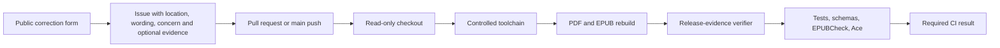
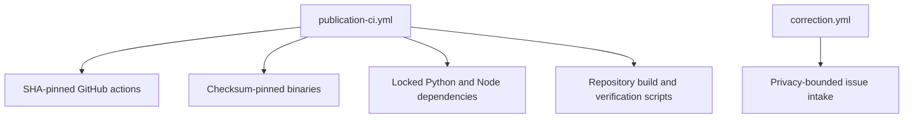
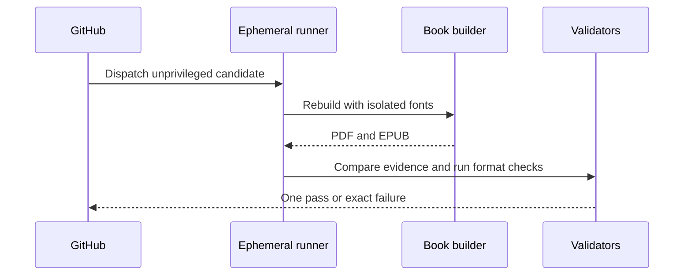
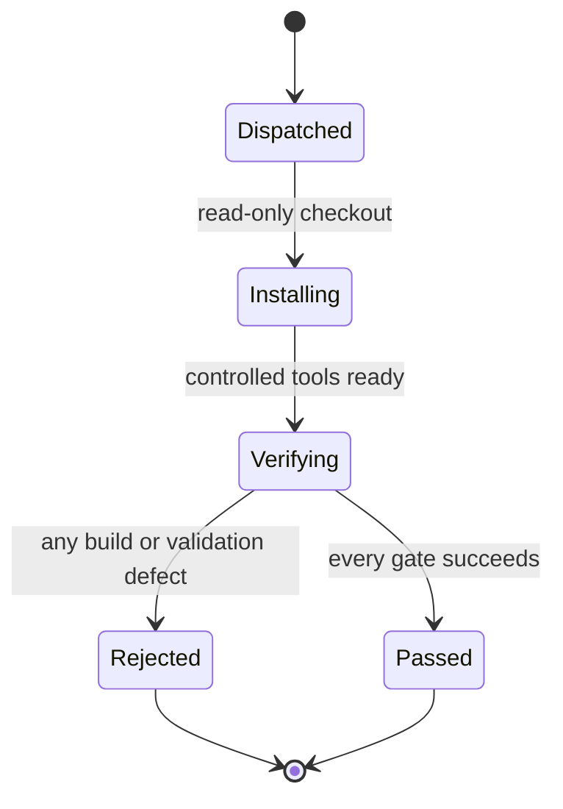
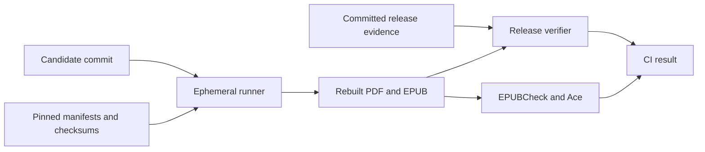

# Publication Automation and Correction Intake

## Overview

This folder owns read-only GitHub Actions validation and the public correction-intake form for the book. Pull requests and pushes to `main` rebuild and verify the exact PDF and EPUB on the canonical macOS 15 ARM64 runner with only a read-only ephemeral `GITHUB_TOKEN`, no repository or environment secrets, no write permissions, no release publication, and no raw pilot-data upload. The issue form is public and must not solicit direct contact or private medical data.

## Key Components

- `workflows/publication-ci.yml`: fixes the builder to macOS 15 ARM64; pins actions by full commit SHA; pins Typst, Inter, and EPUBCheck by version and checksum; installs locked Python and DAISY Ace dependencies; disables system fonts; rebuilds both formats; and requires the tracked artifacts, release record, tests, schemas, EPUBCheck, and Ace to pass.
- `workflows/pages.yml`: builds the static reading site from the same Typst source and deploys it through the Pages Actions artifact route. It is a second consumer of the book source and never replaces or blocks the PDF/EPUB pipeline.
- `workflows/release-rebuild.yml`: `workflow_dispatch`-only helper for the rare case where `dist/` must be regenerated on the pinned macOS 15 ARM64 runner because Typst bytes are platform-dependent. It is read-only, always checks out `main`, rebuilds both formats, runs veraPDF PDF/UA-1, EPUBCheck, and Ace, then uploads the artifacts and a machine-written evidence draft. It must never commit, publish, or change a gate; a maintainer downloads the bundle, verifies it, and updates the release records in a normal reviewed change.
- `ISSUE_TEMPLATE/correction.yml`: structured public intake for source, doctrine, safety, rights, accessibility, text, and layout corrections. Require a precise location, current wording, concern, and privacy acknowledgement; keep evidence optional for obvious production defects and never add a contact field.
- Keep PR execution on `pull_request`. Never combine PR-head checkout with `pull_request_target`, `workflow_run` privileges, secrets, or a write-capable token.
- Do not promote PR-built artifacts into a privileged publication job. Any future release job must rebuild from the trusted `main` SHA.

## Diagrams (Mermaid)

### Flowchart

### Component Diagram

### Sequence Diagram

### State Machine

### Data Flow Diagram

