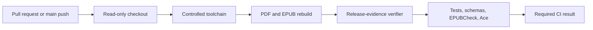
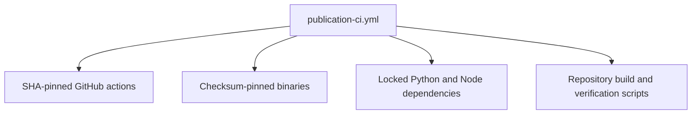
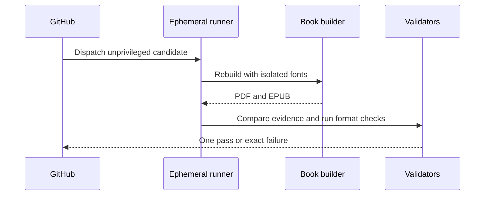
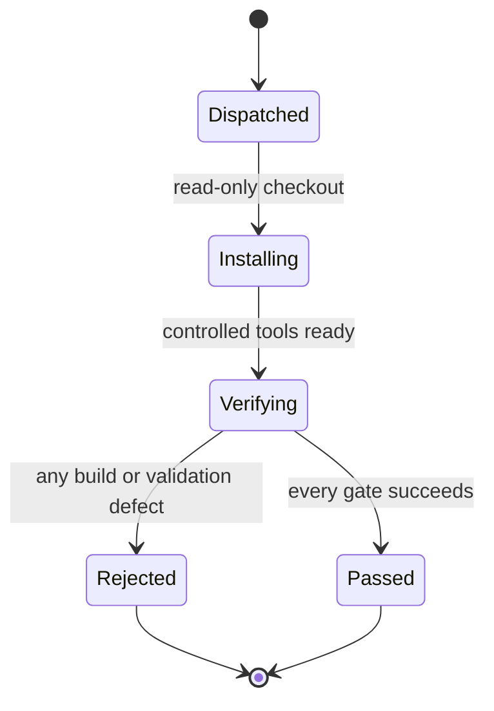
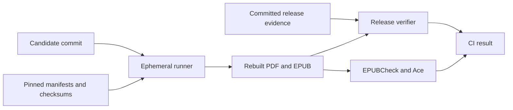

# Publication Automation

## Overview

This folder owns read-only GitHub Actions validation for the book. Pull requests and pushes to `main` rebuild and verify the exact PDF and EPUB on the canonical macOS 15 ARM64 runner with only a read-only ephemeral `GITHUB_TOKEN`, no repository or environment secrets, no write permissions, no release publication, and no raw pilot-data upload.

## Key Components

- `workflows/publication-ci.yml`: fixes the builder to macOS 15 ARM64; pins actions by full commit SHA; pins Typst, Inter, and EPUBCheck by version and checksum; installs locked Python and DAISY Ace dependencies; disables system fonts; rebuilds both formats; and requires the tracked artifacts, release record, tests, schemas, EPUBCheck, and Ace to pass.
- Keep PR execution on `pull_request`. Never combine PR-head checkout with `pull_request_target`, `workflow_run` privileges, secrets, or a write-capable token.
- Do not promote PR-built artifacts into a privileged publication job. Any future release job must rebuild from the trusted `main` SHA.

## Diagrams (Mermaid)

### Flowchart

### Component Diagram

### Sequence Diagram

### State Machine

### Data Flow Diagram

