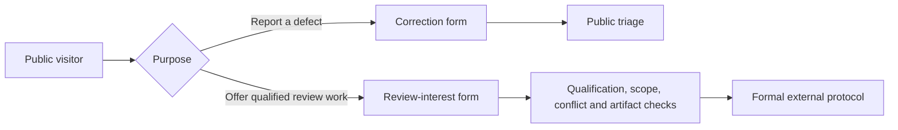
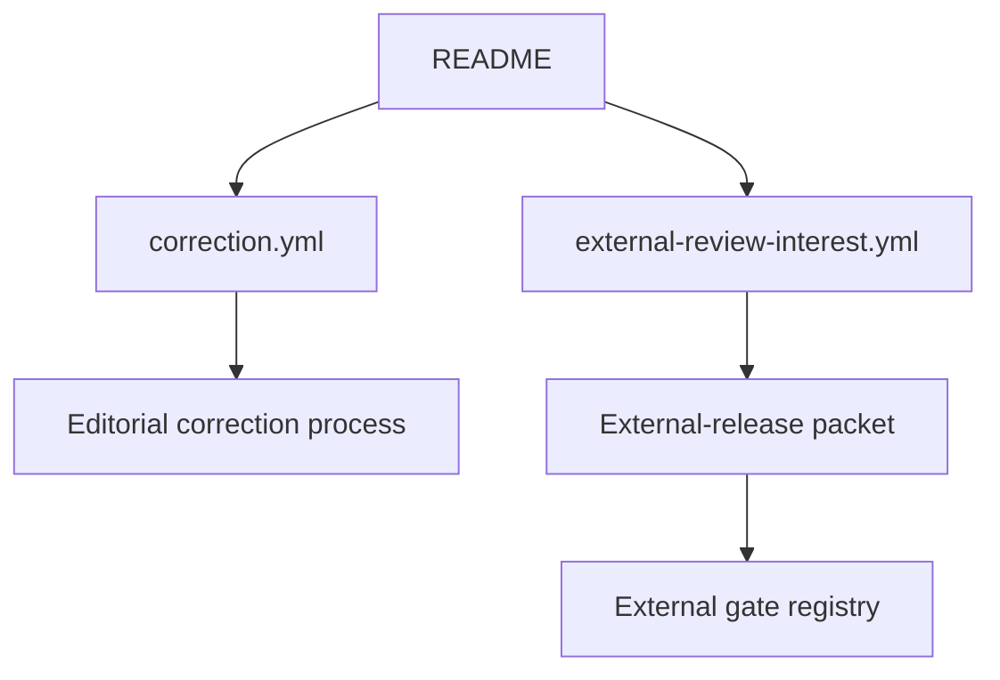
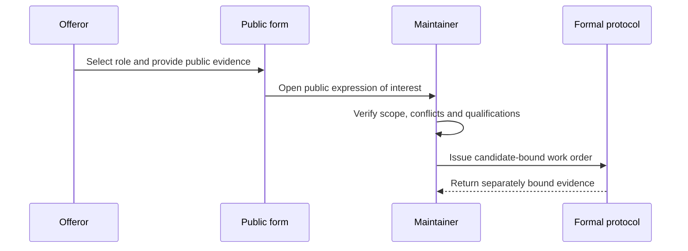

# Public Issue Forms

## Overview

These forms expose bounded public entry points without collecting private
contact details, medical histories, participant data, or unpublished review
evidence.

## Key Components

- `correction.yml`: actionable public correction reports tied to a location and
  current wording or behavior.
- `external-review-interest.yml`: public expressions of interest from expert
  reviewers or study coordinators. It is not a participant-recruitment form,
  reviewer authentication, review evidence, or a passed external gate.

## Diagrams

### Flowchart

### Component Diagram

### Sequence Diagram

