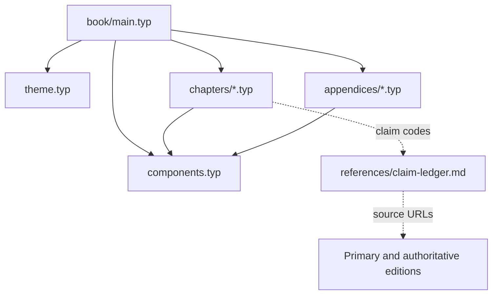
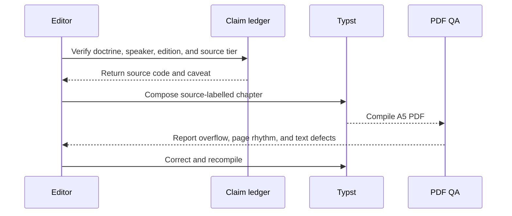
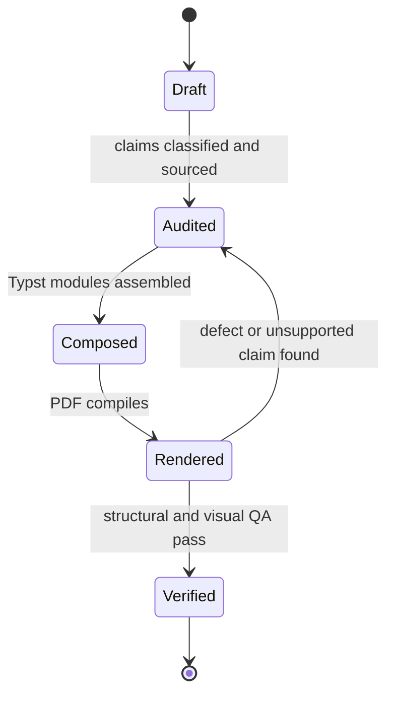
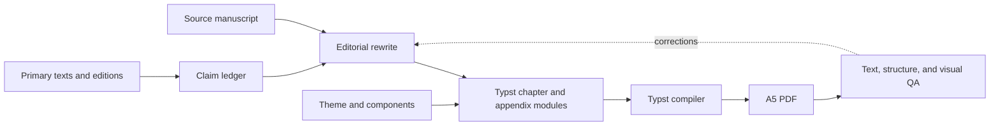

# Streamentry Typst Book

## Overview

This workspace turns `con-duong-niem-xu-mahasi-hop-nhat.md` into an A5 Vietnamese practice handbook. The source Markdown is preserved unchanged. The publication title is *Hướng Đến Nhập Lưu*, not a promise of attainment.

Accuracy has priority over continuity with the source. Keep early Pāli discourses, later Theravāda exegesis, the *Visuddhimagga*, Mahāsi instructions, and modern editorial or safety advice visibly separate.

## Key Components

- `con-duong-niem-xu-mahasi-hop-nhat.md`: immutable source manuscript. Recorded SHA-256: `ad7a886895cf8cd29b369fda89de5665c96907d990f95dba8f028336bcbbd440`.
- `book/main.typ`: only publication entry point.
- `book/theme.typ`: A5 page, type, print-safe white paper palette, and global show rules.
- `book/components.typ`: source badges, chapter openers, practice cards, cautions, and reference blocks.
- `book/chapters/`: editorial chapters.
- `book/appendices/`: reusable practice tools.
- `book/references/claim-ledger.md`: claim-to-source audit trail.
- `dist/huong-den-nhap-luu.pdf`: verified deliverable.

The canonical publication credit is `TS. Lê Việt Hồng - Cư Sĩ Chánh Niệm + ChatGPT`. Keep the cover, PDF metadata, and README synchronized.

Build from the workspace root:

```sh
typst compile --root /Volumes/SSD/streamentry book/main.typ dist/huong-den-nhap-luu.pdf
```

Do not impersonate the Buddha, fabricate quotations, or turn a retreat schedule, noting technique, cessation experience, or teacher verdict into a canonical guarantee of stream-entry.

## Diagrams (Mermaid)

### Flowchart


### Component Diagram



### Sequence Diagram



### State Machine



### Data Flow Diagram


