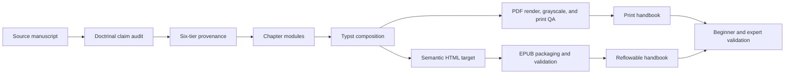
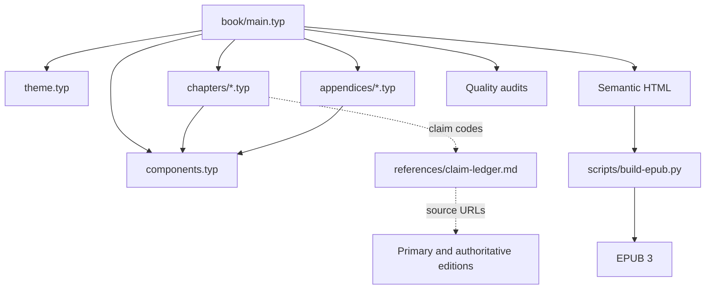
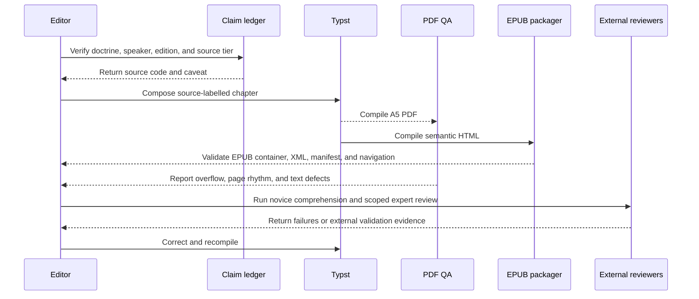
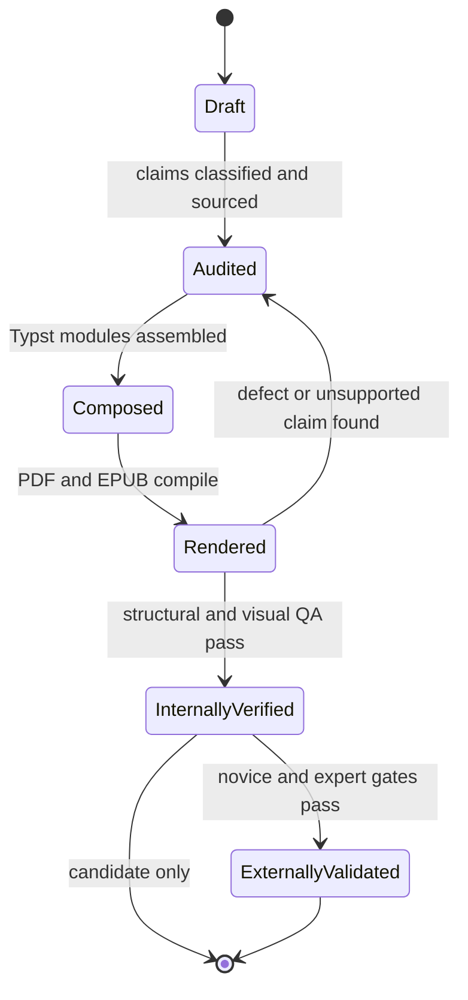
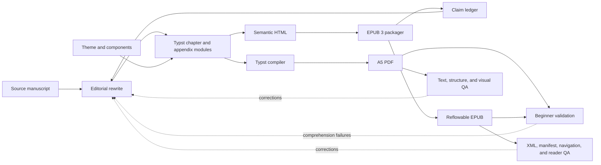

# Streamentry Typst Book

## Overview

This workspace turns `con-duong-niem-xu-mahasi-hop-nhat.md` into an A5 Vietnamese practice handbook. The source Markdown is preserved unchanged. The publication title is *Hướng Đến Nhập Lưu*, not a promise of attainment.

Accuracy has priority over continuity with the source. Keep early Pāli discourses, later Theravāda exegesis, the *Visuddhimagga*, Mahāsi instructions, and modern editorial or safety advice visibly separate.

## Key Components

- `con-duong-niem-xu-mahasi-hop-nhat.md`: immutable source manuscript. Recorded SHA-256: `ad7a886895cf8cd29b369fda89de5665c96907d990f95dba8f028336bcbbd440`.
- `book/main.typ`: only Typst content entry point for both paged and HTML targets.
- `book/theme.typ`: A5 print rules plus reflowable HTML CSS selected through `target()`. Use left binding with mirrored 22 mm inside and 14 mm outside margins for the perfect-bound edition.
- `book/components.typ`: target-aware source badges, chapter openers, practice cards, cautions, and reference blocks. Keep source badges above, not inline with, cited prose; preserve a quiet gap below provenance blocks.
- `book/chapters/`: editorial chapters.
- `book/appendices/`: reusable practice tools.
- `book/references/claim-ledger.md`: claim-to-source audit trail.
- `book/references/editorial-depth-audit.md`: chapter-by-chapter test for harmful compression.
- `book/references/publish-readiness-audit.md`: adapted 80-item publication scorecard.
- `book/references/beginner-validation-protocol.md`: external novice and reader-app acceptance gates.
- `dist/huong-den-nhap-luu.pdf`: verified deliverable.
- `scripts/build-epub.py`: deterministic EPUB 3 packaging and structural validation.
- `dist/huong-den-nhap-luu.epub`: verified reflowable deliverable.

The canonical publication credit is `CS Chánh Niệm + ChatGPT`. Keep the cover, PDF metadata, and README synchronized.

Build from the workspace root:

```sh
typst compile --root /Volumes/SSD/streamentry book/main.typ dist/huong-den-nhap-luu.pdf
python3 scripts/build-epub.py
```

Do not impersonate the Buddha, fabricate quotations, or turn a retreat schedule, noting technique, cessation experience, or teacher verdict into a canonical guarantee of stream-entry.

## Diagrams (Mermaid)

### Flowchart


```mermaid
flowchart LR
  A["Source manuscript"] --> B["Doctrinal claim audit"]
  B --> C["Six-tier provenance"]
  C --> D["Chapter modules"]
  D --> E["Typst composition"]
  E --> F["PDF render, grayscale, and print QA"]
  E --> H["Semantic HTML target"]
  H --> I["EPUB packaging and validation"]
  F --> G["Print handbook"]
  I --> J["Reflowable handbook"]
  G --> K["Beginner and expert validation"]
  J --> K
```

### Component Diagram


```mermaid
flowchart TB
  M["book/main.typ"] --> T["theme.typ"]
  M --> C["components.typ"]
  M --> H["chapters/*.typ"]
  M --> A["appendices/*.typ"]
  M --> E["Semantic HTML"]
  E --> P["scripts/build-epub.py"]
  P --> U["EPUB 3"]
  M --> Q["Quality audits"]
  H --> C
  A --> C
  H -. "claim codes" .-> L["references/claim-ledger.md"]
  L -. "source URLs" .-> S["Primary and authoritative editions"]
```

### Sequence Diagram


```mermaid
sequenceDiagram
  participant E as Editor
  participant L as Claim ledger
  participant T as Typst
  participant Q as PDF QA
  participant P as EPUB packager
  participant R as External reviewers
  E->>L: Verify doctrine, speaker, edition, and source tier
  L-->>E: Return source code and caveat
  E->>T: Compose source-labelled chapter
  T-->>Q: Compile A5 PDF
  T->>P: Compile semantic HTML
  P-->>E: Validate EPUB container, XML, manifest, and navigation
  Q-->>E: Report overflow, page rhythm, and text defects
  E->>R: Run novice comprehension and scoped expert review
  R-->>E: Return failures or external validation evidence
  E->>T: Correct and recompile
```

### State Machine


```mermaid
stateDiagram-v2
  [*] --> Draft
  Draft --> Audited: claims classified and sourced
  Audited --> Composed: Typst modules assembled
  Composed --> Rendered: PDF and EPUB compile
  Rendered --> Audited: defect or unsupported claim found
  Rendered --> InternallyVerified: structural and visual QA pass
  InternallyVerified --> ExternallyValidated: novice and expert gates pass
  InternallyVerified --> [*]: candidate only
  ExternallyValidated --> [*]
```

### Data Flow Diagram


```mermaid
flowchart LR
  S["Source manuscript"] --> E["Editorial rewrite"]
  P["Primary texts and editions"] --> L["Claim ledger"]
  L --> E
  E --> T["Typst chapter and appendix modules"]
  Y["Theme and components"] --> T
  T --> C["Typst compiler"]
  C --> D["A5 PDF"]
  T --> H["Semantic HTML"]
  H --> P["EPUB 3 packager"]
  P --> U["Reflowable EPUB"]
  D --> Q["Text, structure, and visual QA"]
  U --> V["XML, manifest, navigation, and reader QA"]
  D --> B["Beginner validation"]
  U --> B
  Q -. "corrections" .-> E
  V -. "corrections" .-> E
  B -. "comprehension failures" .-> E
```
