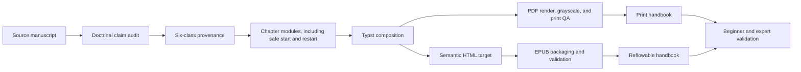
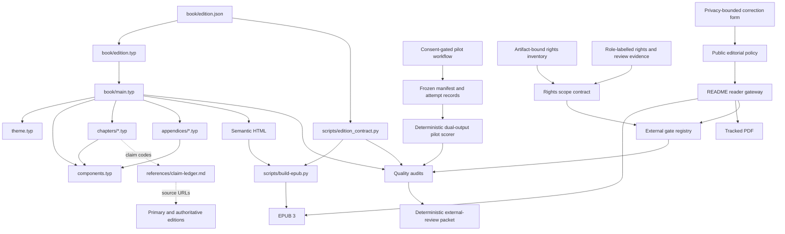
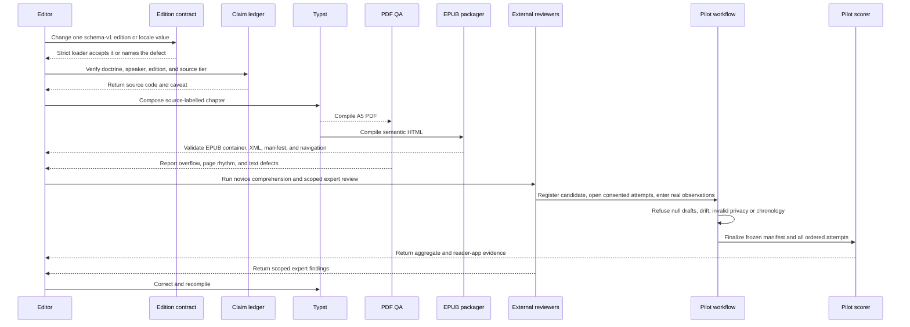
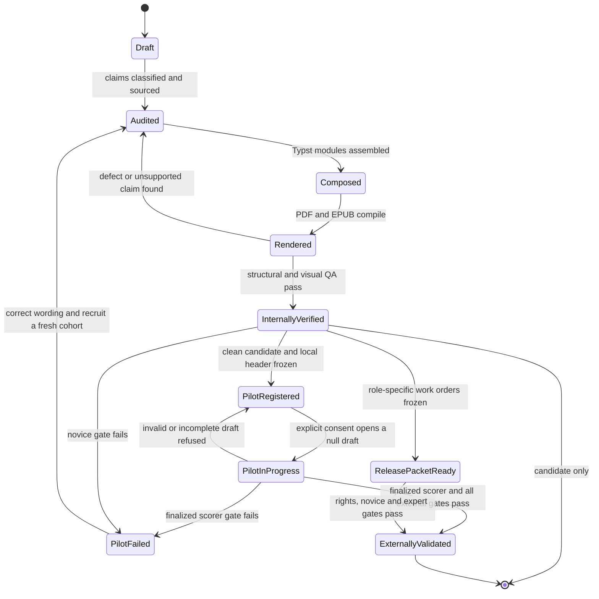
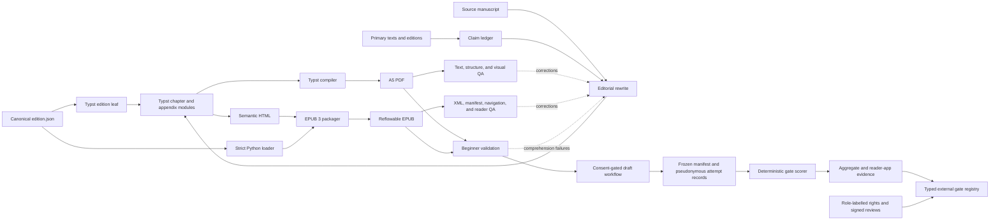

# Streamentry Typst Book

## Mission

This project exists to bring *Dự Lưu* (Stream Entry, sotāpatti) out of obscurity
and into ordinary Vietnamese lay life. Two goals drive every decision, in this
order:

1. **Craft: make the book insanely great.** Not merely correct — the book a
   busy, skeptical, middle-aged reader finishes, trusts, and acts on. A true
   beginner goes from opening the file to a safe first sit within minutes, and
   any claim can be traced to its source in seconds.
2. **Reach: help as many people as possible genuinely understand what Stream
   Entry is** — what the early discourses actually say, what it is not, and how
   a householder could plausibly walk toward it. Reach is measured in informed
   readers, not downloads.

Reach never outruns truth. Growth tactics that require exaggerating certainty,
promising attainment, hiding AI involvement, or bypassing the rights and
external-evidence gates are forbidden even when they would work. An honest book
that reaches ten thousand people beats a hyped one that reaches a million.

### What "insanely great" means here (testable bar)

- **Fast start:** a newcomer reaches a safe first sit within the first three
  pages after the front matter, with local stop conditions visible immediately.
- **No opaque terms:** every technical or Pāli term carries a plain-language
  gloss at first use, in the same paragraph or adjacent block.
- **Every chapter lands:** each explanatory chapter ends with a closed-book
  retrieval card or an explicit real-world decision block testing the central
  distinction, not vocabulary recall.
- **Traceable trust:** any doctrinal or safety claim resolves to its source
  through the source map without leaving the book; provenance stays visible but
  never blocks the reading flow.
- **Production quality:** byte-reproducible builds; clean EPUBCheck, DAISY Ace,
  and forced-profile veraPDF runs; metadata small enough to stay quiet yet
  large enough for middle-aged eyes in print.
- **Validated, not assumed:** beginner comprehension is proven only through
  `beginner-validation-protocol.md`; internal review can never substitute for
  it.

### Honest reach playbook

Prefer these levers, in rough order of leverage:

- **Translations.** The single biggest multiplier. Each locale is a separate
  schema-v1 candidate with its own identity, labels, rights decision, and full
  evidence chain — budget for that pipeline instead of hacking strings into the
  Vietnamese contract. An English edition unlocks the global mindfulness
  audience.
- **Web-first readability.** The semantic HTML target is the linkable surface.
  Keep it excellent (navigation, landmarks, card bindings) because every shared
  link lands there, not in the ZIP.
- **Shareable one-page artifacts.** The decision map, the 3–5–4 map, the
  four-region insight summary, and the Tứ Thánh Đế action loop are designed to
  survive screenshots: title, attribution, and safety boundary travel with the
  image. Improve them as standalone teaching objects.
- **Answer-engine clarity.** README opens with a direct plain-language answer
  to "what is Dự Lưu / Stream Entry?" using both Vietnamese and English terms
  naturally, so search and AI assistants quote it correctly. Never stuff
  keywords at the cost of doctrinal precision.
- **Teacher and center channels.** Qualified teachers receive the bounded
  external-review packet path; their scoped findings become evidence, and their
  endorsements only after gates pass. Never recruit novices through public
  issues.
- **Free-at-the-core posture.** Digital access stays free; any pricing waits
  for the rights decision and never gates the core teaching behind paywalls or
  email capture dark patterns.

Forbidden reach tactics: fabricated testimonials, countdown urgency,
attainment-timeframe promises, unattributed quote graphics, claiming external
validation before gates close, or letting public repository access imply a
redistribution license.

## Overview

This workspace turns `con-duong-niem-xu-mahasi-hop-nhat.md` into an A5 Vietnamese practice handbook. The source Markdown is preserved unchanged. The publication title is *Hướng Đến Nhập Lưu*, not a promise of attainment.

Accuracy has priority over continuity with the source. Keep early Pāli discourses, later Theravāda exegesis, the *Visuddhimagga*, Mahāsi instructions, and modern editorial or safety advice visibly separate.

## Key Components

- `con-duong-niem-xu-mahasi-hop-nhat.md`: immutable source manuscript. Recorded SHA-256: `ad7a886895cf8cd29b369fda89de5665c96907d990f95dba8f028336bcbbd440`.
- `README.md`: public reader gateway. Put the Vietnamese reader's download choice, intended use, reading route, safety boundary, source model, correction path, candidate status, and missing-rights warning before contributor build details. Never let public file access imply a redistribution license or external validation.
- `EDITORIAL_POLICY.md`: public source, AI, safety, disagreement, correction, privacy, rights, commercial-interest, and unresolved-evidence contract. It must state the absence of a fixed response deadline, verifiable credentials, rights clearance, and external validation rather than manufacturing accountability.
- `.github/ISSUE_TEMPLATE/correction.yml`: privacy-bounded public correction form linked from README and Chapter 99; require actionable location and wording evidence without soliciting direct contact or private medical data.
- `.github/ISSUE_TEMPLATE/external-review-interest.yml`: public, privacy-bounded expression-of-interest form for qualified reviewers and study coordinators. It must exclude novice-participant recruitment and state that an issue is not qualification proof, formal review evidence, or a passed gate.
- `book/edition.json`: sole canonical edition and locale authority for publication identity, output names, source binding, cover copy, interface labels, accessibility copy, semantic smoke text, and validation scope.
- `book/edition.typ`: thin Typst leaf that exposes `edition.json`; it must not introduce independent metadata or locale policy.
- `scripts/edition_contract.py`: strict schema-v1 Python loader used by build and verification. Unknown, missing, malformed, unsafe, or internally inconsistent values fail closed.
- `scripts/edition_contract_validation.py`: focused duplicate-key, exact-object, Unicode, and string-array validation primitives for the loader.
- `book/main.typ`: only Typst content entry point for both paged and HTML targets. It also inserts the four `part()` divider pages (Phần I–IV) between chapter includes; keep divider copy short and never turn a divider into a content-bearing page.
- `book/theme.typ`: A5 print rules plus reflowable HTML CSS selected through `target()`. Use left binding with mirrored 22 mm inside and 14 mm outside margins for the perfect-bound edition.
- `book/components.typ`: target-aware source badges, chapter openers, practice cards, cautions, and reference blocks. In semantic HTML, every repeated titled card must bind its visible title with a unique deterministic `aria-labelledby`; use `note` for practice/caution callouts and `group` for non-landmark collections. Keep source badges above, not inline with, cited prose; preserve a quiet gap below provenance blocks.
- `book/chapters/`: editorial chapters.
- `book/chapters/01-bay-ngay.typ`: safe first-sit route, seven-day start, explicitly editorial days 8–30 bridge, and the canonical restart path after ordinary interruption.
- `book/chapters/04-duyen-khoi.typ`: action-first feeling-to-craving drill followed by the source-bounded full twelve-link map; never collapse the latter into the former.
- `book/chapters/07-doi-song-tai-gia.typ`: ordinary-life transfer through task-first attention, brief response checks, formal-practice boundaries, an immediate collision loop, and a post-error repair loop. Their counts and timings are editorial; immediate protection and essential duties outrank introspection.
- `book/chapters/10-nhap-luu.typ`: focused beginner explanation of the first three fetters through separate source claims, a visibly editorial object/basis/means model, ordinary-life and meditation cases, and the canonical criteria surrounding Stream-entry.
- `book/chapters/11-ha-phan-va-sa-mon-qua.typ`: separate 3–5–4 map for the five lower fetters, four fruits, four pairs/eight persons, and DN 2.
- `book/chapters/12-ban-do-tue.typ`: later-reference insight map, printed as Chương 13 and placed last under Phần IV — Đọc sâu. The Tứ Thánh Đế integration chapter (`13-tu-dieu-de-van-hanh.typ`, printed as Chương 12) deliberately precedes it so the path foundation arrives before the taxonomy. Define the map before taxonomy; separate continuity, experiential resolution, and relation-to-experience; separate object/knowing/reaction/conclusion; state that the sources supply no validated numeric maturity threshold; and preserve the direct beginner route to the four-region explanation. Keep the four-question evidence frame, a navigable subheading and the six-question explanation (foundation, changed knowing, possible experience, practice, insufficient lookalikes, transition) consistent across stages 1–11, plus the one-object walkthrough that makes the changing way of knowing concrete. Explain stages 12–17 by system function and evidential limit, not as separately reproducible feelings. Never turn its editorial teaching aids into a self-diagnostic ladder or stage-production recipe.
- `book/appendices/`: reusable practice tools.
- `book/appendices/e-ban-do-quyet-dinh.typ`: original safety-first retrieval map for stay, switch, act, repair, reduce and stop decisions; its editorial synthesis is claim C74 in the internal ledger, bounded by C75–C76 for the Vietnamese emergency-number route. Ledger `Cxx` codes are internal traceability only — they must never appear in reader-facing text.
- `book/references/claim-ledger.md`: claim-to-source audit trail.
- `book/references/attainment-source-audit.md`: immutable segment-level audit for the attainment claims in Chapters 10–11.
- `book/references/editorial-depth-audit.md`: chapter-by-chapter test for harmful compression.
- `book/references/publish-readiness-audit.md`: adapted 80-item publication scorecard.
- `book/references/release-evidence.md`: exact candidate hashes, tool versions, verification scope, and open external gates.
- `book/references/edition-contract.md`: field ownership, canonical Vietnamese line, future-locale rules, build flow, and falsifiable limits of the edition contract.
- `book/references/external-release-packet.md`: single operational handoff for rights, expert review, novice testing, human EPUB evidence, and bounded comparison.
- `book/references/external-release-gates.json`: machine-readable external-gate, typed-evidence, and permitted-claims registry.
- `book/references/rights-decision-template.md`: authority, asset, format, channel, commercial-scope, and third-party-rights decision record with a mandatory machine-readable public summary.
- `book/references/rights-materials-inventory.md`: decision-support inventory for manuscript, contributor, adapted passage, third-party work, font, source-code, and format rights. Its schema-v1 source/PDF/EPUB identity is machine-checked for freshness; facts and fresh hashes are not clearance.
- `book/references/clinical-safety-review-protocol.md`: independent clinical and research-safety reviewer contract.
- `book/references/beginner-validation-protocol.md`: external novice and reader-app acceptance gates.
- `book/references/comparative-beginner-protocol.md`: bounded comparison protocol for a fixed Vietnamese beginner panel.
- `book/references/beginner-pilot-cohort-manifest.schema.json`: frozen cohort contract and ordered attempt ledger.
- `book/references/beginner-pilot-record.schema.json`: structured, privacy-bounded novice-attempt record.
- `book/references/doctrinal-review-protocol.md`: operational contract for independent Theravāda review.
- `dist/huong-den-nhap-luu.pdf`: current internally verified print candidate.
- `scripts/build-epub.py`: deterministic EPUB 3 packaging and structural validation, including labelled content links, resolved local fragments, absolute HTTPS external sources, distinct labels for different external destinations, and resolved visible-title bindings for repeated cards.
- `scripts/verify_release.py`: small release-verification orchestrator.
- `scripts/rights_inventory_contract.py`: fail-closed schema-v1 binding between the rights inventory and the immutable manuscript plus exact current PDF/EPUB bytes.
- `scripts/build-external-review-packet.py`: clean-checkout CLI that creates one deterministic, candidate-bound ZIP for all six external work orders. The packet must carry the complete frozen beginner-pilot preparation and scoring runtime, not only its prose protocols and schemas.
- `scripts/external_review_packet.py`, `scripts/external_review_packet_content.py`, and `scripts/external_review_packet_archive.py`: committed-source collection, canonical packet content, deterministic ZIP writing, and self-validation.
- `scripts/release_evidence.py`, `scripts/release_pdf.py`, and `scripts/release_epub.py`: fail-closed evidence-table, per-page PDF, and fixed-publication EPUB contracts. The EPUB verifier independently rejects broken or unlabelled content links and unsafe external-link schemes.
- `.github/workflows/publication-ci.yml`: read-only publication CI with SHA-pinned actions and checksum-pinned downloaded tools for deterministic rebuilds, tests, EPUBCheck, DAISY Ace, and forced-profile veraPDF PDF/UA-1 validation.
- `scripts/build-web.py`: separate static-site consumer of the same Typst source. It compiles `book/main.typ` to HTML with the pinned Typst, normalizes it through the EPUB builder's contract, and splits it into clean URLs with a hierarchical sidebar, in-page table of contents, client-side search index, pager, and light/dark themes. It adds no edition metadata or locale policy and never replaces the PDF/EPUB pipeline.
- `web/`: site sources consumed by `scripts/build-web.py`; `site.css` holds the editorial design system and `site.js` the theme, drawer, search, and scroll behaviour.
- `.github/workflows/pages.yml`: builds the site from the Typst source and deploys it to GitHub Pages through the Actions artifact route. The repository's Pages source must be set to **GitHub Actions**; generated output stays under the ignored `build/web`.
- `.github/workflows/release-rebuild.yml`: `workflow_dispatch`-only, read-only job that always checks out `main`, rebuilds both formats on the pinned `macos-15` runner with the same checksum-pinned toolchain as publication CI, runs veraPDF PDF/UA-1, EPUBCheck, and DAISY Ace on the fresh bytes, and uploads the binaries, raw validator outputs, and a machine-written evidence draft. It never commits or publishes and it changes no gate; a maintainer still verifies the bundle and updates `release-evidence.md`, `rights-materials-inventory.md`, and `external-release-gates.json` in a reviewed change. Use it when the tracked `dist/` artifacts must be regenerated on the pinned platform, because Typst bytes depend on the platform.
- `tests/test_build_web.py`: helper regression coverage plus a full-build test that verifies generated pages, resolved internal links, the six source badges, and the safety and rights statements.
- `scripts/verapdf_validation.py` and `scripts/verify-verapdf.py`: pinned veraPDF installer contract plus fail-closed JSON, version, artifact, profile, rule, check, and batch validation.
- `ci/`: pinned Python and Node dependency contracts used only by publication CI.
- `scripts/score-beginner-pilot.py`: manifest-only first-five gate scoring with artifact and contract binding.
- `scripts/prepare-beginner-pilot.py`, `scripts/beginner_pilot_preparation.py`, and `scripts/beginner_pilot_workflow.py`: consent-gated `init` / intentionally invalid `new-attempt` / one-way `finalize` workflow. It freezes artifact and contract identity, computes retention and record hashes, and invokes both public reports without manufacturing participant data.
- `tests/test_edition_contract.py`: regression coverage for strict loading and cross-field invariants.
- `tests/test_epub_edition_contract.py` and `tests/test_release_identity.py`: alternate-locale XML/label escaping plus PDF/EPUB identity-drift regressions.
- `dist/huong-den-nhap-luu.epub`: current internally verified reflowable candidate.

`book/edition.json` is the only canonical source for the publication credit and
all other edition or locale values. The current Vietnamese contract declares
`CS Chánh Niệm (với sự hỗ trợ từ AI)`; consume it through
`book/edition.typ` or
`scripts/edition_contract.py` rather than copying it into production code.
README may describe the current value, but it is not an authority. It must read
edition identity from the contract, artifact identity from release evidence,
and external status from the gate registry rather than copying drift-prone
counts or claiming that public access grants redistribution rights.

Schema v1 has one canonical Vietnamese build line. A future locale is a separate
publication candidate with its own identity, localized labels, rights decision,
source and doctrinal review, safety review where applicable, novice
comprehension evidence, and reader-app evidence. Passing the Vietnamese
internal or external gates never transfers those results to a translation.

Beginner readability is a publication contract, not a style preference. Define technical terms at first use, connect each conceptual section to the prior one, orient and synthesize dense lists, and keep appendices usable when opened directly. Close every explanatory chapter with either a short closed-book retrieval card or an explicit real-world decision block; test the central distinction and next action, not terminology recall or attainment status. In safety and decision passages, give each observable trigger or action its own list item. Treat sentence length as a review signal, not an automatic defect; preserve a long paragraph when its source-bound explanation is coherent and each inference remains visible. The first-sit route must expose its local stop conditions and label lookup without forcing a full safety-chapter detour; the full safety chapter remains mandatory before intensification. Keep one canonical restart protocol in Chapter 1 and link to it briefly elsewhere. Internal editorial review may mark these gates complete, but only `book/references/beginner-validation-protocol.md` can support a claim of novice validation.

For running the novice test, start with `book/references/beginner-reader-kit.md` and use it together with the protocol. Run the preparation CLI from a clean canonical-history candidate: `init` freezes the local registration header; `new-attempt` requires an explicit consent flag and creates a schema-invalid null draft; `finalize` strips the draft marker only after strict validation, computes retention and hashes, locks the manifest, and runs both reports. Freeze the artifacts and ten-file scoring contract before attempt one, enumerate every started attempt in one authoritative manifest, and count only the first five completed eligible attempts among at most seven starts. Raw records stay under ignored `build/beginner-pilot/`; only the privacy-coarsened aggregate and reader-app reports are publishable. The CLI cannot witness consent, authenticate people, validate an external registry, or prove terminal-attempt completeness. Use an external append-only registry for that stronger claim.

For external release work, start with `book/references/external-release-packet.md`. Treat schema-v3 `external-release-gates.json` as the status source and let `scripts/verify_release.py` check protocol hashes, required gate-specific evidence roles, path reuse, role/header agreement, mandatory completion, public-confirmation and scope-limit fields, exact-once PDF and EPUB digest fields, candidate binding, cohort/report bindings, cross-document status, public contact-data rejection, and permitted claim enums. A passed `rights_decision` must also bind the current materials-inventory and immutable-source hashes, authorize both PDF and EPUB, state source/print/derivative scopes, territory, language, term, attribution and notices, and resolve contributor and third-party status with no open rights item. The frozen candidate commit may precede the evidence commit, but it must be an ancestor of it and contain the exact recorded PDF and EPUB bytes; `release-evidence.md` and public evidence may be committed later. Machine verification cannot establish a signer's identity or authority, the legal validity of a grant, a reviewer's competence, participant identity, custody completeness, or the honesty of a study. Keep every gate open until that human evidence exists.

Run `python3 scripts/build-external-review-packet.py` only from a clean
checkout when issuing work orders. The ignored ZIP binds its protocol copies,
assignment sheets and self-contained beginner-pilot runtime to the exact commit
and artifact hashes. A cohort operator must use the enclosed runtime rather than
fetching a drifting scorer. Packet creation is logistics, not external evidence,
and never changes a gate status.

When discussing attainment, use *the first three fetters*, not an invented standalone canonical list called “three lower fetters.” Keep that subset distinct from the full five lower fetters, the four fruits, and DN 2's broader discourse title. Chapter 10 explains the subset through the object, verified-basis, and means frame, explicitly labelled as editorial rather than a canonical 1–2–3 sequence. Chapter 11 supplies the wider classification.

Build from the workspace root:

```sh
python3 scripts/build-epub.py
python3 scripts/verify_release.py
python3 scripts/build-web.py --output build/web
python3 scripts/build-external-review-packet.py
```

The reading site is a second consumer of the same Typst source, never a fork of
it. It reuses the EPUB builder's normalization contract and reads every edition
or locale value through `book/edition.json`; it introduces no independent
metadata and adds no reader-facing doctrinal claim. A website build failing must
never block or alter the PDF/EPUB pipeline, and a published page must never
imply that rights, doctrinal review, safety review, or novice validation have
closed.

Under the pinned macOS 15 ARM64 publication CI tool and font environment, the canonical builder emits a byte-reproducible PDF/UA-1 candidate and synchronized reflowable EPUB. The platform is part of the reproducibility contract because official Typst builds on different operating systems need not emit identical bytes. Publication CI disables system-font discovery and supplies the official checksum-pinned Inter 4.0 files so a missing or substituted local font cannot silently change the release. Repeated visual cards must expose their visible titles as machine-readable names without inflating the heading outline or landmark list. veraPDF must be the exact version, URL, and checksum declared by `scripts/verapdf_validation.py`, must be forced to `ua1`, and must return a normal, compliant, zero-failure report bound to the current PDF. Treat veraPDF, EPUBCheck, DAISY Ace, and browser accessibility-tree inspection as internal machine evidence; actual assistive-technology and reader-app use remain external gates.

Do not impersonate the Buddha, fabricate quotations, or turn a retreat schedule, noting technique, cessation experience, or teacher verdict into a canonical guarantee of stream-entry.

## Diagrams (Mermaid)

### Flowchart


```mermaid
flowchart LR
  A["Source manuscript"] --> B["Doctrinal claim audit"]
  B --> C["Six-class provenance"]
  C --> D["Chapter modules, including safe start and restart"]
  D --> E["Typst composition"]
  E --> F["PDF render, grayscale, and print QA"]
  E --> H["Semantic HTML target"]
  H --> I["EPUB packaging and validation"]
  F --> G["Print handbook"]
  I --> J["Reflowable handbook"]
  G --> K["Beginner and expert validation"]
  J --> K
```

### Component Diagram


```mermaid
flowchart TB
  D["book/edition.json"] --> Y["book/edition.typ"]
  D --> Z["scripts/edition_contract.py"]
  Y --> M["book/main.typ"]
  M["book/main.typ"] --> T["theme.typ"]
  M --> C["components.typ"]
  M --> H["chapters/*.typ"]
  M --> A["appendices/*.typ"]
  M --> E["Semantic HTML"]
  E --> P["scripts/build-epub.py"]
  Z --> P
  Z --> Q
  P --> U["EPUB 3"]
  R0["README reader gateway"] --> U
  R0 --> V["Tracked PDF"]
  R0 --> X
  EP["Public editorial policy"] --> R0
  CF["Privacy-bounded correction form"] --> EP
  M --> Q["Quality audits"]
  O["Consent-gated pilot workflow"] --> N["Frozen manifest and attempt records"]
  N --> G["Deterministic dual-output pilot scorer"]
  G --> Q
  X["External gate registry"] --> Q
  RI["Artifact-bound rights inventory"] --> RC["Rights scope contract"]
  R["Role-labelled rights and review evidence"] --> RC
  RC --> X
  Q --> W["Deterministic external-review packet"]
  H --> C
  A --> C
  H -. "claim codes" .-> L["references/claim-ledger.md"]
  L -. "source URLs" .-> S["Primary and authoritative editions"]
```

### Sequence Diagram


```mermaid
sequenceDiagram
  participant E as Editor
  participant D as Edition contract
  participant L as Claim ledger
  participant T as Typst
  participant Q as PDF QA
  participant P as EPUB packager
  participant R as External reviewers
  participant O as Pilot workflow
  participant S as Pilot scorer
  E->>D: Change one schema-v1 edition or locale value
  D-->>E: Strict loader accepts it or names the defect
  E->>L: Verify doctrine, speaker, edition, and source tier
  L-->>E: Return source code and caveat
  E->>T: Compose source-labelled chapter
  T-->>Q: Compile A5 PDF
  T->>P: Compile semantic HTML
  P-->>E: Validate EPUB container, XML, manifest, and navigation
  Q-->>E: Report overflow, page rhythm, and text defects
  E->>R: Run novice comprehension and scoped expert review
  R->>O: Register candidate, open consented attempts, enter real observations
  O->>O: Refuse null drafts, drift, invalid privacy or chronology
  O->>S: Finalize frozen manifest and all ordered attempts
  S-->>E: Return aggregate and reader-app evidence
  R-->>E: Return scoped expert findings
  E->>T: Correct and recompile
```

### State Machine


```mermaid
stateDiagram-v2
  [*] --> Draft
  Draft --> Audited: claims classified and sourced
  Audited --> Composed: Typst modules assembled
  Composed --> Rendered: PDF and EPUB compile
  Rendered --> Audited: defect or unsupported claim found
  Rendered --> InternallyVerified: structural and visual QA pass
  InternallyVerified --> ReleasePacketReady: role-specific work orders frozen
  InternallyVerified --> PilotRegistered: clean candidate and local header frozen
  PilotRegistered --> PilotInProgress: explicit consent opens a null draft
  PilotInProgress --> PilotRegistered: invalid or incomplete draft refused
  PilotInProgress --> PilotFailed: finalized scorer gate fails
  PilotInProgress --> ExternallyValidated: finalized scorer and all external gates pass
  ReleasePacketReady --> ExternallyValidated: rights, novice and expert gates pass
  InternallyVerified --> PilotFailed: novice gate fails
  PilotFailed --> Audited: correct wording and recruit a fresh cohort
  InternallyVerified --> [*]: candidate only
  ExternallyValidated --> [*]
```

### Data Flow Diagram


```mermaid
flowchart LR
  ED["Canonical edition.json"] --> ET["Typst edition leaf"]
  ED --> EL["Strict Python loader"]
  SM["Source manuscript"] --> EW["Editorial rewrite"]
  PS["Primary texts and editions"] --> CL["Claim ledger"]
  CL --> EW
  EW --> TM["Typst chapter and appendix modules"]
  ET --> TM
  TM --> TC["Typst compiler"]
  TC --> PDF["A5 PDF"]
  TM --> HTML["Semantic HTML"]
  HTML --> EP["EPUB 3 packager"]
  EL --> EP
  EP --> EPUB["Reflowable EPUB"]
  PDF --> QA["Text, structure, and visual QA"]
  EPUB --> V["XML, manifest, navigation, and reader QA"]
  PDF --> B["Beginner validation"]
  EPUB --> B
  B --> O["Consent-gated draft workflow"]
  O --> R["Frozen manifest and pseudonymous attempt records"]
  R --> SC["Deterministic gate scorer"]
  SC --> AE["Aggregate and reader-app evidence"]
  AE --> X["Typed external gate registry"]
  ER["Role-labelled rights and signed reviews"] --> X
  QA -. "corrections" .-> EW
  V -. "corrections" .-> EW
  B -. "comprehension failures" .-> EW
```
