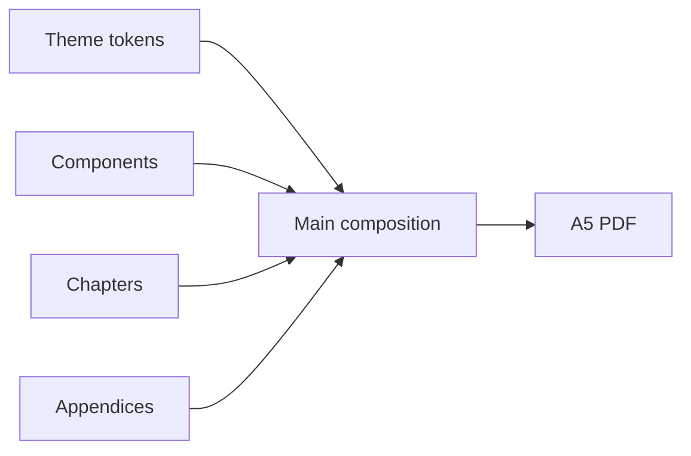
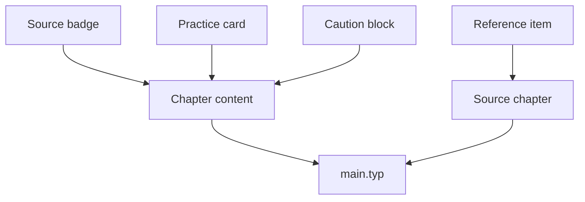
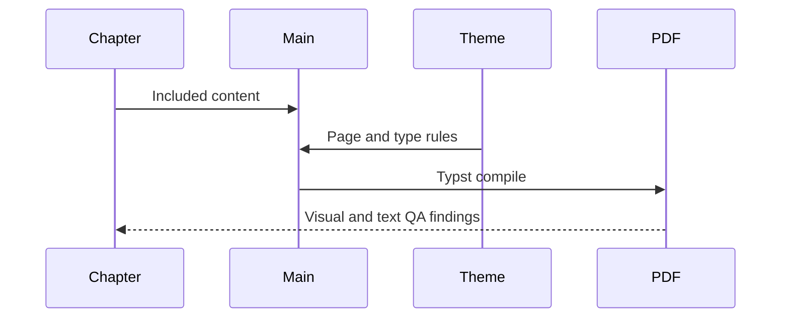

# Typst Book Module

## Overview

This module owns the A5 publication system for *Hướng Đến Nhập Lưu*. `main.typ` stays composition-only. Theme tokens and show rules belong in `theme.typ`; repeated visual patterns belong in `components.typ`; prose belongs in chapter or appendix files.

## Key Components

- `main.typ`: metadata, canonical author credit, cover, and include order.
- `theme.typ`: Libertinus Serif and Inter type system, print-safe white paper palette, A5 margins.
- `components.typ`: stable content blocks only. `source-line` and `modern-note` place badges on a separate line so prose retains the full reading measure.
- `chapters/`: narrative and instructional sequence.
- `appendices/`: printable tools and reference material.
- `references/`: doctrinal audit trail.

The canonical publication credit is `TS. Lê Việt Hồng - Cư Sĩ Chánh Niệm + ChatGPT`. Do not edit the visible cover credit without updating PDF metadata and the root README in the same change.

## Diagrams (Mermaid)

### Flowchart

### Component Diagram

### Sequence Diagram

