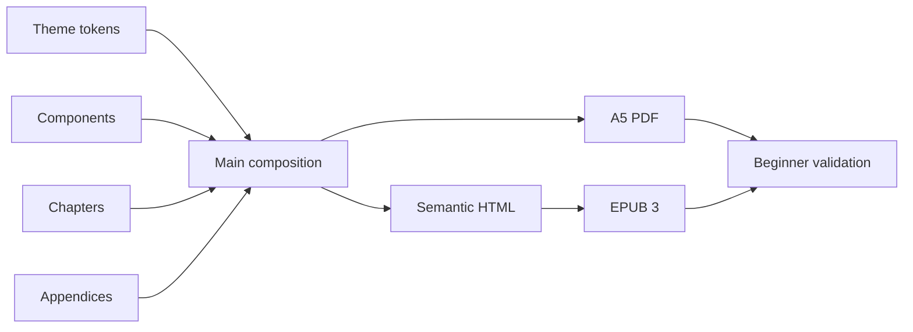
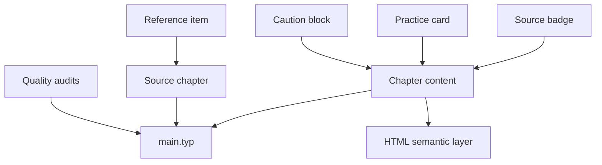
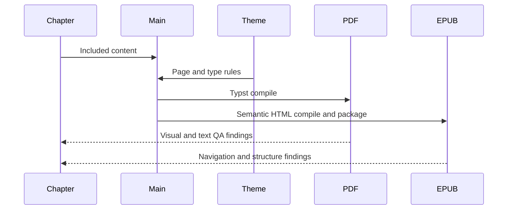

# Typst Book Module

## Overview

This module owns the A5 and reflowable publication system for *Hướng Đến Nhập Lưu*. `main.typ` stays composition-only. Theme tokens and target-specific show rules belong in `theme.typ`; repeated target-aware patterns belong in `components.typ`; prose belongs in chapter or appendix files.

## Key Components

- `main.typ`: metadata, canonical author credit, cover, and include order.
- `theme.typ`: print type system and A5 perfect-binding margins plus semantic HTML CSS for EPUB.
- `components.typ`: stable dual-target blocks. HTML branches must preserve all content hidden inside print grids.
- `chapters/`: narrative and instructional sequence.
- `appendices/`: printable tools and reference material.
- `references/`: doctrinal audit trail, depth review, publication scorecard, and external beginner-validation protocol.

The canonical publication credit is `CS Chánh Niệm + ChatGPT`. Do not edit the visible cover credit without updating PDF metadata and the root README in the same change.

## Diagrams (Mermaid)

### Flowchart

```mermaid
flowchart LR
  T["Theme tokens"] --> M["Main composition"]
  C["Components"] --> M
  H["Chapters"] --> M
  A["Appendices"] --> M
  M --> P["A5 PDF"]
  M --> R["Semantic HTML"]
  R --> E["EPUB 3"]
  P --> V["Beginner validation"]
  E --> V
```

### Component Diagram

```mermaid
flowchart TB
  B["Source badge"] --> H["Chapter content"]
  P["Practice card"] --> H
  W["Caution block"] --> H
  H --> M["main.typ"]
  H --> E["HTML semantic layer"]
  R["Reference item"] --> S["Source chapter"]
  S --> M
  A["Quality audits"] --> M
```

### Sequence Diagram

```mermaid
sequenceDiagram
  participant C as Chapter
  participant M as Main
  participant T as Theme
  participant P as PDF
  participant E as EPUB
  C->>M: Included content
  T->>M: Page and type rules
  M->>P: Typst compile
  M->>E: Semantic HTML compile and package
  P-->>C: Visual and text QA findings
  E-->>C: Navigation and structure findings
```
