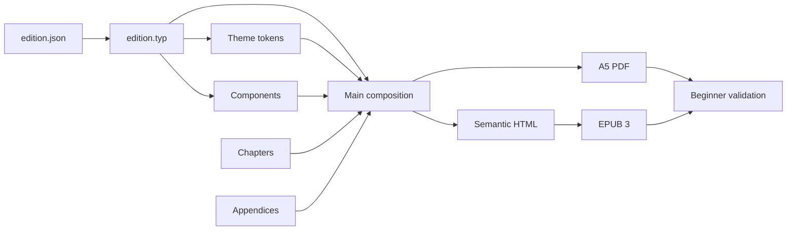
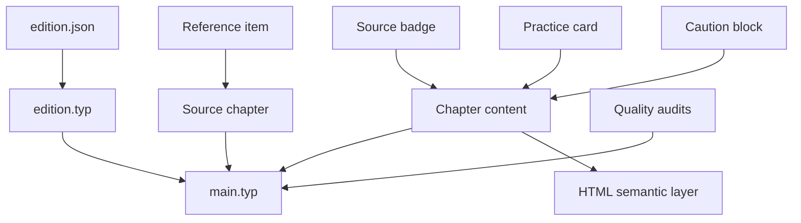
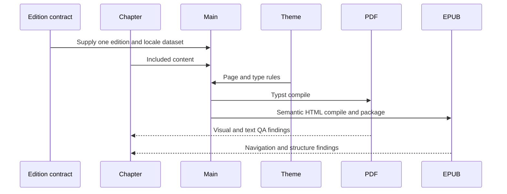

# Typst Book Module

## Overview

This module owns the A5 and reflowable publication system for *Hướng Đến Nhập Lưu*. `edition.json` is the sole edition and locale authority; `edition.typ` is its thin Typst access leaf. `main.typ` stays composition-only. Theme tokens and target-specific show rules belong in `theme.typ`; repeated target-aware patterns belong in `components.typ`; prose belongs in chapter or appendix files.

## Key Components

- `edition.json`: schema-v1 authority for title, credit, language, output identity, source binding, cover copy, reader-facing labels, accessibility copy, semantic smoke text, and validation scope.
- `edition.typ`: leaf that exposes `edition.json` and presentation-only helpers to Typst consumers. Do not add fallback metadata or locale policy here.
- `main.typ`: contract-derived metadata, cover, and include order.
- `theme.typ`: print type system and A5 perfect-binding margins plus semantic HTML CSS for EPUB.
- `components.typ`: stable dual-target blocks. HTML branches must preserve all content hidden inside print grids. Source-map link text must retain its source code so assistive-technology link lists distinguish K01–K41.
- `chapters/`: narrative and instructional sequence.
- `appendices/`: printable tools and reference material.
- `appendices/e-ban-do-quyet-dinh.typ`: one-page, dual-target decision map that preserves safety, formal-practice, ordinary-life and post-practice choices as text.
- `references/`: doctrinal audit trail, edition-contract documentation, depth review, publication scorecard, exact release evidence, independent-review protocol, external beginner-validation protocol, fixed reader kit, cohort-manifest schema, and pilot-record schema.
- For attainment questions, keep the first three fetters, the full five lower fetters, and the four fruits separate. Chapter 10 owns the first three fetters; Chapter 11 owns the full five, the four fruits, and the DN 2 distinction; the glossary provides direct lookup.

The current Vietnamese contract declares the publication credit
`CS Chánh Niệm + ChatGPT`. Change it only in `edition.json`; the cover and PDF
metadata must consume that value. The root README may describe the current
edition but is not another authority.

## Diagrams (Mermaid)

### Flowchart

```mermaid
flowchart LR
  D["edition.json"] --> L["edition.typ"]
  L --> T
  L --> C
  L --> M
  T["Theme tokens"] --> M["Main composition"]
  C["Components"] --> M
  H["Chapters"] --> M
  A["Appendices"] --> M
  M --> P["A5 PDF"]
  M --> R["Semantic HTML"]
  R --> E["EPUB 3"]
  P --> V["Beginner validation"]
  E --> V
```

### Component Diagram

```mermaid
flowchart TB
  D["edition.json"] --> L["edition.typ"]
  L --> M["main.typ"]
  B["Source badge"] --> H["Chapter content"]
  P["Practice card"] --> H
  W["Caution block"] --> H
  H --> M["main.typ"]
  H --> E["HTML semantic layer"]
  R["Reference item"] --> S["Source chapter"]
  S --> M
  A["Quality audits"] --> M
```

### Sequence Diagram

```mermaid
sequenceDiagram
  participant D as Edition contract
  participant C as Chapter
  participant M as Main
  participant T as Theme
  participant P as PDF
  participant E as EPUB
  D->>M: Supply one edition and locale dataset
  C->>M: Included content
  T->>M: Page and type rules
  M->>P: Typst compile
  M->>E: Semantic HTML compile and package
  P-->>C: Visual and text QA findings
  E-->>C: Navigation and structure findings
```
