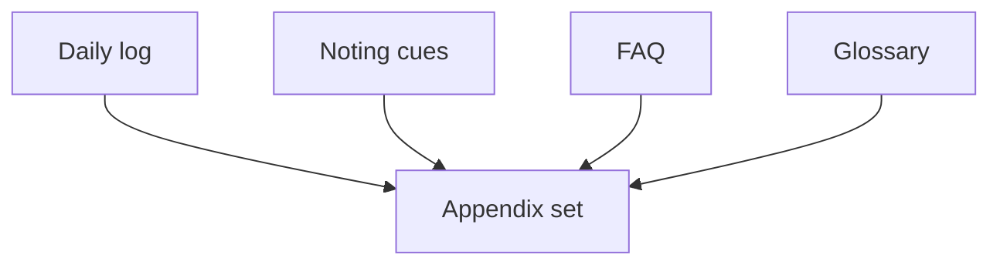
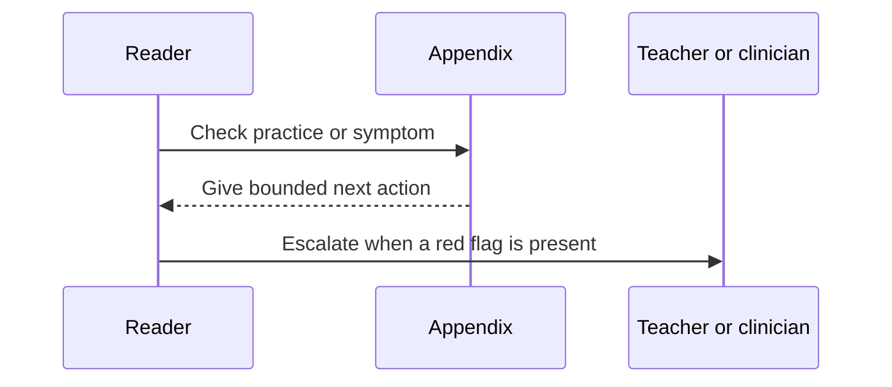

# Appendices

## Overview

Appendices are reusable field tools, not a second narrative. They must remain printable, quickly scannable, and legible on A5 paper.

## Key Components

- Daily and monthly logs measure conduct and continuity, not insight rank.
- Reference labels are pragmatic Mahāsi cues, not an exact taxonomy of the four satipaṭṭhānas.
- FAQ answers preserve source limits.
- The glossary distinguishes similar Pāli terms without pretending one English or Vietnamese word exhausts them.

## Diagrams (Mermaid)

### Flowchart

### Component Diagram

### Sequence Diagram

