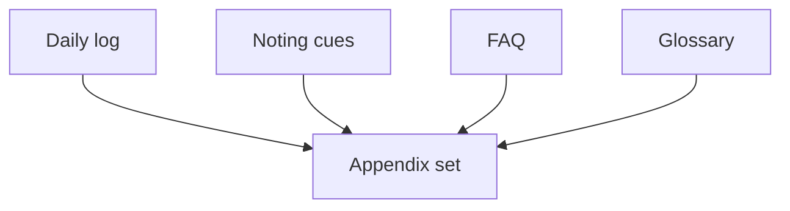
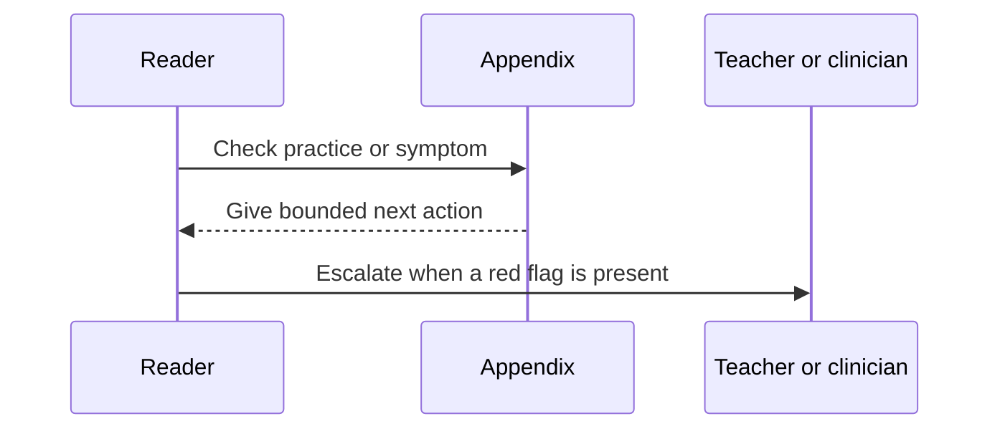

# Appendices

## Overview

Appendices are reusable field tools, not a second narrative. They must remain printable, quickly scannable, and legible on A5 paper.

## Key Components

- Daily and monthly logs measure conduct and continuity, not insight rank.
- Reference labels are pragmatic Mahāsi cues, not an exact taxonomy of the four satipaṭṭhānas.
- FAQ answers preserve source limits.
- When an FAQ sentence relies on more than one tier, display every relevant badge rather than collapsing Mahāsi, commentary, and scripture into one label.
- The glossary distinguishes similar Pāli terms without pretending one English or Vietnamese word exhausts them.
- Each appendix must work when opened directly. Define local terms such as Five Precepts, six sense doors, fetters, or awakening factors instead of assuming the narrative chapters are still in working memory.

## Diagrams (Mermaid)

### Flowchart

```mermaid
flowchart LR
  Q["Reader question"] --> T["Tool or checklist"] --> A["Action"] --> R["Monthly review"]
```

### Component Diagram

```mermaid
flowchart TB
  D["Daily log"] --> A["Appendix set"]
  N["Noting cues"] --> A
  F["FAQ"] --> A
  G["Glossary"] --> A
```

### Sequence Diagram

```mermaid
sequenceDiagram
  participant R as Reader
  participant A as Appendix
  participant T as Teacher or clinician
  R->>A: Check practice or symptom
  A-->>R: Give bounded next action
  R->>T: Escalate when a red flag is present
```
