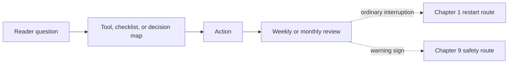
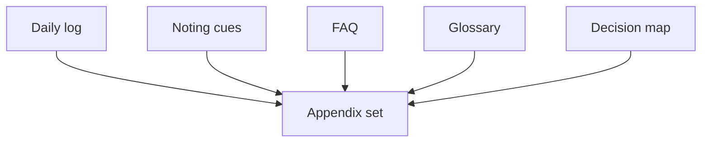
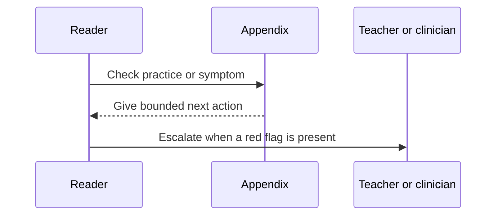

# Appendices

## Overview

Appendices are reusable field tools, not a second narrative. They must remain printable, quickly scannable, and legible on A5 paper.

## Key Components

- Daily and monthly logs measure conduct and continuity, not insight rank.
- Appendix B is the first-sit label lookup and must retain a stable direct anchor from the frontmatter and Chapter 1.
- Reference labels are pragmatic Mahāsi cues, not an exact taxonomy of the four satipaṭṭhānas.
- Give editorial cue tables and review routines a local `BIÊN SOẠN` badge even when their source boundary was already explained in an earlier chapter.
- FAQ answers preserve source limits.
- When an FAQ sentence relies on more than one tier, display every relevant badge rather than collapsing Mahāsi, commentary, and scripture into one label.
- The glossary distinguishes similar Pāli terms without pretending one English or Vietnamese word exhausts them.
- The glossary begins with a linked four-group quick index. Preserve its internal anchors and category headings so the EPUB table of contents remains usable at term-search depth.
- Appendix E is the one-page decision map. Keep the safety gate above the formal-practice and daily-life branches, keep the after-practice decision last, and preserve all four nodes as semantic text in EPUB. It is an editorial retrieval aid bound to C74, not a canonical sequence or diagnostic flowchart.
- Printable dotted worksheet leaders must become responsive bordered fields in HTML; never force a fixed line of punctuation into narrow EPUB viewports.
- Each appendix must work when opened directly. Define local terms such as Five Precepts, six sense doors, fetters, or awakening factors instead of assuming the narrative chapters are still in working memory.
- Review worksheets may point to Chapter 1's canonical restart route, but must not duplicate or silently change its no-makeup, last-stable-level, and warning-sign decisions.
- When glossary or FAQ entries touch stream-entry or the lower fetters, define sakkāyadiṭṭhi, vicikicchā, sīlabbataparāmāsa, the five lower fetters, and the four fruits separately. Do not compress them into one generic “thánh quả” label.
- Glossary shorthand must not outrun the source boundary established in the narrative chapter. In particular, keep temporary quiet, attenuation, and eradication distinct, and label later Theravāda explanations when a cited early discourse supports only a narrower formula.

## Diagrams (Mermaid)

### Flowchart

```mermaid
flowchart LR
  Q["Reader question"] --> T["Tool, checklist, or decision map"] --> A["Action"] --> R["Weekly or monthly review"]
  R -. "ordinary interruption" .-> S["Chapter 1 restart route"]
  R -. "warning sign" .-> C["Chapter 9 safety route"]
```

### Component Diagram

```mermaid
flowchart TB
  D["Daily log"] --> A["Appendix set"]
  N["Noting cues"] --> A
  F["FAQ"] --> A
  G["Glossary"] --> A
  M["Decision map"] --> A
```

### Sequence Diagram

```mermaid
sequenceDiagram
  participant R as Reader
  participant A as Appendix
  participant T as Teacher or clinician
  R->>A: Check practice or symptom
  A-->>R: Give bounded next action
  R->>T: Escalate when a red flag is present
```
