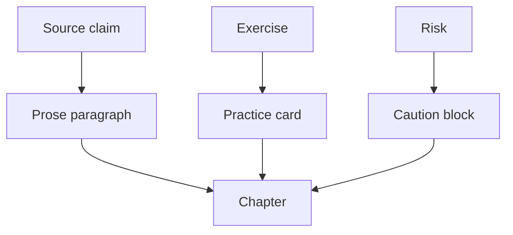
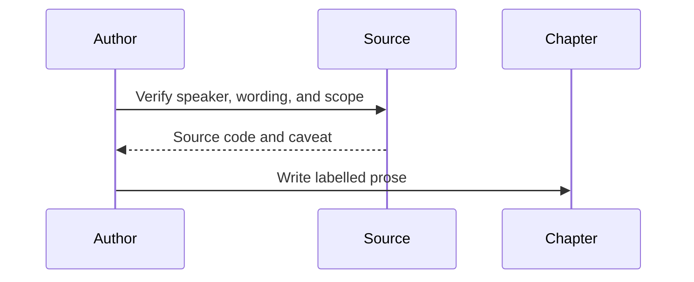

# Chapters

## Overview

Chapters carry the explanatory arc from a seven-day start through the full path, Mahāsi technique, daily life, safety, insight maps, and canonical descriptions of stream-entry. Keep each file below 300 lines.

## Key Components

- Begin with `chapter(...)`.
- Attach `source-badge(...)` or `source-line(...)` to non-obvious doctrinal claims.
- Use prose for argument and cards only for procedures, checks, or source boundaries.
- Never make a schedule or phenomenological map sound universal.

## Diagrams (Mermaid)

### Flowchart

### Component Diagram

### Sequence Diagram

