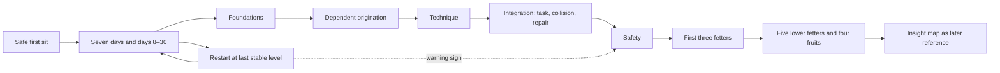
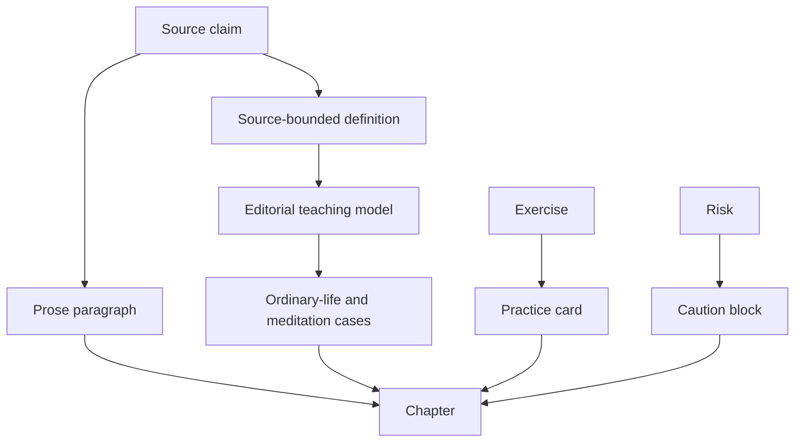
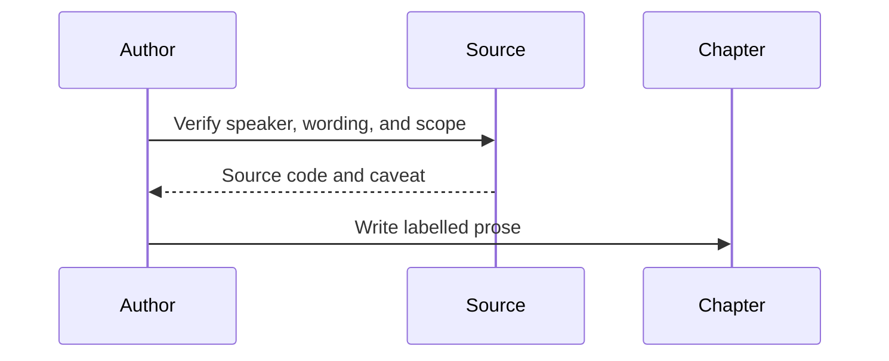

# Chapters

## Overview

Chapters carry the explanatory arc from a seven-day start and an explicit days 8–30 bridge through the full path, dependent origination at feeling and craving, Mahāsi technique, daily life, safety, a focused explanation of the first three fetters, a separate five-lower-fetters and four-fruits map, and the insight map as later reference. Prefer files below 300 lines, but do not compress sourced explanation merely to satisfy the line target.

## Key Components

- Begin with `chapter(...)`.
- Frontmatter must give a short non-linear reading route: first practice, early safety, foundations, retreat screening, then the insight map as later reference.
- Chapter 12 must be self-contained for a reader who has never opened the *Visuddhimagga*: define `tuệ` and `các hành`, then front-load a plain-language practice progression before taxonomy. Separate a lookalike phenomenon, a glimpse of a characteristic way of knowing, a provisionally dominant insight region, and a path-fruition claim. Explain conditional maturation and the practice boundary before the seven-purification taxonomy; separate continuity, experiential resolution and relation-to-experience; distinguish object, knowing, reaction and conclusion; state that the sources supply no validated numeric threshold for “maturity”; and offer a direct route to the four-region explanation. The five-part evidential frame and worked interview are editorial tools for bounded hypothesis testing, not a stage score. Stages 1–11 each have a navigable heading and answer the same six questions; a one-object walkthrough makes the changing way of knowing concrete. Stages 12–17 are explained by function and evidential limit, not invented as separately memorable feelings. The frame, ordinary-sitting loop, walkthrough and retrieval exercise are editorial scaffolding over P02, not a canonical or validated classifier.
- Expand DN, MN, SN, AN and Ud on the first-reading path. Keep canonical collection locations distinct from the edition's traceability codes: K for discourse-source records, P for Mahāsi texts, V for the selected *Visuddhimagga* edition, and R for research, health or official sources. Link the early quick legend to the durable source-map legend; never imply that K01 is a canonical sutta number or that the code letter ranks evidence.
- Keep the reader-facing trust statement on the first-reading path. It must disclose the publication credit, absence of independently verifiable credentials for `CS Chánh Niệm`, bounded role and non-authority of ChatGPT, open rights/review/novice/reader-app gates, lack of a public reuse license, and the correction route. Do not move these facts only to repository policy or the final source pages.
- Keep the bounded external-review interest route in Chapter 99 so a qualified reader who receives only the PDF or EPUB can reach the public intake. It must repeat the public/privacy boundary and state that an offer is not review evidence or a passed gate.
- Attach `source-badge(...)` or `source-line(...)` to non-obvious doctrinal claims.
- Use prose for argument and cards only for procedures, checks, or source boundaries.
- Never make a schedule, a “feeling to craving” intervention, or a phenomenological map sound universal.
- Put hard decision rules where a beginner first encounters the decision. Do not rely on a later safety or retreat chapter to repair ambiguous week-one instructions.
- Keep the pre-first-sit route short: Chapter 1 owns the local stop conditions and first action. Require the full safety chapter before intensification, prolonged solo practice, or retreat, and immediately when a local warning applies.
- The month-one bridge is editorial, not a canonical dose. Change only one variable at a time, link directly to weekly/monthly review, and preserve explicit hold, increase, reduce, and stop routes.
- Chapter 1 owns the canonical restart route after ordinary interruption. Later chapters and appendices should link to it in one line rather than restating the protocol. A stop caused by a warning sign routes to Chapter 9 instead of automatic resumption.
- Chapter 9 owns the current Vietnam emergency route. Keep 112 distinct from the specialized 113, 114 and 115 functions; cite R10–R11, state the checked date, retain the country boundary, and never imply response-time, coverage, transport or clinical-triage guarantees.
- Chapter 99 owns the reader-facing source map and closes with the public editorial-policy and structured-correction routes. Keep each external source link's K, P, V, or R code in its visible label so the destination remains distinguishable in an assistive-technology link list. Keep the correction route public-data safe by warning against contact details and private medical information.
- In Chapter 4, let the reader try the bounded feeling-to-craving exercise and one ordinary example before presenting all twelve links. Keep the exercise visibly editorial and immediately restore the full doctrinal scope.
- Chapter 7 owns ordinary-life transfer. Distinguish task-first attention, a brief inner check, and formal practice; put immediate protection before introspection; provide both a collision loop and a post-error repair loop; keep their counts and timings explicitly editorial.
- Give every technical or Pāli term a plain-language gloss in the same paragraph or immediately adjacent block on first use. A rear glossary reinforces but does not rescue an opaque chapter.
- Open each chapter by carrying forward the minimum prior idea and naming the next problem. Before a dense list, orient the reader; after it, state the usable synthesis.
- Close every explanatory chapter with either a short closed-book retrieval card or an explicit real-world decision block. Test the chapter's central distinction and next action, not terminology recall or attainment status. Safety closures must repeat the action threshold rather than send a distressed reader on a distant lookup.
- Keep repeated warnings only when they add a threshold, decision rule, or source-boundary correction. Otherwise point to the full treatment.
- When explaining attainment, keep the first three fetters, the full five lower fetters, and the four fruits distinct. Chapter 10 explains the first three through the stable `object / verified basis / means` frame and applies it to both ordinary life and a meditation case; this is an editorial teaching model, not a canonical sequence. Its “who can attain?” section must use DN 16 to reject monastic-only and male-only restrictions while keeping possibility distinct from a promise, prevalence estimate or identity-based qualification. Chapter 11 places the subset inside the full five and maps the four fruits; Chapter 12 remains a later lineage-map reference. Stream-entry cuts the first three fetters; non-returning concerns the full five lower fetters; “sa-môn quả” names the four fruits, not one vague success state.
- Keep temporary quiet, attenuation, and eradication visibly distinct. Exercises may expose a manifestation or train against its conditions, but they never diagnose that a fetter has been eradicated.
- Preserve the source distinctions between `sakkāya` and `sakkāya-diṭṭhi`, latent tendency and an arisen fetter, and exact early-discourse wording versus later Theravāda cosmological glosses.

## Diagrams (Mermaid)

### Flowchart

```mermaid
flowchart LR
  A["Safe first sit"] --> M["Seven days and days 8–30"] --> B["Foundations"] --> C["Dependent origination"] --> D["Technique"] --> E["Integration: task, collision, repair"] --> F["Safety"] --> G["First three fetters"] --> H["Five lower fetters and four fruits"] --> I["Insight map as later reference"]
  M --> R["Restart at last stable level"]
  R --> M
  R -. "warning sign" .-> F
```

### Component Diagram

```mermaid
flowchart TB
  S["Source claim"] --> P["Prose paragraph"]
  S --> B["Source-bounded definition"]
  B --> M["Editorial teaching model"]
  M --> X["Ordinary-life and meditation cases"]
  E["Exercise"] --> C["Practice card"]
  R["Risk"] --> W["Caution block"]
  P --> H["Chapter"]
  X --> H
  C --> H
  W --> H
```

### Sequence Diagram

```mermaid
sequenceDiagram
  participant A as Author
  participant S as Source
  participant C as Chapter
  A->>S: Verify speaker, wording, and scope
  S-->>A: Source code and caveat
  A->>C: Write labelled prose
```
