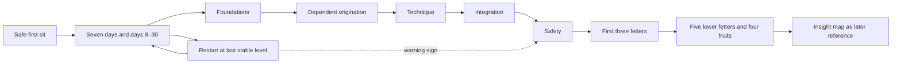
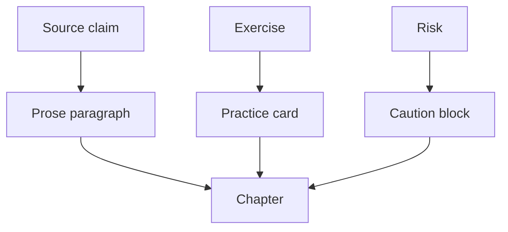
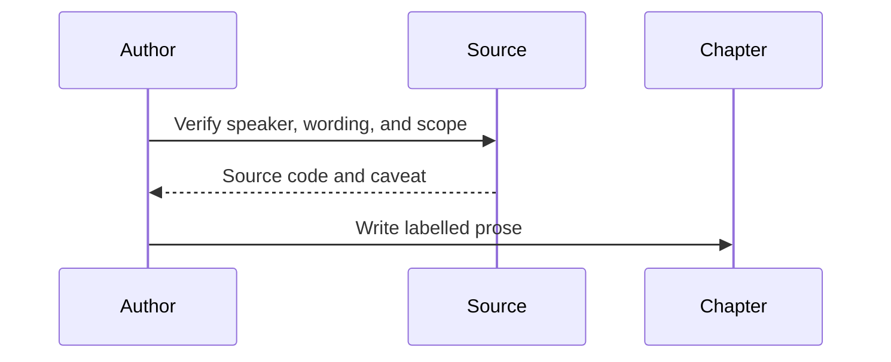

# Chapters

## Overview

Chapters carry the explanatory arc from a seven-day start and an explicit days 8–30 bridge through the full path, dependent origination at feeling and craving, Mahāsi technique, daily life, safety, a focused explanation of the first three fetters, a separate five-lower-fetters and four-fruits map, and the insight map as later reference. Prefer files below 300 lines, but do not compress sourced explanation merely to satisfy the line target.

## Key Components

- Begin with `chapter(...)`.
- Frontmatter must give a short non-linear reading route: first practice, early safety, foundations, retreat screening, then the insight map as later reference.
- Attach `source-badge(...)` or `source-line(...)` to non-obvious doctrinal claims.
- Use prose for argument and cards only for procedures, checks, or source boundaries.
- Never make a schedule, a “feeling to craving” intervention, or a phenomenological map sound universal.
- Put hard decision rules where a beginner first encounters the decision. Do not rely on a later safety or retreat chapter to repair ambiguous week-one instructions.
- Keep the pre-first-sit route short: Chapter 1 owns the local stop conditions and first action. Require the full safety chapter before intensification, prolonged solo practice, or retreat, and immediately when a local warning applies.
- The month-one bridge is editorial, not a canonical dose. Change only one variable at a time, link directly to weekly/monthly review, and preserve explicit hold, increase, reduce, and stop routes.
- Chapter 1 owns the canonical restart route after ordinary interruption. Later chapters and appendices should link to it in one line rather than restating the protocol. A stop caused by a warning sign routes to Chapter 9 instead of automatic resumption.
- In Chapter 4, let the reader try the bounded feeling-to-craving exercise and one ordinary example before presenting all twelve links. Keep the exercise visibly editorial and immediately restore the full doctrinal scope.
- Give every technical or Pāli term a plain-language gloss in the same paragraph or immediately adjacent block on first use. A rear glossary reinforces but does not rescue an opaque chapter.
- Open each chapter by carrying forward the minimum prior idea and naming the next problem. Before a dense list, orient the reader; after it, state the usable synthesis.
- Keep repeated warnings only when they add a threshold, decision rule, or source-boundary correction. Otherwise point to the full treatment.
- When explaining attainment, keep the first three fetters, the full five lower fetters, and the four fruits distinct. Chapter 10 explains the first three; Chapter 11 places them inside the full five and maps the four fruits; Chapter 12 remains a later lineage-map reference. Stream-entry cuts the first three fetters; non-returning concerns the full five lower fetters; “sa-môn quả” names the four fruits, not one vague success state.
- Keep temporary quiet, attenuation, and eradication visibly distinct. Exercises may expose a manifestation or train against its conditions, but they never diagnose that a fetter has been eradicated.
- Preserve the source distinctions between `sakkāya` and `sakkāya-diṭṭhi`, latent tendency and an arisen fetter, and exact early-discourse wording versus later Theravāda cosmological glosses.

## Diagrams (Mermaid)

### Flowchart

```mermaid
flowchart LR
  A["Safe first sit"] --> M["Seven days and days 8–30"] --> B["Foundations"] --> C["Dependent origination"] --> D["Technique"] --> E["Integration"] --> F["Safety"] --> G["First three fetters"] --> H["Five lower fetters and four fruits"] --> I["Insight map as later reference"]
  M --> R["Restart at last stable level"]
  R --> M
  R -. "warning sign" .-> F
```

### Component Diagram

```mermaid
flowchart TB
  S["Source claim"] --> P["Prose paragraph"]
  E["Exercise"] --> C["Practice card"]
  R["Risk"] --> W["Caution block"]
  P --> H["Chapter"]
  C --> H
  W --> H
```

### Sequence Diagram

```mermaid
sequenceDiagram
  participant A as Author
  participant S as Source
  participant C as Chapter
  A->>S: Verify speaker, wording, and scope
  S-->>A: Source code and caveat
  A->>C: Write labelled prose
```
