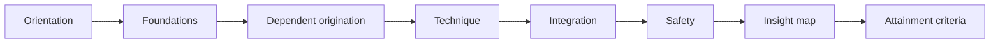
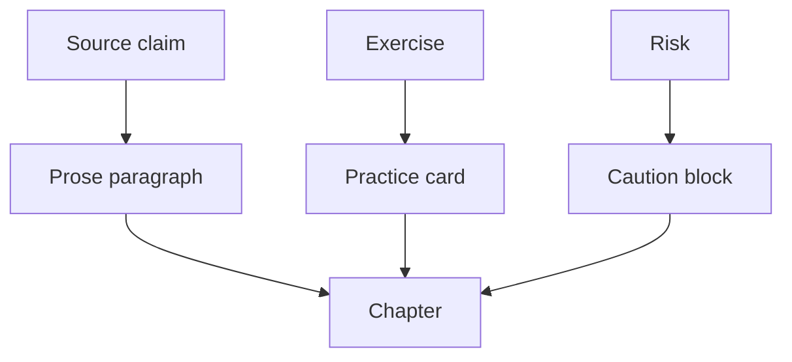
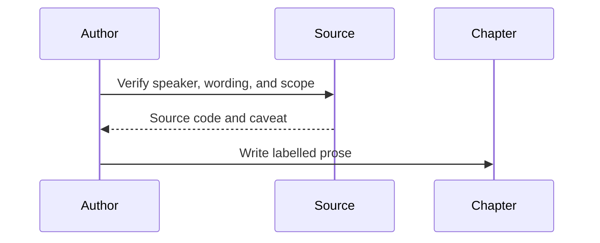

# Chapters

## Overview

Chapters carry the explanatory arc from a seven-day start through the full path, dependent origination at feeling and craving, Mahāsi technique, daily life, safety, insight maps, and canonical descriptions of stream-entry. Prefer files below 300 lines, but do not compress sourced explanation merely to satisfy the line target.

## Key Components

- Begin with `chapter(...)`.
- Frontmatter must give a short non-linear reading route: first practice, early safety, foundations, retreat screening, then the insight map as later reference.
- Attach `source-badge(...)` or `source-line(...)` to non-obvious doctrinal claims.
- Use prose for argument and cards only for procedures, checks, or source boundaries.
- Never make a schedule, a “feeling to craving” intervention, or a phenomenological map sound universal.
- Put hard decision rules where a beginner first encounters the decision. Do not rely on a later safety or retreat chapter to repair ambiguous week-one instructions.

## Diagrams (Mermaid)

### Flowchart

```mermaid
flowchart LR
  A["Orientation"] --> B["Foundations"] --> C["Dependent origination"] --> D["Technique"] --> E["Integration"] --> F["Safety"] --> G["Insight map"] --> H["Attainment criteria"]
```

### Component Diagram

```mermaid
flowchart TB
  S["Source claim"] --> P["Prose paragraph"]
  E["Exercise"] --> C["Practice card"]
  R["Risk"] --> W["Caution block"]
  P --> H["Chapter"]
  C --> H
  W --> H
```

### Sequence Diagram

```mermaid
sequenceDiagram
  participant A as Author
  participant S as Source
  participant C as Chapter
  A->>S: Verify speaker, wording, and scope
  S-->>A: Source code and caveat
  A->>C: Write labelled prose
```
