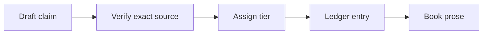
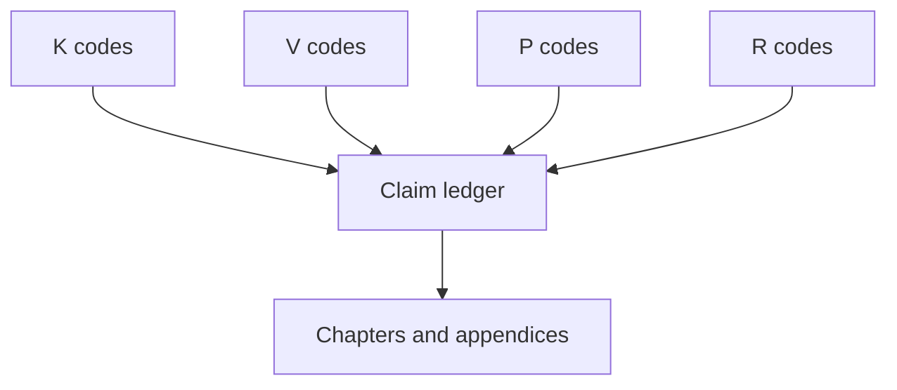
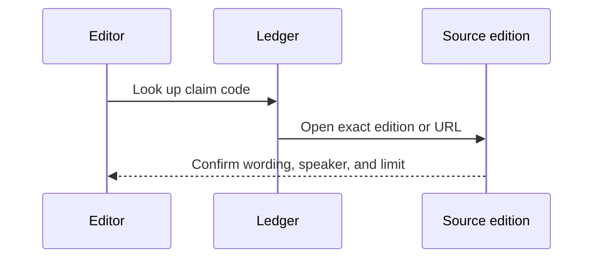

# References

## Overview

This folder holds the audit trail behind doctrinal and safety claims. It is the first stop before changing a source label, guarantee, attainment criterion, or health recommendation.

## Key Components

- `claim-ledger.md`: claim, tier, exact source, evidence strength, and caveat.
- K codes: Nikāya discourses.
- V codes: *Visuddhimagga*.
- P codes: Mahāsi works.
- R codes: modern research used only for safety.

## Diagrams (Mermaid)

### Flowchart

### Component Diagram

### Sequence Diagram

