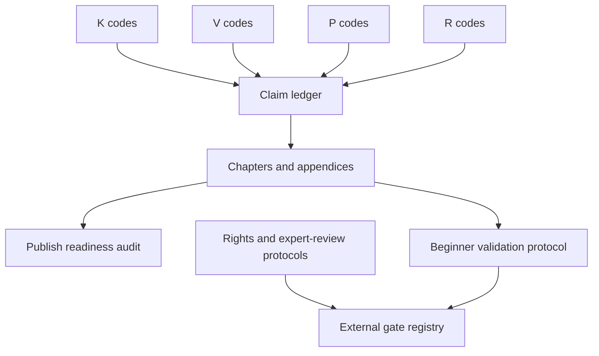
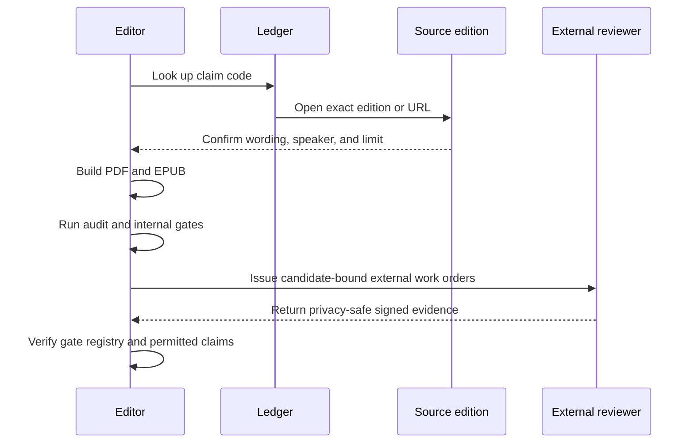

# References

## Overview

This folder holds the audit trail behind doctrinal and safety claims. It is the first stop before changing a source label, guarantee, attainment criterion, or health recommendation.

## Key Components

- `claim-ledger.md`: claim, tier, exact source, evidence strength, and caveat.
- `editorial-depth-audit.md`: chapter-level check for under-explained mechanisms, procedures, and limits.
- `publish-readiness-audit.md`: 80-item adapted CORE-EEAT scorecard; it records quality evidence but cannot establish market leadership.
- `release-evidence.md`: exact candidate hashes, tool versions, structural and visual checks, and still-open external gates.
- `external-release-packet.md`: role-based handoff and change-control sequence for all external gates.
- `external-release-gates.json`: machine-readable gate status, protocol fingerprints, evidence index, and permitted claims.
- `rights-decision-template.md`: decision record for authority, contributors, third-party material, formats, channels, and commercial scope.
- `doctrinal-review-protocol.md`: reviewer qualifications, conflicts, artifact identity, scope, severity, disposition, and signed report requirements.
- `clinical-safety-review-protocol.md`: clinical and research-safety competence, mandatory checks, findings, and signed-report requirements.
- `external-evidence/`: public, privacy-safe gate evidence only; never raw participant data.
- `beginner-validation-protocol.md`: unassisted comprehension, safety, navigation, and EPUB-reader gates for true beginners.
- `comparative-beginner-protocol.md`: preregistration draft for a rights-safe comparison against a fixed Vietnamese beginner panel.
- `beginner-reader-kit.md`: consent and moderator scripts, privacy and distress rules, fixed eight-task rubric, scenario-level fetter discrimination, and EPUB smoke-test procedure.
- `beginner-pilot-cohort-manifest.schema.json`: exact artifact and contract identity plus the ordered five-to-seven-attempt cohort ledger.
- `beginner-pilot-record.schema.json`: privacy-bounded raw-attempt structure for the eight fixed tasks and EPUB repeats.
- If the chapter explains fetters or fruits, the ledger should keep the first three fetters, the full five lower fetters, and the four fruits on separate lines with separate source codes. Do not reuse one citation to imply a larger doctrinal bundle than the source states.
- The novice fetter gate must test application, not recall alone: healthy inquiry is not automatically fetter-doubt, keeping precepts is not automatically ritual clinging, and non-aversive boundary setting is not automatically ill will.
- Never commit raw participant records. Keep them under ignored `build/beginner-pilot/`; publish only the scorer's privacy-coarsened aggregate evidence and fixed-criterion failure themes. Do not publish free-text answers or notes.
- K codes: Nikāya discourses.
- V codes: *Visuddhimagga*.
- P codes: Mahāsi works.
- R codes: modern research and authoritative health guidance used only for safety.
- Add an evidential-limit row when the book rejects a comparative claim such as “the easiest link” because the cited sources do not make that ranking.

## Diagrams (Mermaid)

### Flowchart

```mermaid
flowchart LR
  C["Draft claim"] --> V["Verify exact source"] --> T["Assign tier"] --> L["Ledger entry"] --> B["Book prose"]
  B --> U["Beginner validation"]
  U --> E["External evidence"]
  E --> G["Machine gate registry"]
  G --> R["Release decision"]
```

### Component Diagram

```mermaid
flowchart TB
  K["K codes"] --> L["Claim ledger"]
  V["V codes"] --> L
  P["P codes"] --> L
  R["R codes"] --> L
  L --> C["Chapters and appendices"]
  C --> Q["Publish readiness audit"]
  C --> U["Beginner validation protocol"]
  X["Rights and expert-review protocols"] --> G["External gate registry"]
  U --> G
```

### Sequence Diagram

```mermaid
sequenceDiagram
  participant E as Editor
  participant L as Ledger
  participant S as Source edition
  participant R as External reviewer
  E->>L: Look up claim code
  L->>S: Open exact edition or URL
  S-->>E: Confirm wording, speaker, and limit
  E->>E: Build PDF and EPUB
  E->>E: Run audit and internal gates
  E->>R: Issue candidate-bound external work orders
  R-->>E: Return privacy-safe signed evidence
  E->>E: Verify gate registry and permitted claims
```
