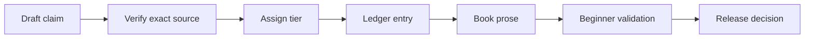
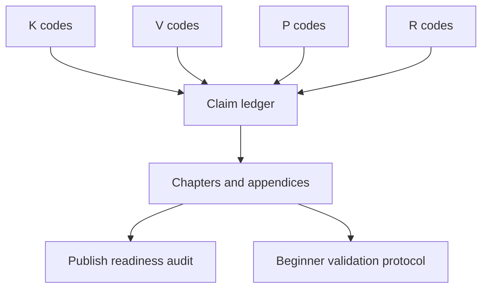
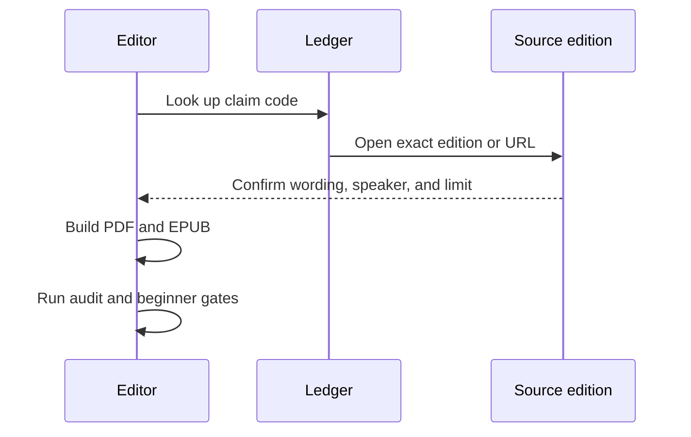

# References

## Overview

This folder holds the audit trail behind doctrinal and safety claims. It is the first stop before changing a source label, guarantee, attainment criterion, or health recommendation.

## Key Components

- `claim-ledger.md`: claim, tier, exact source, evidence strength, and caveat.
- `editorial-depth-audit.md`: chapter-level check for under-explained mechanisms, procedures, and limits.
- `publish-readiness-audit.md`: 80-item adapted CORE-EEAT scorecard; it records quality evidence but cannot establish market leadership.
- `beginner-validation-protocol.md`: unassisted comprehension, safety, navigation, and EPUB-reader gates for true beginners.
- `beginner-reader-kit.md`: facilitator script, scoring sheet, and EPUB smoke-test fields for the beginner-validation protocol.
- K codes: Nikāya discourses.
- V codes: *Visuddhimagga*.
- P codes: Mahāsi works.
- R codes: modern research used only for safety.
- Add an evidential-limit row when the book rejects a comparative claim such as “the easiest link” because the cited sources do not make that ranking.

## Diagrams (Mermaid)

### Flowchart

```mermaid
flowchart LR
  C["Draft claim"] --> V["Verify exact source"] --> T["Assign tier"] --> L["Ledger entry"] --> B["Book prose"]
  B --> U["Beginner validation"]
  U --> R["Release decision"]
```

### Component Diagram

```mermaid
flowchart TB
  K["K codes"] --> L["Claim ledger"]
  V["V codes"] --> L
  P["P codes"] --> L
  R["R codes"] --> L
  L --> C["Chapters and appendices"]
  C --> Q["Publish readiness audit"]
  C --> U["Beginner validation protocol"]
```

### Sequence Diagram

```mermaid
sequenceDiagram
  participant E as Editor
  participant L as Ledger
  participant S as Source edition
  E->>L: Look up claim code
  L->>S: Open exact edition or URL
  S-->>E: Confirm wording, speaker, and limit
  E->>E: Build PDF and EPUB
  E->>E: Run audit and beginner gates
```
