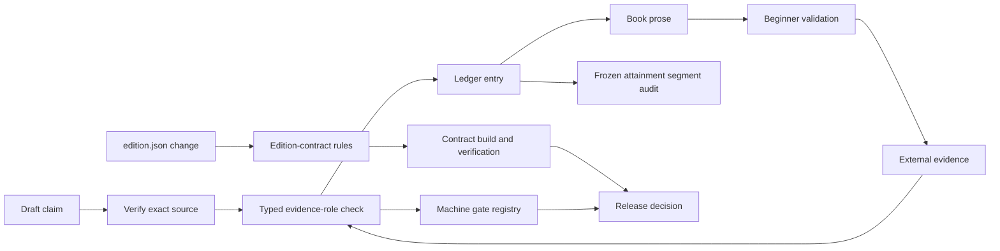
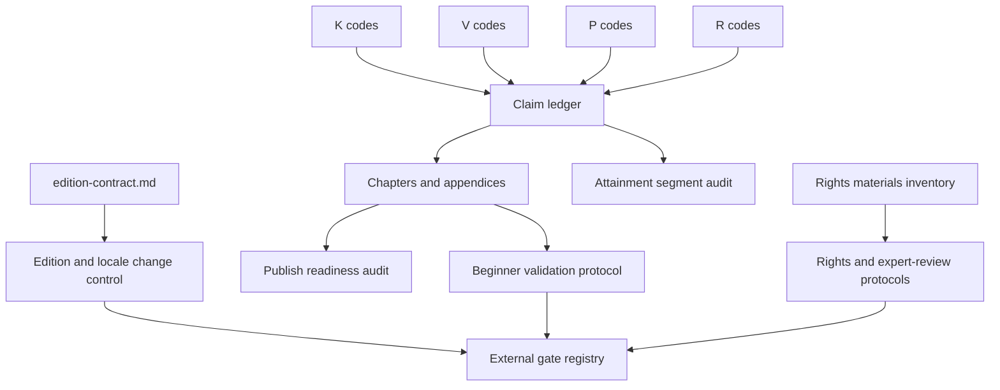
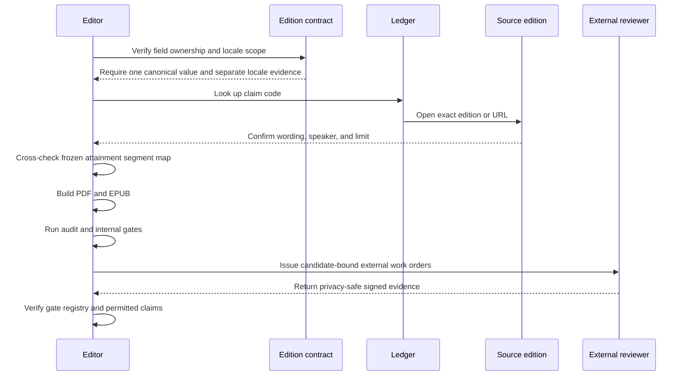

# References

## Overview

This folder holds the audit trail behind doctrinal and safety claims. It is the first stop before changing a source label, guarantee, attainment criterion, or health recommendation.

## Key Components

- `claim-ledger.md`: claim, tier, exact source, evidence strength, and caveat.
- `attainment-source-audit.md`: frozen Bilara segment map for the first three fetters, five lower fetters, four fruits, and DN 2 boundary; internal evidence only, never a substitute for independent Theravāda review.
- `edition-contract.md`: schema-v1 ownership, canonical Vietnamese publication line, future-locale requirements, build flow, and falsifiable boundaries. It documents `book/edition.json` but does not replace it as the sole authority.
- `editorial-depth-audit.md`: chapter-level check for under-explained mechanisms, procedures, and limits.
- `publish-readiness-audit.md`: 80-item adapted CORE-EEAT scorecard; it records quality evidence but cannot establish market leadership.
- `release-evidence.md`: exact candidate hashes, tool versions, structural, content-link and visual checks, and still-open external gates. Link counts describe the final EPUB bytes; they are evidence, not constants to copy into reader-facing pages.
- `external-release-packet.md`: role-based handoff and change-control sequence for all external gates, including the clean-checkout command for the deterministic coordinator ZIP; building it does not pass any gate.
- `external-release-gates.json`: schema-v3 machine-readable gate status, protocol fingerprints, typed evidence index, frozen-artifact ancestry binding, cohort/report bindings, and permitted claims.
- `rights-decision-template.md`: decision record for authority, contributors, third-party material, formats, channels, and commercial scope, plus the exact machine-readable summary required in public evidence.
- `rights-materials-inventory.md`: verified asset and license facts plus unresolved manuscript, contributor, adapted-passage, commercial-source, font, and channel decisions; it never passes the rights gate.
- `doctrinal-review-protocol.md`: reviewer qualifications, conflicts, artifact identity, scope, severity, disposition, and signed report requirements.
- `clinical-safety-review-protocol.md`: clinical and research-safety competence, mandatory checks, findings, and signed-report requirements.
- `external-evidence/`: public, privacy-safe gate evidence only; never raw participant data.
- Every terminal evidence item must declare a canonical gate-specific `role`, and its Markdown must contain exactly one matching `Evidence role:`, `PDF SHA-256:`, and `EPUB SHA-256:` line plus non-empty `Completed:`, `Signer or verifiable public confirmation:`, and `What this evidence does not establish:` fields. A rights decision additionally requires the exact scope summary in its template and cannot pass with stale inventory/source hashes, unauthorized PDF/EPUB, unresolved contributors or third-party materials, or open rights items. Required singleton roles cannot be combined in one generic file; the clinical gate may carry multiple separately bound reports of its one allowed role. Public evidence containing likely private email addresses or phone numbers is rejected.
- `beginner-validation-protocol.md`: unassisted comprehension, safety, navigation, and EPUB-reader gates for true beginners.
- `comparative-beginner-protocol.md`: preregistration draft for a rights-safe comparison against a fixed Vietnamese beginner panel.
- `beginner-reader-kit.md`: consent and moderator scripts, privacy and distress rules, fixed eight-task rubric, scenario-level fetter discrimination, and EPUB smoke-test procedure.
- `beginner-pilot-cohort-manifest.schema.json`: exact artifact and contract identity plus the ordered five-to-seven-attempt cohort ledger.
- `beginner-pilot-record.schema.json`: privacy-bounded raw-attempt structure for the eight fixed tasks and EPUB repeats.
- If the chapter explains fetters or fruits, the ledger should keep the first three fetters, the full five lower fetters, and the four fruits on separate lines with separate source codes. Do not reuse one citation to imply a larger doctrinal bundle than the source states.
- The novice fetter gate must test application, not recall alone: healthy inquiry is not automatically fetter-doubt, keeping precepts is not automatically ritual clinging, and non-aversive boundary setting is not automatically ill will. It must also test whether the reader can distinguish appropriation of experience, verified basis for the path, and misuse of a means without turning that editorial frame into three canonical stages.
- Never commit raw participant records. Keep them under ignored `build/beginner-pilot/`; publish only the scorer's privacy-coarsened aggregate evidence and fixed-criterion failure themes. Do not publish free-text answers or notes.
- The aggregate novice report must bind one cohort ID, one manifest SHA-256, and exactly five unique counted-record hashes. The EPUB reader-app report must bind the same cohort and manifest plus exactly one of those five hashes. These reports are deterministic transformations, not proof of reader identity, moderator honesty, preregistration timing, or omission-free custody.
- K codes: Nikāya discourses.
- V codes: *Visuddhimagga*.
- P codes: Mahāsi works.
- R codes: modern research and authoritative health guidance used only for safety.
- Add an evidential-limit row when the book rejects a comparative claim such as “the easiest link” because the cited sources do not make that ranking.

## Diagrams (Mermaid)

### Flowchart

```mermaid
flowchart LR
  EC["edition.json change"] --> ER["Edition-contract rules"]
  ER --> BV["Contract build and verification"]
  C["Draft claim"] --> V["Verify exact source"] --> T["Assign tier"] --> L["Ledger entry"] --> B["Book prose"]
  L --> A["Frozen attainment segment audit"]
  B --> U["Beginner validation"]
  U --> E["External evidence"]
  E --> T["Typed evidence-role check"]
  T --> G["Machine gate registry"]
  BV --> R
  G --> R["Release decision"]
```

### Component Diagram

```mermaid
flowchart TB
  D["edition-contract.md"] --> E["Edition and locale change control"]
  K["K codes"] --> L["Claim ledger"]
  V["V codes"] --> L
  P["P codes"] --> L
  R["R codes"] --> L
  L --> C["Chapters and appendices"]
  L --> A["Attainment segment audit"]
  C --> Q["Publish readiness audit"]
  C --> U["Beginner validation protocol"]
  I["Rights materials inventory"] --> X["Rights and expert-review protocols"]
  X --> G["External gate registry"]
  E --> G
  U --> G
```

### Sequence Diagram

```mermaid
sequenceDiagram
  participant E as Editor
  participant C as Edition contract
  participant L as Ledger
  participant S as Source edition
  participant R as External reviewer
  E->>C: Verify field ownership and locale scope
  C-->>E: Require one canonical value and separate locale evidence
  E->>L: Look up claim code
  L->>S: Open exact edition or URL
  S-->>E: Confirm wording, speaker, and limit
  E->>E: Cross-check frozen attainment segment map
  E->>E: Build PDF and EPUB
  E->>E: Run audit and internal gates
  E->>R: Issue candidate-bound external work orders
  R-->>E: Return privacy-safe signed evidence
  E->>E: Verify gate registry and permitted claims
```
