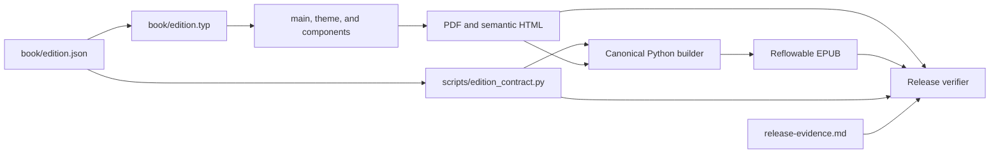

# Edition and locale contract

## Status and authority

`book/edition.json` is the sole canonical authority for the active
publication's edition and locale data. It currently uses schema version 1.
Typst files, Python scripts, tests, release records, and descriptive
documentation are consumers. None of them may become a second source of truth.

This authority is deliberately narrow. It covers publication identity,
machine-facing locale data, reader-facing interface strings, source-file
binding, and deterministic output settings. It does not own doctrinal prose,
citations, external-gate status, or claims about readers.

The current active line is Vietnamese:

| Contract field | Current value |
|---|---|
| `edition_id` | `vi-2026` |
| `metadata.language` | `vi` |
| `scope.validation_locale` | `vi-VN` |
| `publication.file_stem` | `huong-den-nhap-luu` |
| `scope.target_audience` | Người lớn Việt Nam mới bắt đầu thực hành thiền |

This table describes the checked-in contract. If it ever disagrees with
`book/edition.json`, the JSON file is authoritative and this document is stale.
The word “validation” in `validation_locale` defines the population and language
to which evidence must be bound. It does not assert that external validation
has passed.

## Schema-v1 ownership

| Object | What it owns |
|---|---|
| `schema_version` | Exact contract version. Version 1 is the only accepted value. |
| `edition_id` | Stable, lowercase identity of this publication line. |
| `metadata` | Title, author credit, BCP 47 publication language, description, keywords, and subjects. |
| `publication` | Output filename stem, identifier seed, EPUB modification time, and deterministic PDF creation timestamp. |
| `source` | Safe repository-relative manuscript path and its lowercase SHA-256. |
| `cover` | Title lines, kicker, edition label, source-bound epigraph lines and attribution, and provenance lines rendered on the cover. |
| `labels` | Reader-facing author, chapter, practice, FAQ, caution, source-link, navigation, and landmark labels. |
| `accessibility` | Cover alternative text and the EPUB accessibility summary. |
| `quality` | Locale-specific semantic text that must survive the HTML and EPUB path. |
| `scope` | BCP 47 validation locale and the intended reader population. |

Content ownership remains elsewhere:

- `book/chapters/` and `book/appendices/` own the Vietnamese reading text.
- `book/references/claim-ledger.md` owns claim-to-source traceability.
- `book/references/release-evidence.md` owns measured facts about one built
  candidate, including the hash of the exact edition contract used.
- `book/references/external-release-gates.json` owns external-gate status and
  permitted claims.

Moving a value into `edition.json` does not move the surrounding evidence or
editorial responsibility with it.

## Consumer boundary

`book/edition.typ` is a leaf adapter. It reads `edition.json` for
`book/main.typ`, `book/theme.typ`, and `book/components.typ`, and may provide
presentation-only helpers. It must not define fallback identity, locale, label,
or accessibility values.

`scripts/edition_contract.py` is the strict Python loader. The canonical builder,
release verifier, and release-evidence parser consume its immutable contract
view. Compatibility aliases in a consumer are acceptable only when they are
derived directly from that loaded view.

The semantic HTML layer has a separate component contract: repeated practice
cards and cautions expose their visible titles as named `note` objects; day
cards, reference entries, and decision nodes expose their visible titles as
named `group` objects. Each uses one unique deterministic `aria-labelledby`
target. FAQ questions remain real headings. The builder rejects a missing,
empty, external, or unresolved title target and rejects a layout-only decision
map that adds a role. This improves machine-readable structure without turning
hundreds of cards into headings or landmarks.

Schema v1 fails closed on:

- duplicate, unknown, or missing JSON keys;
- empty, multiline, surrounding-whitespace, or non-NFC strings;
- empty or duplicate string arrays;
- an unsupported schema version;
- malformed publication or validation BCP 47 tags;
- a validation locale whose primary language differs from the publication
  language;
- malformed edition or output slugs;
- a non-HTTPS identifier seed;
- a malformed UTC EPUB timestamp or non-positive PDF epoch;
- an absolute or parent-traversing manuscript path;
- a malformed source SHA-256;
- cover title lines that do not reconstruct the metadata title;
- cover alternative text that does not identify that title.

`tests/test_edition_contract.py` must exercise these rejection paths and load
the tracked Vietnamese contract. Tests should encode why drift matters: an
invalid value must stop publication rather than be repaired silently.

## Build and verification flow



Run the canonical path from the repository root:

```sh
source venv/bin/activate
python3 scripts/build-epub.py
python3 scripts/verify_release.py
```

The builder loads and validates `edition.json` before compiling, checks the
bound manuscript, and uses the same contract for generated EPUB metadata,
labels, navigation, accessibility copy, and output paths. Typst consumes the
same JSON file for document metadata, cover copy, language, and shared labels.

The verifier reloads the contract, checks that its SHA-256 matches the release
record, and compares contract-derived facts with the actual PDF and EPUB. A
standalone `typst compile` can render a document, but it does not replace the
strict Python contract gate or release verification.

Publication CI and the frozen-candidate verifier also derive the PDF and EPUB
paths from `publication.file_stem`. A second literal filename in workflow or
release-gate code would split artifact identity and must fail review.

Any intentional contract change requires a fresh canonical build, refreshed
artifact measurements in `release-evidence.md`, the edition-contract test
suite, and `scripts/verify_release.py`. External-gate status changes only when
the required human evidence exists; a metadata rebuild cannot close a gate.

## Rules for a future locale

Schema v1 describes one active publication at the fixed path
`book/edition.json`. Do not silently replace the Vietnamese line or present a
translated build as another output of the same validated product. Before
supporting parallel locales, add an explicit contract-selection mechanism,
distinct output paths, and tests that prove one locale cannot leak into another.

Every new locale must have:

1. A distinct `edition_id`, output stem, identifier seed, language, validation
   locale, and artifact identity.
2. Localized cover text, labels, alternative text, accessibility summary,
   semantic smoke text, metadata, chapters, appendices, glossary, and safety
   instructions. Changing JSON strings alone is not a translation.
3. A rights decision covering the translated manuscript, quoted source
   editions, contributors, formats, channels, and commercial scope.
4. Independent doctrinal review of the words that readers in that locale will
   receive. Approval of Vietnamese wording does not approve its translation.
5. Locale-appropriate safety review where translated terminology or local
   referral guidance can change meaning or action.
6. Fresh novice comprehension and reader-app evidence from the declared target
   population, bound to the new PDF and EPUB bytes.
7. A new release record and external-gate registry bindings. Do not copy passed
   statuses, signatures, participant records, or permitted claims from the
   Vietnamese candidate.

These are separate publication gates, not translation polish. The failure mode
is asymmetric: duplicated metadata is easy to notice, while a plausible but
misleading doctrinal or safety translation can remain hidden until a reader
acts on it.

## Falsifiable boundaries

| Claim | Observation that disproves it |
|---|---|
| `edition.json` is the sole production authority. | A Typst or Python consumer supplies an independent fallback or literal for an owned field. |
| Typst and Python consume the same edition. | A built PDF, HTML document, EPUB package, cover, label, or output path disagrees with the loaded contract. |
| The loader fails closed. | A malformed, unknown, unsafe, or internally inconsistent schema-v1 value is accepted. |
| Release evidence is bound to the contract. | `verify_release.py` accepts a release record whose edition-contract hash or artifact metadata differs. |
| Locale evidence is non-transferable. | A new locale is marked passed using Vietnamese rights, review, novice, or reader-app evidence without locale-specific work. |

A passing contract test establishes schema shape and explicit cross-field
invariants only. A successful build and verifier run establish internal
consistency between the checked-in contract and the generated candidate. They
do not establish:

- doctrinal accuracy or translation equivalence;
- rights ownership or distribution authority;
- clinical safety for every reader;
- accessibility in a particular assistive-technology stack;
- comprehension, adherence, or benefit among beginners;
- independent expert endorsement;
- spiritual attainment;
- comparative superiority or market leadership.

Those claims require the separate evidence named by the source, review,
beginner-validation, accessibility, rights, and external-release contracts.
