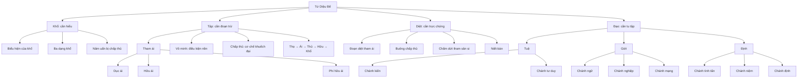

# Tứ Diệu Đế: Bản đồ vận hành của khổ và con đường nhập lưu

> **Mục tiêu của chương:** Sau khi đọc xong, người đọc có thể nhìn Tứ Diệu Đế như một bản đồ nhân quả có thể áp dụng vào trải nghiệm trực tiếp: nhận diện khổ, thấy cơ chế làm khổ sinh khởi, hiểu khổ có thể chấm dứt, và biết phải rèn luyện những gì.

Tứ Diệu Đế thường được học như bốn mệnh đề phải ghi nhớ:

1. Khổ.
2. Tập.
3. Diệt.
4. Đạo.

Cách học này đúng nhưng chưa đủ. Trong kinh, mỗi đế không chỉ là một điều cần tin; mỗi đế đi kèm với **một nhiệm vụ khác nhau**:

- **Khổ cần được hiểu đầy đủ.**
- **Tập cần được đoạn trừ.**
- **Diệt cần được trực chứng.**
- **Đạo cần được tu tập và phát triển.**

Vì vậy, Tứ Diệu Đế không phải bốn ý tưởng đứng cạnh nhau. Chúng là một vòng chẩn đoán và chữa trị:

> **Nhận ra vấn đề → tìm đúng nguyên nhân → biết có khả năng chấm dứt → rèn con đường dẫn tới chấm dứt.**

Đây là bản đồ trung tâm của chương này.

---

## 1. Bản đồ 30 giây

| Đế | Câu hỏi cốt lõi | Định nghĩa ngắn | Việc phải làm |
|---|---|---|---|
| **Khổ đế** | Điều gì đang bất toại nguyện, mong manh hoặc bị chấp thủ? | Thực trạng của khổ và tính không thể bảo đảm thỏa mãn lâu dài của các pháp hữu vi khi bị bám víu | **Hiểu** |
| **Tập đế** | Khổ này đang được nuôi bởi điều gì? | Trong công thức kinh điển, nguồn sinh khởi trực tiếp của khổ là **tham ái** | **Đoạn trừ** |
| **Diệt đế** | Nếu tham ái và chấp thủ không còn được nuôi, điều gì xảy ra? | Sự đoạn diệt của tham ái; Niết-bàn là sự chấm dứt tham, sân và si | **Trực chứng** |
| **Đạo đế** | Phải rèn những năng lực nào? | Bát Chánh Đạo, được nhóm thành giới, định và tuệ | **Tu tập** |

### Sơ đồ cây tối giản

```text
TỨ DIỆU ĐẾ
├── 1. KHỔ — cần HIỂU
│   ├── Những biểu hiện rõ: sinh, già, bệnh, chết, mất mát, bất như ý...
│   ├── Tính bất ổn của mọi trải nghiệm có điều kiện
│   └── Tóm lại: năm uẩn bị chấp thủ là khổ
│
├── 2. TẬP — cần ĐOẠN TRỪ
│   ├── Lõi kinh điển: tham ái
│   │   ├── Dục ái: muốn khoái lạc giác quan
│   │   ├── Hữu ái: muốn trở thành, tồn tại, củng cố căn tính
│   │   └── Phi hữu ái: muốn biến mất, tiêu diệt, thoát bằng cách phủ định
│   ├── Điều kiện phía trước: vô minh
│   ├── Mười hai nhân duyên: bản đồ chi tiết của sinh khởi và đoạn diệt
│   ├── Cơ chế dễ quan sát: xúc → thọ → ái → thủ → hữu → khổ
│   └── Bốn kiểu chấp thủ: dục, kiến, giới cấm thủ, ngã luận thủ
│
├── 3. DIỆT — cần TRỰC CHỨNG
│   ├── Tham ái tắt
│   ├── Chấp thủ được buông
│   ├── Tham, sân, si chấm dứt
│   └── Niết-bàn
│
└── 4. ĐẠO — cần TU TẬP
    ├── TUỆ
    │   ├── Chánh kiến
    │   └── Chánh tư duy
    ├── GIỚI
    │   ├── Chánh ngữ
    │   ├── Chánh nghiệp
    │   └── Chánh mạng
    └── ĐỊNH
        ├── Chánh tinh tấn
        ├── Chánh niệm
        └── Chánh định
```

### Sơ đồ Mermaid



> **Lưu ý về cấu trúc:** Vị trí của một giáo lý trên sơ đồ là vị trí **chức năng để học**, không phải chiếc hộp độc quyền. Ngũ uẩn làm rõ Khổ đế nhưng cũng được quán theo sinh và diệt. Duyên khởi thuận chiều làm sáng Tập đế và Khổ đế; duyên khởi theo chiều đoạn diệt làm sáng Diệt đế. Bát Chánh Đạo là Đạo đế, đồng thời cũng là phương tiện để hiểu, bỏ và chứng ba đế còn lại.

---

## 2. Những phân biệt phải làm rõ ngay từ đầu

Một sơ đồ dễ nhớ nhưng sai sẽ nguy hiểm hơn một đoạn văn khó nhớ. Có năm chỗ rất dễ bị nhập nhằng.

### 2.1 Tập đế không được định nghĩa đơn giản là “tham ái, chấp thủ và vô minh”

Trong bài kinh đầu tiên về Tứ Diệu Đế, **Tập đế được định nghĩa trực tiếp là tham ái** — gồm dục ái, hữu ái và phi hữu ái.

Vô minh và chấp thủ vẫn cực kỳ quan trọng:

- **Vô minh** là điều kiện nền khiến toàn bộ chuỗi khổ vận hành.
- **Chấp thủ** là mắt xích được tham ái nuôi dưỡng và làm cho khổ tăng cường.

Nhưng chúng không nên được trình bày như ba “thành phần ngang hàng” trong định nghĩa ngắn gọn của Tập đế.

Cách viết chính xác hơn là:

> **Tập đế có lõi là tham ái. Trong cơ chế duyên khởi, tham ái được vô minh tạo điều kiện và dẫn tới chấp thủ.**

### 2.2 “Tham ái” và “tham” gần nhau nhưng không hoàn toàn đồng nghĩa

- **Taṇhā — tham ái, khát ái:** thuật ngữ trọng tâm trong Tập đế.
- **Lobha hoặc rāga — tham, tham dục, đam mê:** những thuật ngữ rộng hơn chỉ tâm chiếm hữu, ham muốn hoặc say đắm.

Trong ngôn ngữ đời thường, có thể nói chúng cùng thuộc “họ tham”. Nhưng trong một cuốn sách hướng dẫn nhập lưu, không nên tuyên bố chúng là một từ hoàn toàn giống nhau về mọi ngữ cảnh.

### 2.3 “Si” và “vô minh” chồng lấp mạnh nhưng không phải lúc nào cũng nên thay thế máy móc

- **Moha — si:** mê mờ, lẫn lộn, không thấy đúng.
- **Avijjā — vô minh:** không biết hoặc không thấu triệt thực tại, đặc biệt là không biết Tứ Diệu Đế trong định nghĩa của duyên khởi.

Trong nhiều cách giảng, cả hai đều được dịch là “delusion/ignorance” và đều thuộc gốc mê. Để học thực hành, có thể nhớ chung là **không thấy rõ**. Để viết chính xác, nên giữ hai thuật ngữ và giải thích quan hệ thay vì khẳng định chúng luôn đồng nhất tuyệt đối.

### 2.4 Sân không phải là chấp thủ

- **Chấp thủ** là nắm chặt, đồng hóa hoặc dựa căn tính vào một đối tượng, quan điểm, quy tắc hay ý niệm về cái tôi.
- **Sân** là phản ứng chống đối, khó chịu, thù ghét hoặc muốn đẩy một trải nghiệm ra khỏi mình.

Sân thường bùng lên khi điều ta muốn bị ngăn cản hoặc điều ta bám víu bị đe dọa. Vì vậy, chúng liên hệ chặt nhưng không phải một.

### 2.5 Một khoảnh khắc bình tĩnh chưa phải là Niết-bàn

Khi tâm tạm thời không phản ứng, ta có thể thấy được **một bài học về sự không chấp thủ**. Nhưng điều đó không đủ để kết luận rằng tham, sân và si đã được nhổ tận gốc.

Cần phân biệt:

- **Tạm lắng:** phiền não không biểu hiện trong một lúc.
- **Đè nén:** phiền não bị ép xuống nhưng điều kiện vẫn còn.
- **Suy yếu:** sức mạnh và tần suất của phiền não giảm.
- **Đoạn tận:** gốc phiền não không còn khả năng sinh trở lại.

Niết-bàn trong nghĩa giải thoát không chỉ là cảm giác dễ chịu, trống rỗng hay yên tĩnh nhất thời.

---

# PHẦN I — KHỔ ĐẾ

## 3. Khổ không chỉ có nghĩa là đau đớn

Từ **dukkha** thường được dịch là “khổ”, nhưng nếu chỉ hiểu là đau thể xác hoặc buồn bã thì quá hẹp.

Dukkha bao gồm ít nhất ba chiều:

1. **Đau đớn rõ ràng:** thân đau, tâm buồn, mất mát, sợ hãi.
2. **Bất toại nguyện:** được rồi vẫn sợ mất; chưa được thì chạy theo; mất rồi thì tiếc.
3. **Không thể dùng cái vô thường làm chỗ dựa tuyệt đối:** bất cứ thứ gì do điều kiện tạo thành đều đổi khác, nên không thể bảo đảm an toàn và thỏa mãn vĩnh viễn.

Vì vậy, câu “đời là khổ” rất dễ gây hiểu lầm. Phật giáo không phủ nhận niềm vui, tình thương, sáng tạo hay cái đẹp. Điểm chính là:

> **Niềm vui có điều kiện không thể mang nổi kỳ vọng trở thành nơi nương tựa tuyệt đối. Khi ta bắt nó phải vĩnh viễn, nó trở thành nguồn căng thẳng.**

### Một ví dụ đơn giản

Bạn hoàn thành một sản phẩm và được khen.

- Cảm giác dễ chịu là thật.
- Thành tựu là thật.
- Nhưng nó thay đổi.
- Nếu tâm chuyển từ “điều này đang dễ chịu” sang “tôi phải tiếp tục được công nhận như vậy”, áp lực bắt đầu.

Khổ không nhất thiết nằm trong thành tựu. Khổ nằm trong việc bắt một hiện tượng biến đổi phải xác nhận một cái tôi cố định.

---

## 4. “Tám khổ” và danh sách trong kinh

Trong cách giảng phổ biến ở Đông Á, Khổ đế thường được tóm thành **tám khổ**:

1. Sinh.
2. Già.
3. Bệnh.
4. Chết.
5. Thương mà phải xa.
6. Ghét mà phải gặp.
7. Cầu mà không được.
8. Năm thủ uẩn — toàn bộ tiến trình thân–tâm khi bị chấp thủ.

Danh sách trong các kinh Nikāya được diễn đạt chi tiết hơn, gồm sinh, già, bệnh, chết; sầu, bi, khổ, ưu, não; gặp điều không ưa; xa điều mình yêu; không được điều mong muốn; và tóm lại, năm uẩn bị chấp thủ là khổ.

Hai cách trình bày không nhất thiết mâu thuẫn. “Tám khổ” là một cách **gộp để dễ nhớ**. Khi viết sách, nên nói rõ đây là cách nhóm phổ biến, không nên khiến người đọc tưởng rằng kinh chỉ có đúng tám dòng tách biệt.

### Diễn giải đời thường

| Nhóm khổ | Nghĩa thực tế |
|---|---|
| Sinh | Bước vào một tiến trình thân–tâm luôn cần được duy trì và dễ tổn thương |
| Già | Năng lực, hình thể và quyền kiểm soát suy giảm |
| Bệnh | Thân không tuân theo ý muốn |
| Chết | Mọi sở hữu, vai trò và quan hệ trong đời này bị buộc phải buông |
| Gặp điều không ưa | Không thể kiểm soát hoàn toàn môi trường, người khác và cảm giác |
| Xa điều mình yêu | Mọi quan hệ và trạng thái quý giá đều chịu vô thường |
| Cầu không được | Thực tại không có nghĩa vụ phục vụ mong muốn của ta |
| Năm uẩn bị chấp thủ | Toàn bộ kinh nghiệm thân–tâm bị nắm thành “tôi” và “của tôi” |

---

## 5. Ba dạng khổ

Một cách phân tích truyền thống khác chia dukkha thành ba dạng.

### 5.1 Khổ khổ — đau vì bản thân trải nghiệm đã khó chịu

Ví dụ:

- Đau răng.
- Mất người thân.
- Bị xúc phạm.
- Lo âu.
- Kiệt sức.

Đây là dạng dễ nhận ra nhất.

### 5.2 Hoại khổ — khổ vì cái dễ chịu thay đổi

Ví dụ:

- Cuộc vui kết thúc.
- Sức khỏe giảm.
- Một mối quan hệ đổi khác.
- Thành công cũ không còn đủ để làm ta hài lòng.

Điều dễ chịu không sai. Khổ phát sinh khi tâm đòi nó phải tồn tại theo ý mình.

### 5.3 Hành khổ — tính bất ổn của mọi pháp hữu vi

“Hành” ở đây chỉ những gì do điều kiện tạo nên. Vì phụ thuộc điều kiện, chúng không hoàn toàn nằm dưới quyền kiểm soát và không thể là một nền an toàn tuyệt đối.

Đây là lớp tinh tế nhất. Một ngày có vẻ hoàn toàn ổn vẫn mang tính hành khổ vì:

- Thân đang đổi.
- Tâm đang đổi.
- Hoàn cảnh đang đổi.
- Những điều ta dựa vào đang đổi.

Thấy hành khổ không có nghĩa là bi quan. Nó có nghĩa là **ngừng đòi cái không bền phải làm nhiệm vụ của cái bất biến**.

---

## 6. Năm uẩn là gì?

Kinh tóm tắt Khổ đế bằng câu: **năm uẩn bị chấp thủ là khổ**.

Năm uẩn là năm nhóm hoạt động dùng để phân tích trải nghiệm:

1. **Sắc — rūpa:** thân thể và phương diện vật chất.
2. **Thọ — vedanā:** sắc thái dễ chịu, khó chịu hoặc trung tính.
3. **Tưởng — saññā:** nhận dạng, phân biệt, ghi dấu và gắn nhãn.
4. **Hành — saṅkhāra:** ý định, khuynh hướng, phản ứng tạo tác và các cấu trúc tâm lý có điều kiện.
5. **Thức — viññāṇa:** sự nhận biết tương ứng với mắt, tai, mũi, lưỡi, thân và ý.

### 6.1 Sắc — cái được trải nghiệm như thân và vật chất

Ví dụ:

- Cảm giác bàn chân chạm đất.
- Hơi nóng trong mặt khi tức giận.
- Tim đập nhanh.
- Âm thanh của một câu nói.

Sắc không phải “cái tôi”. Nó là tiến trình vật chất thay đổi theo thức ăn, nhiệt độ, tuổi tác, bệnh tật và vô số điều kiện.

### 6.2 Thọ — dễ chịu, khó chịu hoặc trung tính

Thọ không đồng nghĩa với cảm xúc phức tạp. Nó là “tông” cơ bản của trải nghiệm:

- Dễ chịu.
- Khó chịu.
- Không rõ dễ chịu hay khó chịu.

Thọ là một mắt xích cực kỳ quan trọng vì từ thọ, tham ái thường sinh:

- Dễ chịu → muốn giữ.
- Khó chịu → muốn đẩy.
- Trung tính → lơ mơ, chán, tìm kích thích.

### 6.3 Tưởng — nhận ra và gắn nhãn

Tưởng giúp ta nhận ra:

- Đây là giọng của người quen.
- Đây là lời phê bình.
- Đây là nguy hiểm.
- Đây là cơ hội.

Tưởng hữu ích nhưng có thể sai. Tâm có thể gắn nhãn “họ coi thường tôi” khi dữ kiện chỉ là một câu hỏi trung tính.

### 6.4 Hành — những tạo tác và khuynh hướng phản ứng

Hành bao gồm các ý định, thói quen tâm và phản ứng được hình thành:

- Muốn phản công.
- Muốn trốn.
- Muốn làm vừa lòng.
- Lập kế hoạch.
- Tự kể một câu chuyện về mình.

Hành là nơi quá khứ huấn luyện hiện tại. Mỗi lần lặp lại một phản ứng, ta làm cho con đường đó dễ được kích hoạt hơn lần sau.

### 6.5 Thức — sự nhận biết qua sáu cửa

Có nhãn thức, nhĩ thức, tỷ thức, thiệt thức, thân thức và ý thức. Thức không nên được hình dung ngay thành một “người quan sát” thường hằng đứng sau mọi trải nghiệm. Trong phân tích ngũ uẩn, thức cũng sinh khởi tùy điều kiện.

---

## 7. Năm uẩn khác với năm uẩn bị chấp thủ

Đây là một phân biệt quan trọng.

- **Năm uẩn** là các nhóm hoạt động của trải nghiệm.
- **Năm uẩn bị chấp thủ** là những hoạt động ấy khi bị nắm bằng tham dục, đồng hóa và quan niệm “tôi” hoặc “của tôi”.

Chấp thủ không hoàn toàn đồng nhất với năm uẩn, cũng không phải một vật tách biệt nằm bên ngoài. Có thể hiểu nó là **dục và đam mê hướng vào năm uẩn**.

Ví dụ:

- Sắc: “Cơ thể này phải luôn trẻ và hấp dẫn thì tôi mới có giá trị.”
- Thọ: “Tôi phải cảm thấy dễ chịu; khó chịu là không thể chấp nhận.”
- Tưởng: “Cách tôi nhìn sự việc chắc chắn là thực tại.”
- Hành: “Thói quen và ý muốn này chính là con người thật của tôi.”
- Thức: “Có một chủ thể nhận biết bất biến ở đây; đó là tôi.”

Điều cần thấy không phải “năm uẩn xấu”. Điều cần thấy là quá trình lấy năm uẩn làm nền cho một căn tính cần được bảo vệ.

---

## 8. Bài tập nhận diện Khổ đế

Khi khổ đang có mặt, hỏi:

1. **Dữ kiện trực tiếp là gì?**
2. **Thọ đang dễ chịu, khó chịu hay trung tính?**
3. **Tâm đã thêm câu chuyện nào?**
4. **Tôi đang đòi điều gì phải khác đi thì tôi mới ổn?**
5. **Tôi đang bám vào uẩn nào như “tôi” hoặc “của tôi”?**

Mục tiêu chưa phải giải quyết ngay. Nhiệm vụ của Khổ đế trước tiên là **hiểu đúng cái đang xảy ra**.

---

# PHẦN II — TẬP ĐẾ

## 9. Định nghĩa cốt lõi: tham ái làm khổ sinh khởi

Trong công thức Tứ Diệu Đế, Tập đế chỉ tham ái có tính tái tạo sự trở thành, đi cùng đam mê và tìm kiếm thỏa mãn hết chỗ này đến chỗ khác.

Ba dạng được nêu rõ:

1. **Dục ái — kāma-taṇhā.**
2. **Hữu ái — bhava-taṇhā.**
3. **Phi hữu ái — vibhava-taṇhā.**

Điểm cốt lõi không phải “có mong muốn là sai”. Điểm cốt lõi là một dạng khát khao nói rằng:

> **Tôi phải có, phải trở thành, hoặc phải thoát khỏi điều này thì mới ổn.**

---

## 10. Ba dạng tham ái

### 10.1 Dục ái — muốn được kích thích và thỏa mãn giác quan

Đối tượng có thể là:

- Đồ ăn.
- Tình dục.
- Hình ảnh.
- Âm nhạc.
- Tiền bạc.
- Cảm giác được khen.
- Thông báo trên điện thoại.
- Cảm giác chiến thắng trong tranh luận.

Dục ái không chỉ nằm trong vật. Nó thường nằm trong **tưởng tượng và kế hoạch về khoái lạc**.

Dấu hiệu thực tế:

- “Chỉ xem thêm một video nữa.”
- “Chỉ khi họ công nhận tôi thì tôi mới yên.”
- “Tôi cần cảm giác này tiếp tục.”

### 10.2 Hữu ái — muốn trở thành, tồn tại và củng cố một căn tính

Ví dụ:

- Muốn trở thành người thành công.
- Muốn được xem là thông minh.
- Muốn mình là người tu giỏi.
- Muốn bảo vệ hình ảnh “tôi là người đúng”.
- Muốn một trạng thái thiền đặc biệt xác nhận mình đã đạt gì đó.

Hữu ái đặc biệt tinh tế vì nó có thể đội lốt phát triển bản thân hoặc tu tập.

Không phải mọi nỗ lực trở nên tốt hơn đều là hữu ái. Vấn đề xuất hiện khi kết quả bị biến thành điều kiện để cái tôi được tồn tại và an toàn.

### 10.3 Phi hữu ái — muốn biến mất, tiêu diệt hoặc thoát bằng phủ định

Ví dụ:

- Muốn một cảm xúc biến mất ngay lập tức.
- Muốn xóa bỏ một phần con người mình vì ghét nó.
- Muốn hủy một quan hệ chỉ để không phải cảm thấy tổn thương.
- Muốn ngủ, say, lướt mạng hoặc làm việc quá mức để không phải tiếp xúc với tâm.
- Muốn “không còn là tôi” theo cách thù ghét chính mình.

Phi hữu ái không đồng nghĩa với mọi ý muốn chấm dứt điều xấu. Muốn bỏ thuốc lá, dừng bạo lực hoặc kết thúc một hành vi gây hại có thể là trí tuệ. Phi hữu ái mang chất **xua đuổi và phủ định vì không chịu nổi trải nghiệm**.

---

## 11. Không phải mọi mong muốn đều là tham ái

Nếu mọi mong muốn đều phải bị tiêu diệt, người ta không thể muốn giữ giới, muốn học Pháp hoặc muốn giúp người.

Trong Phật giáo có khái niệm **chanda**, có thể hiểu là ý muốn, hứng thú hoặc chủ ý làm. Tùy bối cảnh, nó có thể thiện hoặc bất thiện. Một khát vọng lành mạnh có thể hướng tới:

- Hiểu rõ hơn.
- Làm điều thiện.
- Bảo vệ gia đình mà không chiếm hữu.
- Hoàn thành công việc hữu ích.
- Đoạn trừ thói quen gây hại.

Một phép thử thực tế:

| Thiện ý hoặc thiện dục | Tham ái |
|---|---|
| Có mục tiêu nhưng vẫn tiếp xúc được với thực tại | Bắt thực tại phải phục vụ mục tiêu |
| Có thể thay đổi phương tiện | Đồng hóa bản thân với kết quả |
| Thất bại tạo dữ liệu | Thất bại trở thành đe dọa căn tính |
| Nỗ lực đi cùng tỉnh táo | Nỗ lực đi cùng co thắt và cưỡng ép |
| Sẵn sàng buông khi thấy gây hại | Tiếp tục vì không chịu mất |

Đây không phải phép đo tuyệt đối. Một hành động thường chứa nhiều động lực trộn lẫn. Điều cần làm là nhìn xem động lực nào đang được nuôi.

---

## 12. Vô minh đứng ở đâu?

Trong duyên khởi, vô minh là điều kiện nền cho các tạo tác và toàn bộ tiến trình dẫn tới khổ.

Một định nghĩa thực hành của vô minh là:

> **Không thấy trải nghiệm theo Tứ Diệu Đế: không nhận ra đâu là khổ, đâu là nguồn sinh khổ, đâu là sự chấm dứt và đâu là con đường.**

Vô minh không chỉ có nghĩa là thiếu kiến thức sách vở. Một người có thể thuộc lòng toàn bộ thuật ngữ nhưng vẫn vô minh ngay trong khoảnh khắc:

- Biết giận là khổ nhưng vẫn xem cơn giận là “tôi đúng”.
- Biết mọi thứ vô thường nhưng vẫn đòi người thân không được thay đổi.
- Biết chấp thủ gây đau nhưng vẫn nắm quan điểm để bảo vệ căn tính.

Ngược lại, trí tuệ không chỉ là có một quan điểm đúng. Nó là thấy rõ nhân quả đến mức cách phản ứng thay đổi.

---

## 13. Từ thọ tới khổ: đoạn duyên khởi có thể quan sát trực tiếp

Toàn bộ mười hai nhân duyên là một hệ thống sâu. Để thực hành trong đời thường, có thể bắt đầu bằng đoạn dễ quan sát dưới đây. Đây là **cách đọc ở độ phân giải tâm lý ngay trong hiện tại**; nó giúp nhận ra cơ chế phản ứng, nhưng không thay thế toàn bộ phạm vi của duyên khởi trong kinh:

```text
Xúc → Thọ → Ái → Thủ → Hữu → Sinh → Khổ
```

### 13.1 Xúc — sự gặp nhau của căn, cảnh và thức

Ví dụ: tai nghe một câu phê bình.

### 13.2 Thọ — sắc thái dễ chịu, khó chịu hoặc trung tính

Câu phê bình tạo thọ khó chịu.

### 13.3 Ái — muốn nắm, muốn đẩy hoặc muốn trở thành

- Muốn lời khen thay cho lời phê bình.
- Muốn cảm giác khó chịu biến mất.
- Muốn trở thành người thắng cuộc tranh luận.

### 13.4 Thủ — nắm chặt

- “Tôi là người có năng lực; họ không được nghi ngờ tôi.”
- “Quan điểm này là tôi.”
- “Tôi phải chứng minh mình đúng.”

### 13.5 Hữu — tiến trình trở thành được hình thành trong phản ứng

Trong khoảnh khắc đó, ta “trở thành” người bị xúc phạm, người tự vệ, người phải thắng.

### 13.6 Sinh — một vai trò và thế giới phản ứng được “sinh” ra

Một thế giới có “tôi đúng” và “kẻ chống tôi” được sinh ra.

### 13.7 Khổ — hệ quả

Căng thân, lời nói gây hại, nhai lại trong đầu, quan hệ xấu đi.

### Điểm can thiệp rẻ nhất

Thường không cần chờ đến cuối chuỗi. Ngay tại **thọ**, có thể biết:

> “Khó chịu đang có mặt.”

Nếu chưa chuyển ngay sang “tôi bị xúc phạm”, không gian lựa chọn xuất hiện.

---

## 14. Mười hai nhân duyên nằm ở đâu trong Tứ Diệu Đế?

Mười hai nhân duyên không phải một giáo lý cạnh tranh với Tứ Diệu Đế. Có thể hiểu chúng như hai độ phóng đại của cùng một vấn đề:

- **Tứ Diệu Đế** cho biết bốn nhiệm vụ: hiểu khổ, bỏ nguồn khổ, chứng sự chấm dứt và tu con đường.
- **Duyên khởi** cho thấy chi tiết hơn cách các điều kiện nương nhau làm toàn bộ khối khổ sinh và diệt.

### 14.1 Chuỗi mười hai chi

```text
1. Vô minh
    ↓
2. Hành
    ↓
3. Thức
    ↓
4. Danh–sắc
    ↓
5. Sáu xứ
    ↓
6. Xúc
    ↓
7. Thọ
    ↓
8. Ái
    ↓
9. Thủ
    ↓
10. Hữu
    ↓
11. Sinh
    ↓
12. Già–chết, sầu, bi, khổ, ưu, não
```

| Chi | Pāli | Nghĩa ngắn để định hướng |
|---|---|---|
| **Vô minh** | avijjā | Không thấy đúng Tứ Đế và quan hệ nhân quả của khổ |
| **Hành** | saṅkhāra | Các tạo tác có chủ ý được vô minh điều kiện hóa |
| **Thức** | viññāṇa | Sự nhận biết phân biệt sinh tùy điều kiện |
| **Danh–sắc** | nāma-rūpa | Phương diện tâm lý và vật chất của kinh nghiệm |
| **Sáu xứ** | saḷāyatana | Mắt, tai, mũi, lưỡi, thân và ý |
| **Xúc** | phassa | Sự gặp nhau của căn, cảnh và thức tương ứng |
| **Thọ** | vedanā | Dễ chịu, khó chịu hoặc trung tính |
| **Ái** | taṇhā | Khát cầu khoái lạc, hiện hữu hoặc phi hiện hữu |
| **Thủ** | upādāna | Nắm chặt và lấy làm nền cho căn tính |
| **Hữu** | bhava | Tiến trình hiện hữu hoặc trở thành; trong cách đọc thực hành, một kiểu căn tính đang được tạo |
| **Sinh** | jāti | Sự sinh và xuất hiện của các uẩn, các xứ; trong cách đọc thực hành, sự “sinh” của một vai trò hoặc căn tính |
| **Già–chết và khối khổ** | jarāmaraṇa… | Sự suy hoại và toàn bộ hệ quả khổ đi kèm |

### 14.2 Chiều sinh khởi và chiều đoạn diệt

Duyên khởi không chỉ nói “cái này làm cái kia sinh”. Nó cũng nêu chiều chấm dứt:

```text
Vô minh diệt → hành diệt → ... → ái diệt → thủ diệt
→ hữu diệt → sinh diệt → già–chết và toàn bộ khối khổ diệt
```

Do đó, đặt mười hai nhân duyên hoàn toàn dưới Tập đế là tiện cho sơ đồ nhưng chưa đủ chính xác:

- **Thuận chiều** giải thích Tập và kết quả là Khổ.
- **Chiều đoạn diệt** giải thích Diệt.
- **Đạo** tạo các điều kiện trí tuệ, giới và định để chuỗi không tiếp tục vận hành như cũ.

### 14.3 Có phải chuỗi chỉ diễn ra qua ba đời?

Các truyền thống diễn giải duyên khởi ở nhiều thang thời gian. Một cách giải thích phổ biến đặt các chi qua đời trước, đời này và đời sau. Một cách đọc thực hành quan sát một phần chuỗi ngay trong hiện tại: xúc, thọ, ái, thủ, hữu và sự “sinh” của một căn tính phản ứng.

Không cần ép hai cách đọc thành một lựa chọn tuyệt đối trong chương nhập môn. Điều chắc chắn và thực dụng hơn là:

1. Kinh trình bày chuỗi như quan hệ điều kiện.
2. Một đoạn quan trọng của chuỗi có thể được quan sát ngay trong kinh nghiệm.
3. Không nên lấy cách đọc từng-khoảnh-khắc làm lý do phủ định toàn bộ chiều tái sinh của văn bản kinh; cũng không nên lấy mô hình ba đời làm lý do bỏ qua cơ chế đang xảy ra trước mắt.

### 14.4 Điểm nối với ngũ uẩn

Ngũ uẩn và duyên khởi không phải hai bộ phận rời nhau:

- “Sinh” được mô tả cùng với sự xuất hiện của các uẩn và các xứ.
- Thọ, hành và thức xuất hiện trực tiếp trong cả hai bản đồ.
- Chấp thủ hướng vào năm uẩn biến tiến trình thân–tâm thành nền cho thân kiến.

Có thể nhớ:

> **Ngũ uẩn trả lời: trải nghiệm đang gồm những hoạt động nào? Duyên khởi trả lời: các hoạt động ấy nương điều kiện nào để làm khổ sinh và diệt?**

### 14.5 Cách dùng mười hai nhân duyên mà không bị ngợp

Đừng cố quan sát đủ mười hai chi trong mỗi phản ứng. Bắt đầu bằng đoạn có độ phân giải cao nhất trong đời thường:

```text
Xúc → Thọ → Ái → Thủ
```

- Có điều gì vừa chạm vào sáu căn?
- Thọ nào xuất hiện?
- Tâm muốn nắm hay đẩy gì?
- Ý niệm “tôi” và “của tôi” đang được dựng ở đâu?

Nếu thấy rõ đoạn này, người thực hành đã chạm vào động cơ của toàn bộ bản đồ thay vì chỉ ghi nhớ mười hai danh từ.

---

## 15. Bốn kiểu chấp thủ

Trong duyên khởi, ái làm điều kiện cho thủ. Kinh phân tích bốn kiểu thủ.

### 15.1 Dục thủ — bám vào khoái lạc giác quan

Không chỉ hưởng thụ, mà là tin rằng khoái lạc ấy cần thiết để mình ổn.

### 15.2 Kiến thủ — bám vào quan điểm

- “Tôi không thể sai.”
- “Chỉ hệ thống của tôi mới đúng.”
- “Nếu quan điểm này sụp, tôi sụp.”

Có chánh kiến không đồng nghĩa với không có quan điểm nào. Khác biệt nằm ở việc dùng quan điểm như công cụ thấy đúng hay dùng nó làm căn tính.

### 15.3 Giới cấm thủ — bám vào quy tắc và nghi thức như thể tự chúng đủ giải thoát

Không phải giữ giới là sai. Giới là phần thiết yếu của con đường. Sai lầm là tin rằng:

- Chỉ làm đúng nghi thức là đủ.
- Chỉ tích lũy hình thức là đủ.
- Một hành vi bên ngoài tự động thanh lọc tâm bất kể động cơ và trí tuệ.

### 15.4 Ngã luận thủ — bám vào học thuyết hay cách định nghĩa về cái tôi

Ví dụ:

- Tôi chính là thân này.
- Tôi sở hữu một tâm bất biến.
- Có một “người quan sát” thường hằng đứng sau mọi kinh nghiệm.
- Tôi là kiểu người như thế này và không thể khác.

Đây không chỉ là triết học. Nó biểu hiện trong hàng trăm câu nhỏ: “Tôi luôn thế”, “Đó là con người thật của tôi”, “Không ai được làm tôi mất mặt”.

---

## 16. Ba độc đứng ở đâu trong bản đồ?

Ba độc hoặc ba gốc bất thiện là:

1. **Tham — lobha/rāga.**
2. **Sân — dosa/paṭigha.**
3. **Si — moha.**

Chúng là một bản đồ rất hữu ích về động lực bất thiện, nhưng không nên đồng nhất cơ học với ba thành phần của Tập đế.

### Quan hệ gần đúng

| Ba độc | Liên hệ với Tứ Diệu Đế |
|---|---|
| Tham | Gần với tham ái, muốn nắm và hưởng |
| Sân | Gần với muốn đẩy, chống và tiêu diệt; có thể biểu hiện trong phi hữu ái |
| Si | Gần với vô minh, không thấy đúng cơ chế |

Cách hiểu vận hành:

```text
Si: không thấy rõ
        ↓
Tham: kéo vào / muốn giữ
Sân: đẩy ra / muốn loại bỏ
        ↓
Hành động và khổ tiếp diễn
```

Nhưng thực tế ba thứ thường trộn nhau. Ví dụ, cơn giận có thể chứa:

- Tham được công nhận.
- Sân với người cản trở.
- Si về điều đang thật sự xảy ra.

---

## 17. Bài tập nhận diện Tập đế

Khi khổ xuất hiện, hỏi:

1. **Tôi đang muốn nắm điều gì?**
2. **Tôi đang muốn đẩy điều gì?**
3. **Tôi đang muốn trở thành ai?**
4. **Tôi đang muốn xóa bỏ phần nào của trải nghiệm?**
5. **Tôi đang biến quan điểm, cảm giác hay vai trò nào thành “tôi”?**
6. **Tôi đang không thấy điều gì?**

Một câu hỏi sắc hơn:

> **“Điều gì phải xảy ra thì tôi mới cho phép mình ổn?”**

Câu trả lời thường chỉ thẳng vào tham ái và chấp thủ.

---

# PHẦN III — DIỆT ĐẾ

## 18. Diệt đế là gì?

Diệt đế là sự đoạn diệt không dư sót của chính tham ái ấy: từ bỏ, buông ra, giải thoát và không còn bám giữ nó.

Trong cách nói ngắn:

> **Khi nguyên nhân không còn được tạo, hệ quả chấm dứt.**

Diệt đế không phải một mệnh lệnh “đừng cảm thấy gì”. Nó cũng không phải làm cho con người trở nên lạnh lùng. Điều chấm dứt là cơ chế bắt trải nghiệm phải phục vụ cái tôi:

- Không cần nắm khoái lạc để được an toàn.
- Không cần đẩy đau đớn bằng thù ghét.
- Không cần tạo một căn tính để có chỗ đứng.

---

## 19. Diệt đế và Niết-bàn

Trong cấu trúc Tứ Diệu Đế, Diệt đế chỉ sự chấm dứt của tham ái. Ở những kinh khác, Niết-bàn được định nghĩa là sự chấm dứt tham, sân và si.

Hai cách diễn đạt bổ sung nhau:

- Tứ Diệu Đế nhấn vào **tham ái** như nguồn sinh khổ.
- Công thức ba độc nhấn vào **toàn bộ ba gốc bất thiện** được đoạn tận.

Do đó có thể viết:

> **Diệt đế là Niết-bàn: tham ái và chấp thủ được đoạn tận; tham, sân và si không còn vận hành.**

Nhưng không nên suy ngược rằng định nghĩa kinh điển của Tập đế là một danh sách ba mục “tham ái, chấp thủ, vô minh”. Đó là hai cách cắt bản đồ ở hai vị trí khác nhau.

---

## 20. Niết-bàn không nên bị thu nhỏ thành một trạng thái tâm dễ chịu

Có ba sai lầm thường gặp.

### 20.1 Đồng nhất Niết-bàn với thư giãn

Thư giãn có điều kiện. Niết-bàn không chỉ là cơ thể bớt căng.

### 20.2 Đồng nhất Niết-bàn với trống rỗng hoặc không suy nghĩ

Tâm ít suy nghĩ có thể là định, mệt mỏi hoặc đờ đẫn. Nó không tự động là giải thoát.

### 20.3 Đồng nhất Niết-bàn với một khoảnh khắc không phản ứng

Một khoảnh khắc không nuôi sân là rất có giá trị. Nó cho thấy khổ phụ thuộc điều kiện. Nhưng từ đó tới đoạn tận phiền não là một khoảng cách lớn.

### Cách dùng trải nghiệm nhỏ đúng đắn

Không nên nói:

> “Tôi vừa không phản ứng, vậy tôi đã kinh nghiệm Niết-bàn hoàn toàn.”

Có thể nói:

> “Trong khoảnh khắc không nuôi phản ứng, khổ giảm. Điều này củng cố hiểu biết rằng khổ phụ thuộc vào điều kiện.”

Cách nói thứ hai vừa thành thật vừa hữu ích.

---

## 21. Diệt đế không phải hư vô

Phi hữu ái muốn tiêu diệt trải nghiệm hoặc cái tôi vì ghét bỏ. Diệt đế là chấm dứt chính lực tham và sân ấy.

Khác biệt:

| Phi hữu ái | Diệt đế |
|---|---|
| “Tôi muốn cái này biến mất vì tôi không chịu nổi.” | Thấy rõ, không nuôi ái và thủ |
| Có co thắt, chống đối | Có buông và không đồng hóa |
| Muốn hủy một đối tượng | Chấm dứt cơ chế tạo khổ |
| Vẫn đặt “tôi” ở trung tâm | Không dựng thêm căn tính để bảo vệ |

---

## 22. Bài tập nhận diện một phần của Diệt đế

Khi ái đang có mặt, thử không nuôi nó trong mười giây:

1. Cảm nhận thọ trực tiếp trong thân.
2. Không thêm câu “tôi phải thoát”.
3. Không hành động ngay.
4. Quan sát ái thay đổi thế nào.
5. Nhận ra phần khổ nào giảm khi không đồng hóa.

Bài tập này không chứng minh chứng ngộ. Nó mua cho người thực hành một mẩu thông tin trực tiếp:

> **Khổ không hoàn toàn nằm trong đối tượng; một phần quan trọng nằm trong cách tâm nắm và chống.**

---

# PHẦN IV — ĐẠO ĐẾ

## 23. Bát Chánh Đạo là “dòng” dẫn tới nhập lưu

Trong một bài kinh về nhập lưu, “dòng” được xác định chính là Bát Chánh Đạo. Người nhập dòng là người thành tựu dòng ấy ở cấp độ siêu thế, không chỉ là người biết tên tám chi.

Bát Chánh Đạo không nên được hiểu như tám bậc thang phải hoàn thành xong từng cái rồi mới sang cái kế tiếp. Các chi hỗ trợ lẫn nhau:

- Chánh kiến định hướng tinh tấn.
- Giới làm tâm ít hối hận.
- Niệm nhận ra tâm đang đi sai.
- Định làm kiến sâu hơn.
- Kiến sâu lại thanh lọc ngữ, nghiệp và mạng.

### “Chánh” nghĩa là gì?

“Chánh” không chỉ có nghĩa là đúng theo quy ước hoặc được một thẩm quyền cho phép. Trong ngữ cảnh con đường, nó có nghĩa là **đúng hướng, thích hợp và hòa hợp với sự chấm dứt khổ**.

---

## 24. Ba nhóm lớn: Giới, Định và Tuệ

| Nhóm | Chi đạo | Chức năng |
|---|---|---|
| **Tuệ** | Chánh kiến, Chánh tư duy | Thấy đúng và hướng tâm đúng |
| **Giới** | Chánh ngữ, Chánh nghiệp, Chánh mạng | Ngăn thân và lời tạo thêm khổ |
| **Định** | Chánh tinh tấn, Chánh niệm, Chánh định | Huấn luyện tâm đủ ổn định và sáng để thấy rõ |

Cách nhớ một từ cho tám chi:

```text
THẤY — HƯỚNG — NÓI — LÀM — NUÔI — RÈN — NHỚ-BIẾT — VỮNG
```

---

## 25. Chánh kiến — THẤY

### Định nghĩa ngắn

> **Thấy trải nghiệm theo nhân quả và Tứ Diệu Đế.**

Trong định nghĩa trực tiếp của Bát Chánh Đạo, Chánh kiến là biết:

- Đây là khổ.
- Đây là nguồn sinh khổ.
- Đây là sự chấm dứt khổ.
- Đây là con đường dẫn tới chấm dứt.

Ở nghĩa rộng hơn, Chánh kiến còn bao gồm hiểu rằng hành động có hệ quả và ý định có sức định hình tâm.

### Ba nhánh dễ nhớ

1. **Nhân quả:** hành động và cách chú ý tạo hệ quả.
2. **Tứ đế:** phân biệt vấn đề, nguyên nhân, kết thúc và phương pháp.
3. **Không đồng hóa:** thấy các pháp sinh do điều kiện, không vội lấy làm tôi.

### Câu hỏi thực hành

- Tôi đang nhìn sự việc bằng dữ kiện hay bằng câu chuyện bảo vệ cái tôi?
- Hành động này sẽ nuôi tham, sân, si hay làm chúng suy yếu?
- Tôi đang cố sửa Khổ đế hay đang thực sự chạm Tập đế?

### Hiểu lầm thường gặp

**Hiểu lầm:** Chánh kiến là tin đúng một bộ giáo điều.

**Sửa:** Niềm tin có thể giúp bắt đầu, nhưng Chánh kiến trưởng thành khi nhân quả được thấy và cách sống đổi theo.

---

## 26. Chánh tư duy — HƯỚNG

“Chánh tư duy” cũng có thể dịch là Chánh ý hướng, Chánh chủ ý hoặc Chánh quyết hướng. Không nên nhập nó với thuật ngữ “tác ý đúng” trong mọi ngữ cảnh. Kinh nêu ba hướng:

1. **Ly dục hoặc xuất ly:** hướng khỏi sự lệ thuộc vào khoái lạc và chiếm hữu.
2. **Không sân:** thiện ý, không nuôi ác ý.
3. **Không hại:** không chủ ý gây tổn thương.

### Ba từ khóa

```text
BUÔNG — LÀNH — KHÔNG HẠI
```

### Ví dụ

Trước khi trả lời một lời xúc phạm:

- Buông nhu cầu phải thắng.
- Nhớ người kia cũng đang chịu điều kiện của họ.
- Không dùng lời nói để làm họ đau chỉ nhằm giải tỏa sân của mình.

### Hiểu lầm thường gặp

**Hiểu lầm:** Xuất ly nghĩa là từ bỏ mọi trách nhiệm và sở hữu.

**Sửa:** Với cư sĩ, xuất ly trước hết là giảm lệ thuộc và chiếm hữu. Một người vẫn có thể làm việc, nuôi gia đình và xây sản phẩm mà không biến tiền, danh hay kết quả thành căn tính tối hậu.

---

## 27. Chánh ngữ — NÓI

Kinh định nghĩa Chánh ngữ bằng việc tránh bốn loại lời nói:

1. Nói dối.
2. Nói chia rẽ.
3. Nói thô ác.
4. Nói phù phiếm hoặc vô ích.

Có thể chuyển sang bốn hướng tích cực:

```text
THẬT — HÒA — NHU — ÍCH
```

- **Thật:** phù hợp dữ kiện.
- **Hòa:** không cố tình chia phe hoặc phá quan hệ.
- **Nhu:** không dùng sự thật như vũ khí gây nhục.
- **Ích:** có mục đích lành mạnh và đúng lúc.

### Bộ lọc trước khi nói

1. Có thật không?
2. Có ích không?
3. Có đúng lúc không?
4. Có thể nói mà không nuôi sân không?

### Hiểu lầm thường gặp

**Hiểu lầm:** Chánh ngữ nghĩa là luôn nói dễ nghe.

**Sửa:** Có lúc lời thật và cần thiết không dễ nghe. Chánh ngữ không đồng nghĩa với chiều lòng; nó loại bỏ dối trá và ý muốn gây hại.

---

## 28. Chánh nghiệp — LÀM

Với người cư sĩ, lõi của Chánh nghiệp thường được diễn đạt là tránh:

1. Sát sinh hoặc cố ý gây hại sự sống.
2. Lấy thứ không được cho.
3. Tà hạnh trong dục, đặc biệt là hành vi phá vỡ an toàn, đồng thuận và cam kết.

Có thể nhớ bằng ba từ:

```text
BẢO SỐNG — TÔN TRỌNG — CHUNG THỦY
```

### Câu hỏi thực hành

- Hành động này có chuyển chi phí và đau khổ sang người yếu hơn không?
- Tôi có đang lấy thứ không được trao: tiền, dữ liệu, công sức, lòng tin?
- Hành vi dục này có dựa trên lừa dối, ép buộc hoặc phản bội không?

### Hiểu lầm thường gặp

**Hiểu lầm:** Chánh nghiệp chỉ là không phạm luật.

**Sửa:** Pháp luật là mức sàn xã hội. Một hành vi có thể hợp pháp nhưng vẫn dựa trên khai thác, lừa dối hoặc cố ý gây hại.

---

## 29. Chánh mạng — NUÔI

Chánh mạng là nuôi sống bản thân mà không dựa trên nghề nghiệp và phương thức gây hại.

Một bài kinh nêu năm loại buôn bán cư sĩ nên tránh:

1. Vũ khí.
2. Sinh vật sống.
3. Thịt.
4. Chất gây say nghiện.
5. Chất độc.

Danh sách này cần được hiểu trong bối cảnh kinh. Khi áp dụng hiện đại, câu hỏi rộng hơn là:

- Công việc có kiếm tiền nhờ nghiện, lừa dối hoặc thao túng không?
- Sản phẩm có chuyển rủi ro sang người không hiểu hoặc không thể từ chối không?
- Mô hình kinh doanh có cần người dùng mất tự chủ để tăng doanh thu không?
- Ta có che giấu tác hại để tiếp tục kiếm lợi không?

### Ba từ khóa

```text
KHÔNG HẠI — KHÔNG LỪA — KHÔNG NGHIỆN
```

### Hiểu lầm thường gặp

**Hiểu lầm:** Chánh mạng đòi một nghề hoàn toàn tinh khiết, không có bất cứ hệ quả gián tiếp nào.

**Sửa:** Đời sống phức tạp hiếm khi tuyệt đối sạch. Cần xét ý định, tác hại trực tiếp, mức kiểm soát, lựa chọn thay thế và nỗ lực giảm hại. Không dùng sự phức tạp để biện minh; cũng không dùng lý tưởng bất khả thi để tê liệt hành động.

---

## 30. Chánh tinh tấn — RÈN

Chánh tinh tấn có bốn nhiệm vụ:

1. **Ngăn:** không cho bất thiện chưa sinh có điều kiện sinh.
2. **Bỏ:** làm bất thiện đã sinh suy yếu và chấm dứt.
3. **Sinh:** tạo điều kiện cho thiện chưa sinh xuất hiện.
4. **Giữ:** duy trì và phát triển thiện đã sinh.

Công thức một dòng:

```text
NGĂN — BỎ — SINH — GIỮ
```

### Ví dụ với nghiện điện thoại

- Ngăn: để điện thoại ngoài phòng vào buổi sáng.
- Bỏ: khi thôi thúc đã sinh, đứng dậy thở và đi bộ thay vì mở ứng dụng.
- Sinh: bắt đầu mười phút đọc kinh hoặc thiền.
- Giữ: bảo vệ lịch và môi trường giúp thói quen lành mạnh tiếp diễn.

### Hiểu lầm thường gặp

**Hiểu lầm:** Tinh tấn là ép tâm thật mạnh.

**Sửa:** Tinh tấn đúng là tạo điều kiện khéo léo. Cưỡng ép quá mức có thể nuôi sân với chính mình và làm tâm kiệt quệ.

---

## 31. Chánh niệm — NHỚ-BIẾT

Chánh niệm không chỉ là “chú ý hiện tại” và cũng không nhất thiết là một giọng nói trong đầu bình luận mọi thứ.

Trong định nghĩa kinh điển, người thực hành quán:

1. Thân trên thân.
2. Thọ trên thọ.
3. Tâm trên tâm.
4. Các pháp trên các pháp.

Với các phẩm chất:

- Tinh cần.
- Biết rõ hoặc tỉnh giác.
- Có niệm, giữ đúng khung quan sát.
- Gác tham và ưu đối với đời.

### Công thức dễ nhớ nhưng phải ghi là công thức thực hành giản lược

```text
NHỚ — RÕ — KHÔNG NUÔI
```

- **Nhớ:** không quên đối tượng và mục đích thực hành.
- **Rõ:** biết điều đang xảy ra trong thân–tâm.
- **Không nuôi:** không tiếp sức ngay cho tham, sân và câu chuyện đồng hóa.

Có thể thêm yếu tố thứ tư:

```text
TINH CẦN
```

Vì chánh niệm trên con đường không phải quan sát thụ động; nó hợp tác với Chánh tinh tấn.

### “Ghi nhận” đứng ở đâu?

Ghi nhận bằng từ — như “đi”, “đau”, “nghĩ”, “giận” — là **một kỹ thuật** có thể giúp thiết lập niệm. Nó không phải toàn bộ Chánh niệm.

- Có thể ghi nhận mà vẫn căng, phán xét và đồng hóa.
- Có thể chánh niệm mà không cần nói từ nào trong đầu.

Vì vậy:

> **Ghi nhận là công cụ; Chánh niệm là năng lực giữ đúng đối tượng, biết rõ và không để tâm bị cuốn đi vô thức.**

### Không có thêm một “người quan sát” thường hằng

Khi đi, chỉ có cảm giác thân, chuyển động, thọ, tưởng và sự biết đang sinh theo điều kiện. Ý nghĩ “có một người đang quan sát tôi” cũng chỉ là một hiện tượng cần được biết.

Không cần tạo một bản ngã thứ hai để canh bản ngã thứ nhất.

### Hiểu lầm thường gặp

**Hiểu lầm:** Chánh niệm là chấp nhận mọi thứ và không can thiệp.

**Sửa:** Chánh niệm thấy rõ; Chánh tinh tấn quyết định cái gì cần ngăn, bỏ, sinh và giữ. Bát Chánh Đạo là một hệ thống, không phải một chi làm tất cả.

---

## 32. Chánh định — VỮNG

Chánh định là sự hợp nhất và ổn định của tâm đặt trên nền các chi đạo đúng. Trong định nghĩa kinh điển ngắn gọn, Chánh định được trình bày bằng bốn tầng thiền — bốn jhāna.

Một bản đồ rất giản lược:

1. **Sơ thiền:** ly dục và bất thiện; có hỷ lạc sinh từ ly, còn hoạt động hướng tâm và xem xét.
2. **Nhị thiền:** hoạt động hướng và xem xét lắng; tâm thống nhất hơn, hỷ lạc sinh từ định.
3. **Tam thiền:** hỷ lắng; xả, niệm và tỉnh giác nổi bật, còn lạc.
4. **Tứ thiền:** vượt lạc và khổ theo cách mô tả của tầng này; xả và niệm thanh tịnh.

### Một từ khóa

```text
HỢP NHẤT
```

### Chánh định khác tập trung thông thường

Một người chơi game, tranh luận hoặc nhắm mục tiêu cũng có thể tập trung cao. Chánh định khác ở chỗ:

- Được nâng đỡ bởi Chánh kiến và giới.
- Không dựa trên tham, sân hoặc ý muốn hại.
- Hướng tới ly tham và thấy rõ.

### Hiểu lầm thường gặp

**Hiểu lầm:** Chánh định chỉ cần ép sự chú ý vào một điểm.

**Sửa:** Căng cứng không đồng nghĩa với định. Định đúng có phẩm chất ổn định, thống nhất, sáng và không bị năm triền cái chi phối.

---

## 33. Bát Chánh Đạo như một hệ thống phản hồi

Có thể hình dung tám chi không phải danh sách mà là một vòng:

```text
Chánh kiến
    ↓ định hướng
Chánh tư duy
    ↓ biểu hiện qua
Chánh ngữ — Chánh nghiệp — Chánh mạng
    ↓ làm tâm bớt hối hận và tán loạn
Chánh tinh tấn — Chánh niệm — Chánh định
    ↓ làm thấy rõ hơn
Chánh kiến sâu hơn
```

Đây là lý do không nên chọn một chi duy nhất rồi xem nó là toàn bộ Phật pháp.

- Niệm không giới có thể trở thành kỹ năng quan sát phục vụ tham vọng.
- Định không kiến có thể chỉ là trạng thái dễ chịu.
- Giới không tuệ có thể thành cứng nhắc và giới cấm thủ.
- Kiến không hành có thể thành bản sắc trí thức.

---

# PHẦN V — TỨ DIỆU ĐẾ TRONG MỘT KHOẢNH KHẮC ĐỜI THƯỜNG

## 34. Ví dụ: bị phê bình trong công việc

### Khổ

- Thân nóng.
- Ngực co.
- Tâm lặp lại câu nói.
- Sợ mất vị thế.

### Tập

- Dục ái: muốn nghe lời công nhận thay vì phê bình.
- Hữu ái: muốn duy trì căn tính “tôi là người giỏi”.
- Phi hữu ái: muốn người kia im hoặc biến khỏi tình huống.
- Thủ: bám vào quan điểm và hình ảnh bản thân.
- Vô minh: không thấy thọ khó chịu đã được biến thành một cuộc chiến căn tính.

### Diệt

Trong vài giây không nuôi câu chuyện, phần khổ do tự vệ có thể giảm. Điều này không xóa vấn đề thực tế, nhưng tách dữ kiện khỏi phản ứng.

### Đạo

- Chánh kiến: phê bình có thể đúng, sai hoặc pha trộn; chưa phải kết luận về con người tôi.
- Chánh tư duy: không hại, không trả đũa.
- Chánh ngữ: hỏi cụ thể và trả lời đúng lúc.
- Chánh tinh tấn: không tiếp tục nhai lại.
- Chánh niệm: biết thân, thọ và tâm.
- Chánh định: giữ tâm đủ vững để xem dữ kiện.

---

## 35. Ví dụ: lướt điện thoại không dừng được

### Khổ

- Tâm phân tán.
- Mất thời gian.
- Sau đó thấy trống và hối tiếc.

### Tập

- Dục ái: muốn kích thích mới.
- Hữu ái: muốn cảm thấy mình đang biết, đang theo kịp.
- Phi hữu ái: né công việc khó hoặc cảm giác trống.
- Thọ trung tính dẫn tới chán, rồi tìm kích thích.

### Diệt

Khi thôi thúc được biết như thôi thúc, không phải mệnh lệnh, một khoảng tự do xuất hiện.

### Đạo

- Chánh tinh tấn: bỏ ứng dụng khỏi màn hình chính.
- Chánh niệm: nhận diện cảm giác ngay trước khi mở máy.
- Chánh kiến: hiểu khoái cảm ngắn không giải quyết bất an.
- Chánh mạng: nếu đang xây sản phẩm, không kiếm lợi từ việc phá tự chủ của người dùng.

---

## 36. Ví dụ: xung đột với người thân

### Khổ

- Bị tổn thương.
- Muốn được hiểu.
- Không khí gia đình căng.

### Tập

- Muốn người kia xác nhận câu chuyện của mình.
- Bám vào vai “người đúng” hoặc “nạn nhân”.
- Sân xuất hiện khi chấp thủ bị thách thức.

### Diệt

Không cần thắng ngay. Khi buông nhu cầu kiểm soát phản ứng của người kia, có thể nghe điều đang thật sự được nói.

### Đạo

- Chánh ngữ: thật, hữu ích, đúng lúc, không nhục mạ.
- Chánh tư duy: thiện ý và không hại.
- Chánh nghiệp: không dùng đe dọa hay phản bội.
- Chánh niệm: nhận ra thân đang vượt ngưỡng; tạm dừng trước khi tiếp tục.

---

# PHẦN VI — TỨ DIỆU ĐẾ VÀ NHẬP LƯU

## 37. Vì sao Tứ Diệu Đế nằm ở trung tâm của nhập lưu?

Trong bài kinh đầu tiên, sự khai mở Pháp nhãn được gắn với việc thấy nguyên tắc: những gì sinh do điều kiện đều chịu đoạn diệt. Trong các kinh khác, Bát Chánh Đạo được gọi là “dòng”.

Điều này gợi một cấu trúc:

1. Thấy các pháp sinh do điều kiện.
2. Thấy khổ cũng có điều kiện.
3. Thấy tham ái và chấp thủ không phải một cái tôi cố định.
4. Thấy khi điều kiện chấm dứt, khổ chấm dứt.
5. Con đường không còn là lý thuyết bên ngoài mà trở thành điều đã được xác nhận đủ sâu để định hướng đời sống.

Nhập lưu không phải chỉ là đồng ý bằng trí óc với năm câu trên. Nhưng nếu không có cấu trúc này, “nhập lưu” rất dễ bị biến thành tìm kiếm một trải nghiệm đặc biệt để củng cố bản ngã.

---

## 38. Bốn yếu tố dẫn tới nhập lưu

Một bài kinh nêu bốn yếu tố:

1. Gần gũi người chân chánh.
2. Nghe Chánh pháp.
3. Tác ý đúng hoặc chú ý khéo léo.
4. Thực hành đúng Pháp.

Đây là một cơ chế kiểm soát sai lệch rất mạnh:

- **Người chân chánh** giúp sửa điểm mù cá nhân.
- **Chánh pháp** cung cấp bản đồ đúng.
- **Tác ý đúng** đặt câu hỏi theo nhân quả thay vì theo bản ngã.
- **Thực hành** kiểm tra bản đồ trong đời sống.

Không yếu tố nào một mình là đủ.

---

## 39. Ba kiết sử được đoạn trừ ở nhập lưu

Theo cách trình bày Theravāda phổ biến, ba kiết sử đầu là:

1. **Thân kiến — sakkāya-diṭṭhi:** các cách chấp năm uẩn thành tự ngã hoặc thuộc về tự ngã.
2. **Hoài nghi — vicikicchā:** sự do dự làm tê liệt đối với con đường sau khi chân lý đã được thấy trực tiếp.
3. **Giới cấm thủ — sīlabbata-parāmāsa:** bám vào quy tắc và nghi thức như thể tự chúng đủ đem lại giải thoát.

### Hoài nghi bị đoạn không có nghĩa là mất khả năng đặt câu hỏi

Đây là chỗ dễ hiểu sai.

- Điều tra, kiểm chứng và hỏi lại vẫn lành mạnh.
- Sự chắc chắn cảm xúc không phải tri kiến.
- Nhưng khi một quan hệ nhân quả được thấy trực tiếp và bền vững, người ta không còn lưỡng lự về chính quan hệ ấy.

Ví dụ đời thường: sau khi thấy lửa đốt cháy nhiều lần, bạn vẫn có thể nghiên cứu nhiệt học; bạn không cần giữ thái độ “có lẽ lửa không nóng” để chứng minh mình cởi mở.

Trong Phật pháp, khó khăn nằm ở chỗ con người có thể nhầm niềm tin mạnh hoặc trải nghiệm mãnh liệt với thấy biết thật. Vì vậy, tiêu chuẩn không nên chỉ là cảm giác chắc chắn. Cần xét:

- Thân kiến có thật sự suy sụp ở cấp độ quan điểm không?
- Giới có trở nên ổn định hơn không?
- Tham, sân, si có được nhìn như tiến trình có điều kiện không?
- Có còn tin rằng nghi thức, danh hiệu hoặc một trải nghiệm tự nó bảo đảm giải thoát không?

### Không nên dùng chương này để tự cấp chứng nhận

Bản đồ có thể giúp thực hành và loại trừ một số hiểu lầm. Nó không đủ để kết luận về quả vị của bản thân hay người khác.

Một tuyên bố chứng ngộ có thể được nuôi bởi chính hữu ái mà con đường nhắm tới việc thấy và buông.

---

# PHẦN VII — CÁCH THỰC HÀNH BẢN ĐỒ

## 40. Vòng Tứ Đế trong 60 giây

Khi có một phản ứng mạnh:

### Bước 1 — Khổ

> Điều gì đang khó chịu, bất ổn hoặc bị nắm giữ?

Chỉ nói dữ kiện và cảm giác thân.

### Bước 2 — Tập

> Tâm đang muốn nắm, đẩy hay trở thành gì?

Tìm tham ái trước; sau đó nhìn chấp thủ và vô minh quanh nó.

### Bước 3 — Diệt

> Nếu không nuôi phản ứng trong mười giây, phần khổ nào giảm?

Không ép cảm giác biến mất.

### Bước 4 — Đạo

> Chi đạo nào cần được kích hoạt ngay?

Thường chỉ cần chọn một hành động:

- Im lặng thay vì nói dối.
- Thở và biết thọ.
- Rời môi trường kích thích.
- Nói một câu thật nhưng không hại.
- Trở lại đối tượng thiền.

---

## 41. Trang thực hành mười phút

```markdown
### Tình huống
- Dữ kiện quan sát được:

### 1. Khổ
- Cảm giác thân:
- Thọ: dễ chịu / khó chịu / trung tính
- Câu chuyện tâm thêm vào:
- Uẩn nào đang bị đồng hóa thành “tôi” hoặc “của tôi”?

### 2. Tập
- Tôi đang muốn nắm điều gì?
- Tôi đang muốn đẩy điều gì?
- Tôi đang muốn trở thành ai?
- Kiểu chấp thủ: dục / kiến / giới cấm / ngã luận
- Điều gì tôi đang không thấy rõ?

### 3. Diệt
- Khi không tiếp sức cho ái trong vài nhịp thở, điều gì thay đổi?
- Phần nào của vấn đề vẫn là dữ kiện cần xử lý?
- Phần nào là khổ do tâm tạo thêm?

### 4. Đạo
- Chánh kiến:
- Chánh tư duy:
- Chánh ngữ:
- Chánh nghiệp:
- Chánh mạng:
- Chánh tinh tấn:
- Chánh niệm:
- Chánh định:

### Hành động thật tiếp theo
- Một hành động quan sát được trong 5 phút tới:
```

---

## 42. Bài thực hành với chánh niệm

Không cần tạo một người quan sát trong đầu.

### Khi đi

- Cảm giác chân.
- Chuyển động.
- Thọ.
- Tâm có vội hay không.

Nếu cần, ghi nhận một từ: “đi”. Sau đó bỏ từ và trở lại trải nghiệm.

### Khi giận

- Nóng.
- Co.
- Khó chịu.
- Muốn đẩy.
- Ý nghĩ tự vệ.

Không cần nói “tôi đang quan sát cơn giận của tôi”. Có thể biết đơn giản:

> “Giận đang có mặt; nó có điều kiện; nó đang thay đổi.”

### Khi vui

- Dễ chịu.
- Muốn kéo dài.
- Sợ mất.

Chánh niệm không chỉ dành cho đau khổ. Khoảnh khắc dễ chịu là nơi dục ái dễ sinh nhất.

---

# PHẦN VIII — CÁC NHẦM LẪN PHỔ BIẾN

## 43. Bảng sửa sai nhanh

| Cách nói dễ nhầm | Cách nói chính xác hơn |
|---|---|
| “Cuộc đời chỉ toàn đau khổ.” | Đời có vui và đau; mọi pháp hữu vi không thể cung cấp sự thỏa mãn tuyệt đối khi bị chấp thủ. |
| “Khổ đế gồm đúng tám mục.” | Tám khổ là cách nhóm phổ biến; kinh còn diễn đạt danh sách chi tiết và tóm bằng năm uẩn bị chấp thủ. |
| “Tập đế gồm tham ái, chấp thủ và vô minh.” | Định nghĩa ngắn trong Tứ Đế lấy tham ái làm nguồn sinh; vô minh là điều kiện nền và chấp thủ là mắt xích tiếp theo trong duyên khởi. |
| “Tham ái và tham hoàn toàn là một từ.” | Chúng gần nhau và chồng lấp, nhưng taṇhā và lobha/rāga có phạm vi kỹ thuật khác nhau. |
| “Si luôn hoàn toàn đồng nghĩa với vô minh.” | Moha và avijjā cùng thuộc mê mờ, nhưng nên giữ phân biệt thuật ngữ khi viết chính xác. |
| “Sân chính là chấp thủ.” | Sân là chống đối; chấp thủ là nắm chặt. Sân thường được chấp thủ và tham ái nuôi. |
| “Diệt đế là một khoảnh khắc dễ chịu.” | Diệt đế là sự đoạn diệt của tham ái; cảm giác dễ chịu có thể vẫn vô thường và bị chấp thủ. |
| “Niết-bàn là một nơi.” | Trong khung vận hành này, Niết-bàn là sự chấm dứt tham, sân và si, không nên hình dung đơn giản như một địa điểm. |
| “Không suy nghĩ là giác ngộ.” | Ít suy nghĩ có thể do định, mệt, đờ hoặc nhiều nguyên nhân khác. |
| “Chánh niệm bằng ghi nhận.” | Ghi nhận là một kỹ thuật; Chánh niệm rộng hơn, gồm giữ đúng khung, biết rõ và hợp tác với tinh tấn. |
| “Chánh niệm là thêm một người quan sát.” | Ý niệm về người quan sát cũng là một pháp sinh khởi cần được biết. |
| “Chánh niệm là không can thiệp.” | Niệm thấy rõ; tinh tấn ngăn, bỏ, sinh và giữ. |
| “Bát Chánh Đạo là tám bước tuần tự.” | Tám chi phát triển tương hỗ; có thể cùng hiện diện ở mức độ khác nhau. |
| “Giữ giới càng nhiều nghi thức càng gần giải thoát.” | Giới cần thiết, nhưng bám hình thức như đủ tự giải thoát là giới cấm thủ. |
| “Hết hoài nghi nghĩa là không hỏi nữa.” | Đoạn nghi không phải chống tư duy; nó là không còn lưỡng lự về điều đã được trực tiếp thấy đúng. |
| “Cảm giác chắc chắn là tri kiến.” | Cảm giác chắc chắn có thể sai; tri kiến cần được đối chiếu với nhân quả, giới hạnh và sự chuyển hóa bền vững. |

---

# PHẦN IX — TỪ ĐIỂN VẬN HÀNH

## 44. Thuật ngữ Pāli–Việt ngắn gọn

| Thuật ngữ | Dịch gợi ý | Nghĩa vận hành |
|---|---|---|
| **Dukkha** | Khổ, căng thẳng, bất toại nguyện | Trải nghiệm đau và tính không thể nương tuyệt đối vào cái hữu vi |
| **Samudaya** | Tập, sinh khởi | Nguồn hoặc sự sinh khởi của khổ |
| **Nirodha** | Diệt | Sự chấm dứt, đặc biệt sự đoạn diệt tham ái |
| **Magga** | Đạo | Con đường, Bát Chánh Đạo |
| **Taṇhā** | Tham ái, khát ái | Muốn nắm, trở thành hoặc tiêu diệt |
| **Upādāna** | Thủ, chấp thủ | Nắm chặt và lấy làm nền căn tính |
| **Avijjā** | Vô minh | Không thấy đúng Tứ Đế và duyên khởi |
| **Lobha** | Tham | Gốc bất thiện kéo vào, chiếm hữu |
| **Dosa** | Sân | Gốc bất thiện chống đối, muốn hại hoặc đẩy ra |
| **Moha** | Si | Gốc bất thiện mê mờ, lẫn lộn |
| **Vedanā** | Thọ | Dễ chịu, khó chịu hoặc trung tính |
| **Saññā** | Tưởng | Nhận dạng và gắn nhãn |
| **Saṅkhāra** | Hành, tạo tác | Ý định, khuynh hướng và hoạt động tạo điều kiện |
| **Viññāṇa** | Thức | Nhận biết qua sáu cửa giác quan và ý |
| **Sati** | Niệm | Ghi nhớ, giữ đối tượng hoặc khung thực hành trong tâm |
| **Sampajañña** | Tỉnh giác, biết rõ | Biết rõ điều đang làm và điều đang xảy ra |
| **Samādhi** | Định | Tâm thống nhất, ổn định |
| **Paññā** | Tuệ | Thấy đúng nhân quả và bản chất của pháp |
| **Sīla** | Giới | Huấn luyện thân và lời để không tạo thêm khổ |
| **Nibbāna** | Niết-bàn | Sự chấm dứt tham, sân và si |
| **Sakkāya-diṭṭhi** | Thân kiến | Chấp năm uẩn theo các mô hình tự ngã |
| **Vicikicchā** | Nghi | Hoài nghi làm tê liệt đối với con đường |
| **Sīlabbata-parāmāsa** | Giới cấm thủ | Chấp quy tắc và nghi thức như tự đủ giải thoát |

---

# PHẦN X — TRANG TÓM TẮT DÙNG TRONG SÁCH

## 45. Tứ Diệu Đế trong bốn động từ

```text
KHỔ: HIỂU
TẬP: BỎ
DIỆT: CHỨNG
ĐẠO: TU
```

## 46. Tập đế trong một câu chính xác

> **Tham ái là nguồn sinh khổ trong công thức Tứ Diệu Đế; nó được vô minh tạo điều kiện, dẫn tới chấp thủ và tiếp tục dựng nên những cách trở thành gây khổ.**

## 47. Ba dạng tham ái

```text
DỤC ÁI: muốn có và hưởng
HỮU ÁI: muốn là và trở thành
PHI HỮU ÁI: muốn xóa và biến mất
```

## 48. Bốn kiểu chấp thủ

```text
DỤC — KIẾN — NGHI THỨC — NGÃ
```

## 49. Ba độc

```text
THAM: kéo vào
SÂN: đẩy ra
SI: không thấy rõ
```

## 50. Bát Chánh Đạo trong tám từ

```text
THẤY — HƯỚNG — NÓI — LÀM — NUÔI — RÈN — NHỚ-BIẾT — VỮNG
```

## 51. Chánh niệm trong công thức thực hành

```text
NHỚ — RÕ — TINH CẦN — KHÔNG NUÔI
```

> Đây là công thức sư phạm để dễ nhớ, không phải tuyên bố rằng kinh điển định nghĩa Chánh niệm chính xác bằng bốn danh từ này.

## 52. Vòng thực hành ngắn nhất

```text
Đang khổ gì?
Đang muốn gì?
Nếu không nuôi thì sao?
Chi đạo nào cần ngay bây giờ?
```

---

# KẾT LUẬN

Tứ Diệu Đế không yêu cầu người đọc bắt đầu bằng một niềm tin tuyệt đối. Nó yêu cầu một cách nhìn và một chương trình thực hành:

- Nhìn thẳng vào khổ mà không biến nó thành bản sắc.
- Tìm nguyên nhân trong tham ái và chấp thủ, thay vì chỉ đổ lỗi cho đối tượng bên ngoài.
- Kiểm chứng rằng khi không nuôi nguyên nhân, khổ giảm.
- Phát triển toàn bộ con đường gồm tuệ, giới và định.

Điểm nguy hiểm nhất là biến bản đồ thành một căn tính mới:

> “Tôi là người hiểu Tứ Diệu Đế.”

Điểm hữu ích nhất là dùng bản đồ ngay khi tâm đang co lại:

> “Đây là khổ. Đây là điều đang nuôi nó. Không nuôi thì khổ thay đổi. Đây là hành động đúng tiếp theo.”

Đối với người hướng tới nhập lưu, mục tiêu không phải tích lũy thêm thuật ngữ hay cảm giác đặc biệt. Mục tiêu là tu học theo hướng **đoạn trừ**, chứ không chỉ tạm làm yếu, thân kiến, nghi và giới cấm thủ.

Bản đồ cần rõ. Nhưng cuối cùng, con đường chỉ trở thành thật khi được bước bằng từng phản ứng, từng lời nói và từng khoảnh khắc không tiếp sức cho tham, sân, si.

---

# Ghi chú nguồn và phạm vi

Chương này ưu tiên các định nghĩa trong kinh Nikāya/Pāli và dùng các ví dụ hiện đại để diễn giải. Một số công thức ngắn như “Nhớ — Rõ — Tinh cần — Không nuôi” là **công cụ sư phạm**, không phải câu dịch nguyên văn từ kinh.

## Nguồn kinh chính

1. [SN 56.11 — Dhammacakkappavattana Sutta: Tứ Diệu Đế, ba dạng tham ái, bốn nhiệm vụ](https://www.accesstoinsight.org/tipitaka/sn/sn56/sn56.011.than.html)
2. [MN 141 — Saccavibhaṅga Sutta: phân tích Tứ Diệu Đế và Bát Chánh Đạo](https://www.accesstoinsight.org/tipitaka/mn/mn.141.than.html)
3. [SN 12.2 — Paṭicca-samuppāda-vibhaṅga Sutta: duyên khởi, sáu loại ái, bốn loại thủ và vô minh](https://www.accesstoinsight.org/tipitaka/sn/sn12/sn12.002.than.html)
4. [MN 9 — Sammādiṭṭhi Sutta: Chánh kiến, ái, thủ và vô minh](https://www.accesstoinsight.org/tipitaka/mn/mn.009.than.html)
5. [MN 44 — Cūḷavedalla Sutta: năm uẩn bị chấp thủ, quan hệ giữa thủ và uẩn, ba nhóm giới–định–tuệ](https://www.dhammatalks.org/suttas/MN/MN44.html)
6. [SN 45.8 — Magga-vibhaṅga Sutta: định nghĩa tám chi đạo](https://www.dhammatalks.org/suttas/SN/SN45_8.html)
7. [MN 10 — Satipaṭṭhāna Sutta: bốn niệm xứ và công thức thực hành chánh niệm](https://www.accesstoinsight.org/tipitaka/mn/mn.010.than.html)
8. [SN 36.6 — Sallatha Sutta: hình ảnh hai mũi tên](https://www.accesstoinsight.org/tipitaka/sn/sn36/sn36.006.than.html)
9. [SN 38.1 — Nibbāna Sutta: Niết-bàn là sự chấm dứt tham, sân và si](https://www.dhammatalks.org/suttas/SN/SN38_1.html)
10. [SN 55.5 — Sāriputta Sutta: bốn yếu tố nhập lưu và Bát Chánh Đạo là dòng](https://www.dhammatalks.org/suttas/SN/SN55_5.html)
11. [AN 5.177 — Vaṇijjā Sutta: năm loại buôn bán cư sĩ nên tránh](https://www.dhammatalks.org/suttas/AN/AN5_177.html)

## Tài liệu giải thích hữu ích

- [Bhikkhu Bodhi — The Noble Eightfold Path: The Way to the End of Suffering](https://www.accesstoinsight.org/lib/authors/bodhi/waytoend.html)
- [The Five Aggregates: A Study Guide](https://www.accesstoinsight.org/lib/study/khandha.html)
- [The Four Noble Truths: A Study Guide](https://www.accesstoinsight.org/lib/study/truths.html)
- [Into the Stream: A Study Guide on the First Stage of Awakening](https://www.accesstoinsight.org/lib/study/into_the_stream.html)

