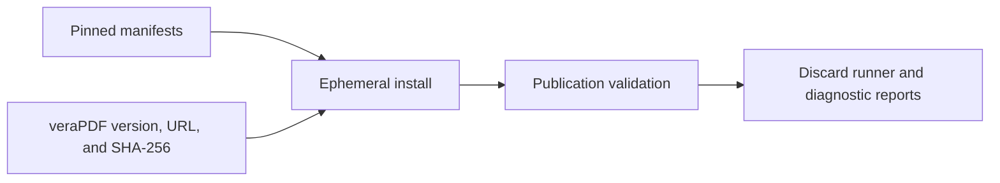
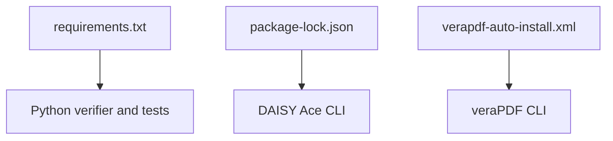
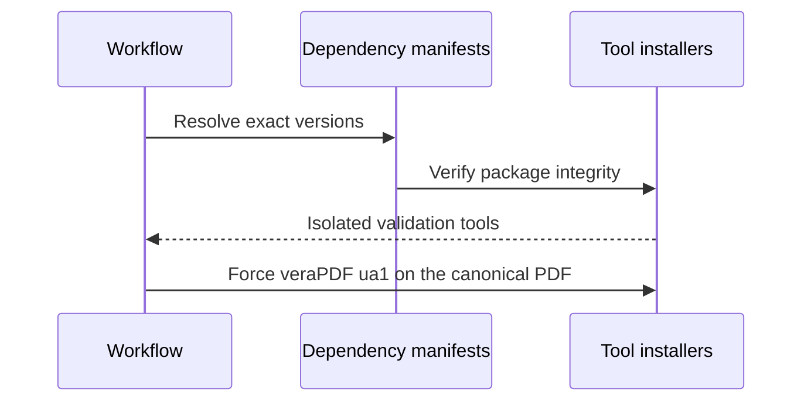
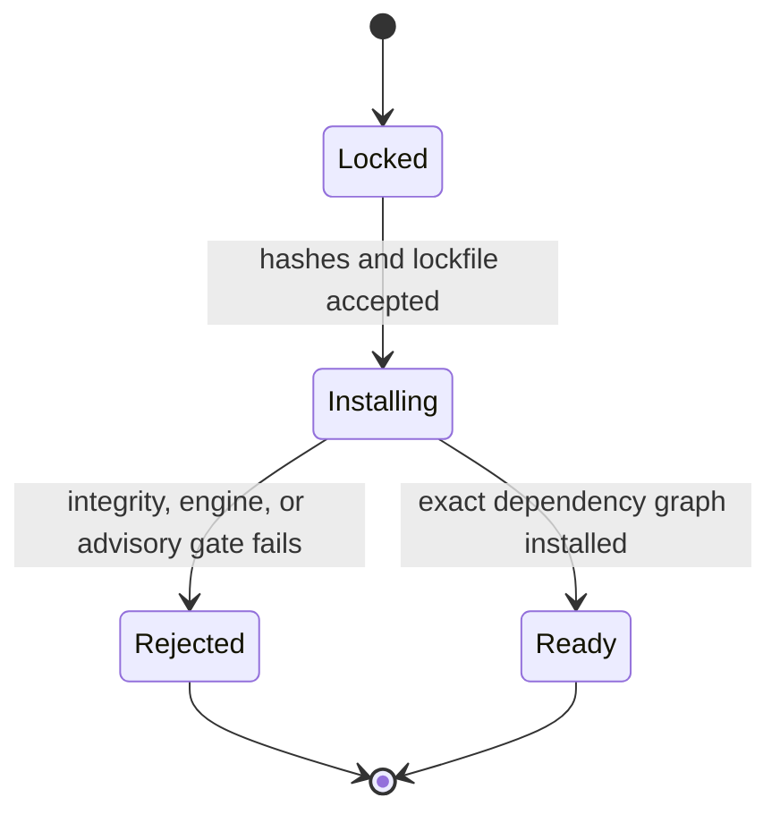
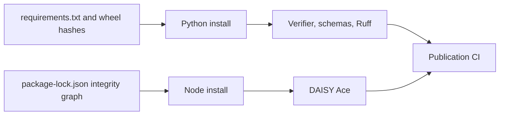

# Publication CI Dependencies

## Overview

This folder contains only pinned dependency contracts for the ephemeral publication validator. It is not a runtime application and must not contain reader data, credentials, or generated reports.

## Key Components

- `requirements.txt`: exact Python versions and reviewed Linux x86-64 plus macOS ARM64 wheel hashes for JSON Schema validation and Ruff. The macOS ARM64 wheels serve the canonical hosted builder; the Linux hashes retain a reviewed local verification path.
- `package.json` and `package-lock.json`: DAISY Ace CLI 1.4.6 and its integrity-locked dependency graph.
- `verapdf-auto-install.xml`: minimal unattended veraPDF CLI installation template. The workflow substitutes only the ephemeral runner path; `scripts/verapdf_validation.py` owns the exact stable version, archive URL, and SHA-256.
- Use `npm ci`, never an unlocked install, in CI. The narrower `@daisy/ace-cli` package intentionally excludes the Ace HTTP server and Electron application.
- Fail the hosted build on high or critical npm advisories. Moderate upstream advisories remain visible in the log and require a threat-model review rather than an unsafe forced downgrade.

## Diagrams (Mermaid)

### Flowchart

### Component Diagram

### Sequence Diagram

### State Machine

### Data Flow Diagram

