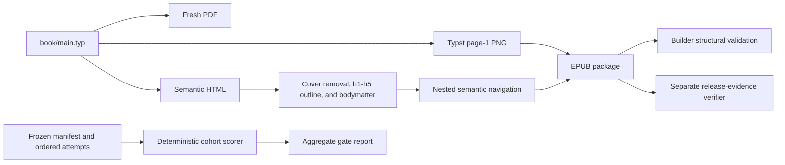
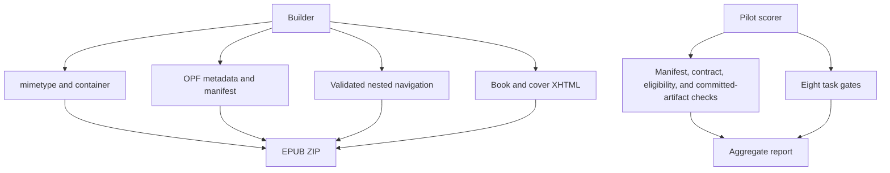
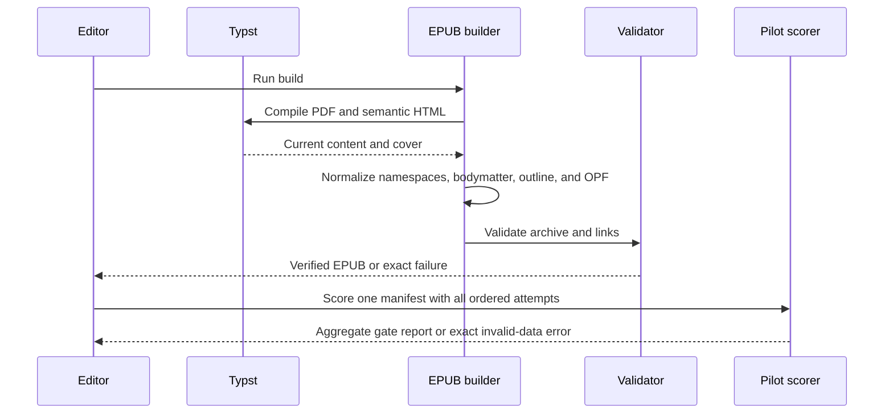
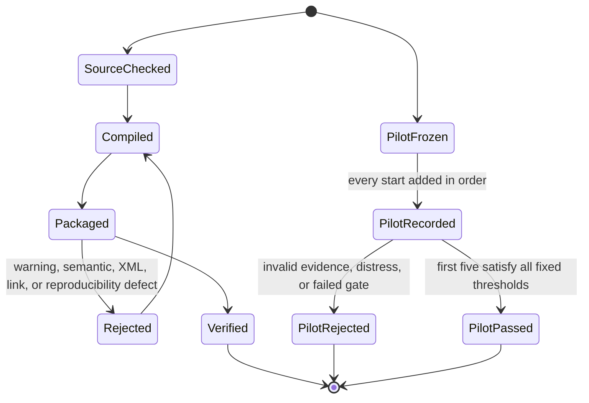
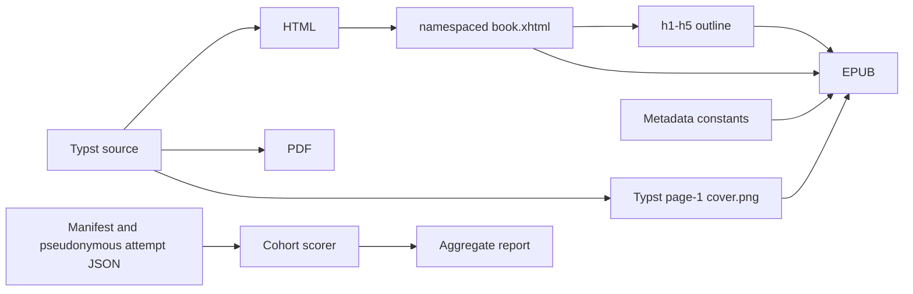

# EPUB Build Module

## Overview

This folder owns deterministic PDF and EPUB publication checks. It converts the target-aware Typst HTML output into XML-conformant XHTML, generates navigation and package metadata, renders the synchronized cover directly through Typst, creates the EPUB container, verifies the release record against both binaries, and fails loudly on structural defects.

## Key Components

- `build-epub.py`: recompiles PDF and HTML, renders page 1 directly to the EPUB cover PNG, verifies the immutable manuscript hash, removes the duplicate HTML cover, promotes Typst body headings from h2-h6 to h1-h5, creates namespaced XHTML and nested navigation, and checks semantics, accessibility metadata, manifest resources, anchors, warning classes, fixed ZIP timestamps, entry order, and uncompressed mimetype.
- `verify_release.py`: orchestrates the release contract and compares the immutable source plus exact binary identities.
- `release_evidence.py`: parses only the visible artifact table and anchors the immutable source hash and publication credit.
- `release_pdf.py`: verifies PDF metadata, tagging, security flags, file size, and every page's A5 geometry and rotation.
- `release_epub.py`: verifies the active package, exact manifest and spine, passive XHTML, metadata, resolved unique navigation, and content/cover counts.
- `beginner_pilot_contract.py`: fixed task ids, criteria, thresholds, allowed fields, cohort rules, and the exact ten-file scoring contract.
- `beginner_pilot_validation.py`: strict JSON, schema, consent, eligibility, task-state, fixed stop-reason, bounded contact-data detection, and retention validation.
- `beginner_pilot_artifact.py`: verifies hashes and page count against real files and committed Git blobs, plus a bounded EPUB container check.
- `beginner_pilot_manifest.py`: loads the only authoritative manifest, rejects direct or nested record additions and reachable Git-history exposure, enforces chronological first-five selection among at most seven starts, verifies canonical origin/main ancestry, and binds the running scorer to the committed contract.
- `beginner_pilot.py`: reusable scoring rules for one validated five-reader novice cohort.
- `score-beginner-pilot.py`: manifest-only CLI that applies fixed comprehension, EPUB, completeness, and distress-veto gates and emits a privacy-coarsened aggregate report without first answers or notes.
- The pilot runtime requires Python's `jsonschema` package. A local manifest cannot independently prove its asserted registration time or that the moderator did not omit the terminal attempt; stronger custody needs an external append-only timestamped registry.
- Keep the OPF `dcterms:modified` value fixed within a release for reproducibility, but advance it when the published content changes to a new release date.
- `build/epub/`: ignored intermediate output.
- `dist/huong-den-nhap-luu.epub`: final artifact.

## Diagrams (Mermaid)

### Flowchart

### Component Diagram

### Sequence Diagram

### State Machine

### Data Flow Diagram

