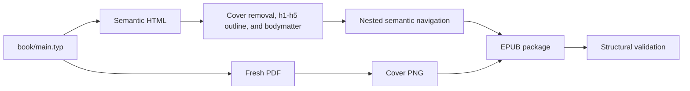
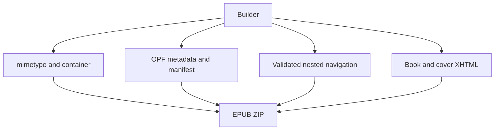
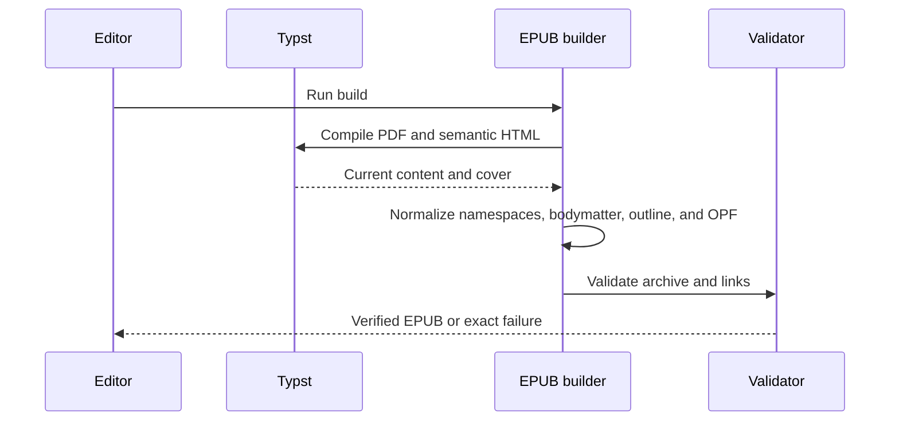
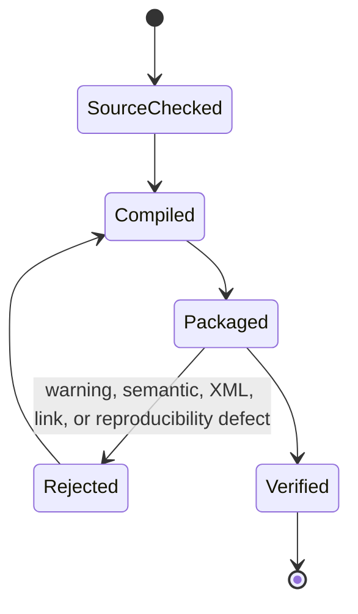
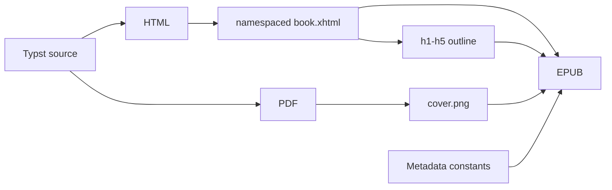

# EPUB Build Module

## Overview

This folder owns deterministic EPUB 3 packaging. It converts the target-aware Typst HTML output into XML-conformant XHTML, generates navigation and package metadata, renders the synchronized PDF cover, creates the EPUB container, and fails loudly on structural defects.

## Key Components

- `build-epub.py`: recompiles PDF and HTML, verifies the immutable manuscript hash, removes the duplicate HTML cover, promotes Typst body headings from h2-h6 to h1-h5, creates namespaced XHTML and nested navigation, and checks semantics, accessibility metadata, manifest resources, anchors, warning classes, fixed ZIP timestamps, entry order, and uncompressed mimetype.
- `build/epub/`: ignored intermediate output.
- `dist/huong-den-nhap-luu.epub`: final artifact.

## Diagrams (Mermaid)

### Flowchart

### Component Diagram

### Sequence Diagram

### State Machine

### Data Flow Diagram

