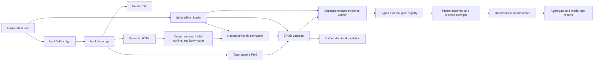
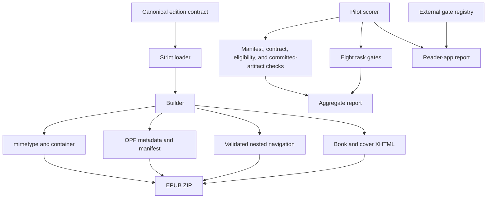
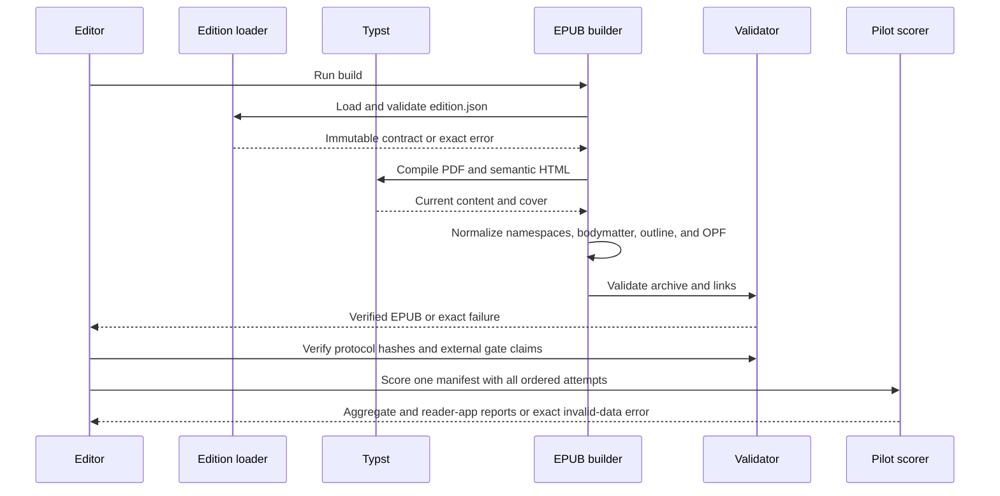
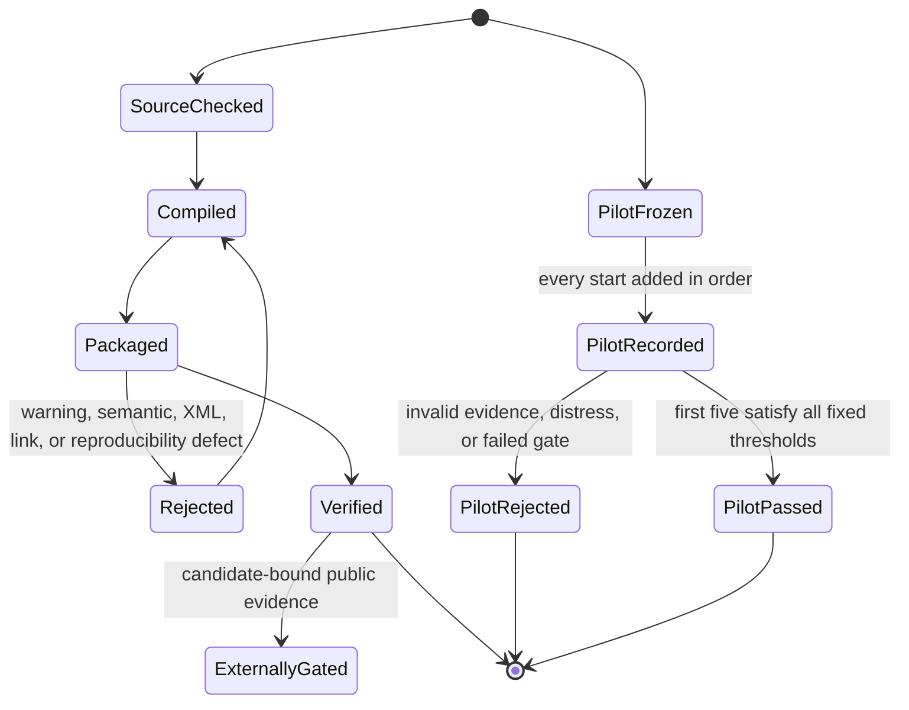
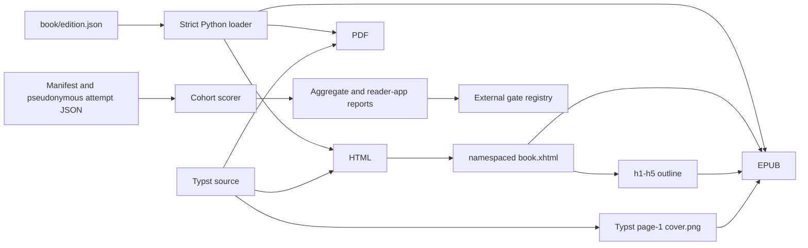

# EPUB Build Module

## Overview

This folder owns deterministic PDF and EPUB publication checks. It loads the
sole canonical edition and locale authority from `book/edition.json`, converts
the target-aware Typst HTML output into XML-conformant XHTML, generates
navigation and package metadata, renders the synchronized cover directly
through Typst, creates the EPUB container, verifies the release record against
the contract and both binaries, and fails loudly on structural defects.

## Key Components

- `edition_contract.py`: strict schema-v1 loader and immutable Python view of `book/edition.json`. It rejects duplicate or unknown keys, missing or malformed fields, unsafe paths, invalid identifiers and tags, and broken cross-field invariants.
- `edition_contract_validation.py`: small strict-JSON primitives for duplicate keys, exact object shapes, NFC single-line text, unique non-empty text arrays, absolute HTTPS identifier seeds, and one shared UTC release instant.
- `build-epub.py`: recompiles PDF and HTML, renders page 1 directly to the EPUB cover PNG, verifies the immutable manuscript hash, removes the duplicate HTML cover, promotes Typst body headings from h2-h6 to h1-h5, creates namespaced XHTML and nested navigation, and checks contract-bound HTML head metadata, semantics, accessibility metadata, manifest resources, anchors, warning classes, fixed ZIP timestamps, entry order, and uncompressed mimetype.
- `verify_release.py`: orchestrates the release contract and compares the immutable source plus exact binary identities.
- `release_evidence.py`: parses only the visible artifact table and anchors the immutable source hash and publication credit to the edition supplied by the release orchestrator.
- `release_pdf.py`: verifies PDF metadata, tagging, security flags, file size, and every page's A5 geometry and rotation.
- `release_epub.py`: verifies the active package, exact manifest and spine, passive XHTML, metadata, resolved unique navigation, and content/cover counts.
- `external_release_gates.py`: verifies the schema-v3 registry, protocol fingerprints, six external-gate states, gate-specific required evidence roles, contract-derived artifact paths, ancestor-plus-exact-artifact candidate binding, cohort/report bindings, release-evidence status agreement, and claims derived from passed gates.
- `external_release_gate_files.py`: contains the fail-closed JSON, repository-path, file-fingerprint, local-link, evidence-status, exact evidence-role, mandatory `Completed`, public-confirmation and scope-limit fields, public contact-data rejection, exact-once PDF/EPUB digest, cohort/manifest, and counted-record validators used by the external gate orchestrator.
- `build-external-review-packet.py`: clean-checkout CLI for the ignored coordinator ZIP.
- `external_review_packet.py`: verifies the clean commit, exact committed source bytes, release candidate, edition contract, and gate registry before collection.
- `external_review_packet_content.py`: canonical gate order, assignment text, guide, manifest, and immutable packet data structures.
- `external_review_packet_archive.py`: deterministic ZIP writer and checksum, manifest, timestamp, assignment, and candidate validator.
- `beginner_pilot_contract.py`: fixed task ids, criteria, thresholds, allowed fields, cohort rules, and the exact ten-file scoring contract. The insight-map criterion points to Chapter 12; the fetter criterion is coded true only under the scenario-level rubric in the reader kit.
- `beginner_pilot_validation.py`: strict JSON, schema, consent, eligibility, task-state, fixed stop-reason, bounded contact-data detection, and retention validation.
- `beginner_pilot_artifact.py`: verifies hashes and page count against real files and committed Git blobs, plus a bounded EPUB container check.
- `beginner_pilot_manifest.py`: loads the only authoritative manifest, rejects direct or nested record additions and reachable Git-history exposure, enforces chronological first-five selection among at most seven starts, verifies canonical origin/main ancestry, and binds the running scorer to the committed contract.
- `beginner_pilot.py`: reusable scoring rules for one validated five-reader novice cohort.
- `score-beginner-pilot.py`: manifest-only CLI that applies fixed comprehension, EPUB, completeness, and distress-veto gates. `--output` emits an aggregate report bound to one cohort, one manifest hash, and five counted-record hashes; `--epub-evidence-output` emits a separate reader-app report bound to the same cohort and manifest plus one of those records. Neither output proves human identity or external custody.
- The pilot runtime requires Python's `jsonschema` package. A local manifest cannot independently prove its asserted registration time or that the moderator did not omit the terminal attempt; stronger custody needs an external append-only timestamped registry.
- Keep the OPF `dcterms:modified` value fixed within a release for reproducibility, but advance it when the published content changes to a new release date.
- `build/epub/`: ignored intermediate output.
- `dist/huong-den-nhap-luu.epub`: final artifact.

Do not reintroduce title, author, language, labels, accessibility copy, output
names, source identity, or release timestamps as independent Python constants.
Consumers may expose compatibility aliases only when their values come directly
from the loaded contract. A future locale requires a distinct edition identity
and separate rights, review, novice, and reader-app evidence; Vietnamese results
do not transfer.

## Diagrams (Mermaid)

### Flowchart

### Component Diagram

### Sequence Diagram

### State Machine

### Data Flow Diagram

