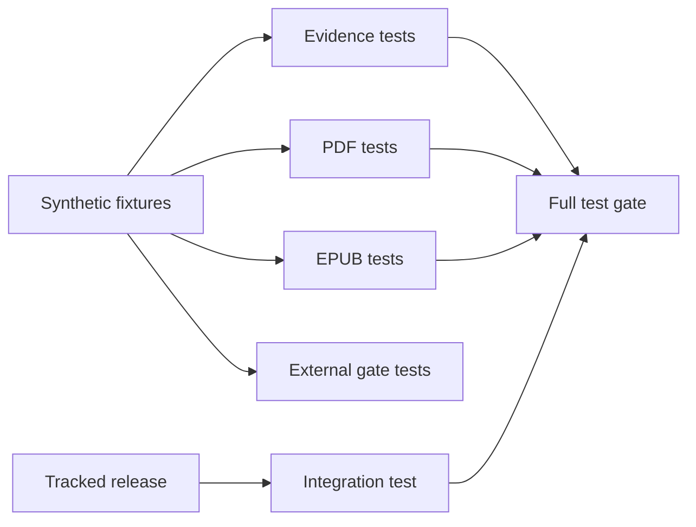
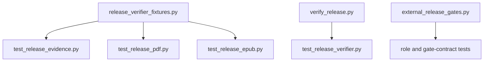
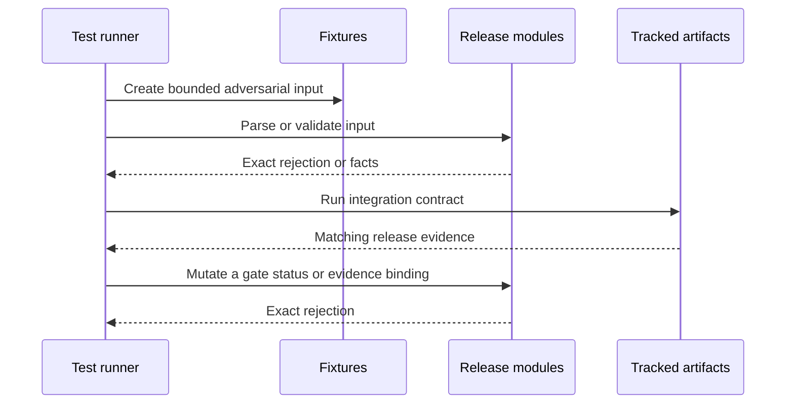
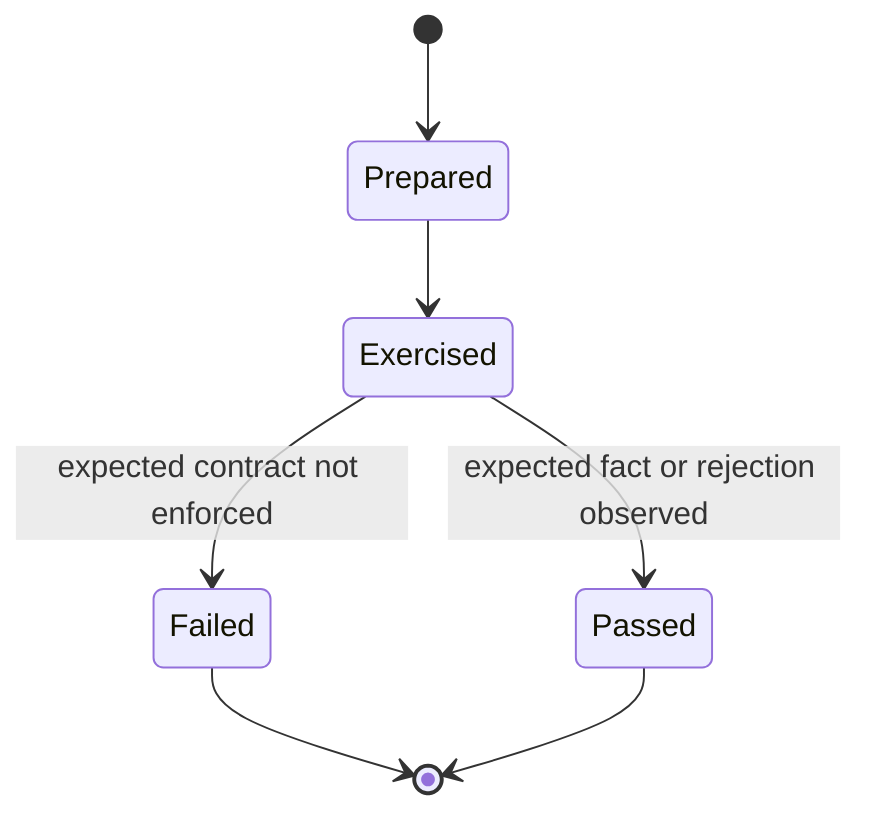
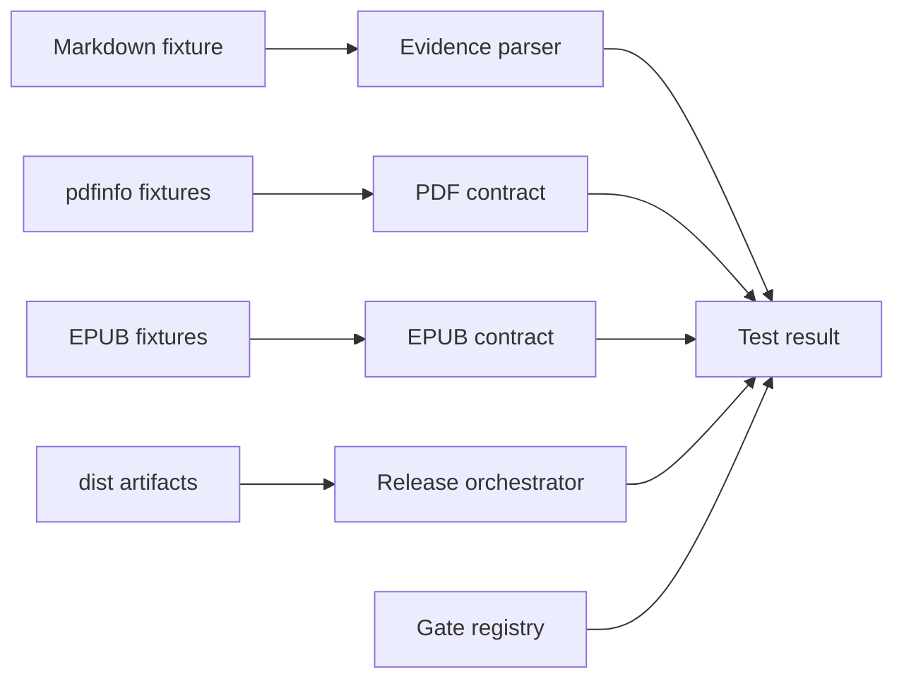

# Publication Verification Tests

## Overview

This folder owns focused regression tests for the builder, pilot scorer, and release gate. Release-verifier tests are split by evidence, PDF, EPUB, and end-to-end integration so each module stays small and each failure names one contract.

## Key Components

- `release_verifier_fixtures.py`: shared synthetic Markdown, PDFInfo, OPF, XHTML, and EPUB fixtures.
- `test_release_evidence.py`: visible-table parsing plus immutable hash and canonical-credit anchors.
- `test_release_pdf.py`: metadata, encryption, all-page size, and rotation regressions.
- `test_release_epub.py`: active-rootfile, fixed manifest/spine, passive XHTML, and TOC-target regressions.
- `test_release_verifier.py`: integration check against the tracked release candidate.
- `test_external_release_gates.py`: protocol-fingerprint, status, gate-specific evidence-role, evidence-binding, path-reuse, and permitted-claim regressions for the external release packet.
- Existing `test_beginner_pilot*.py` files retain the novice-cohort privacy and scoring contract.
- When an intentional chapter or layout change alters the tracked PDF extent, update the integration expectation only after rebuilding both artifacts and updating `release-evidence.md`; do not change synthetic parser fixtures merely to mirror the current book.

## Diagrams (Mermaid)

### Flowchart

### Component Diagram

### Sequence Diagram

### State Machine

### Data Flow Diagram

