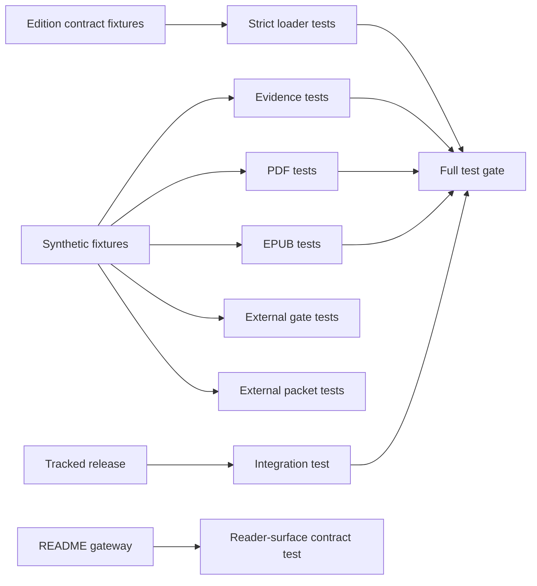
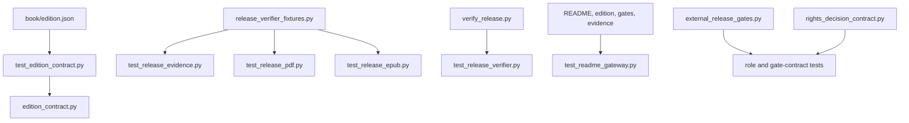
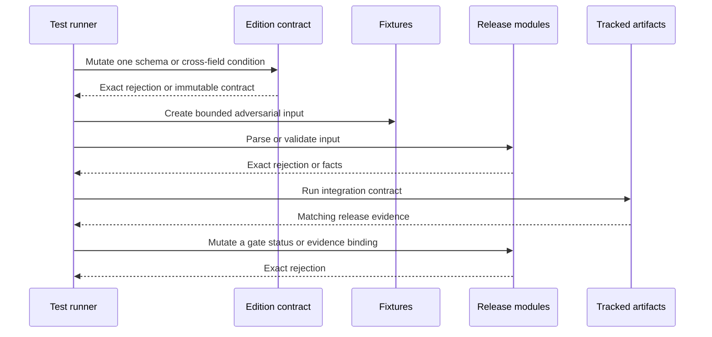
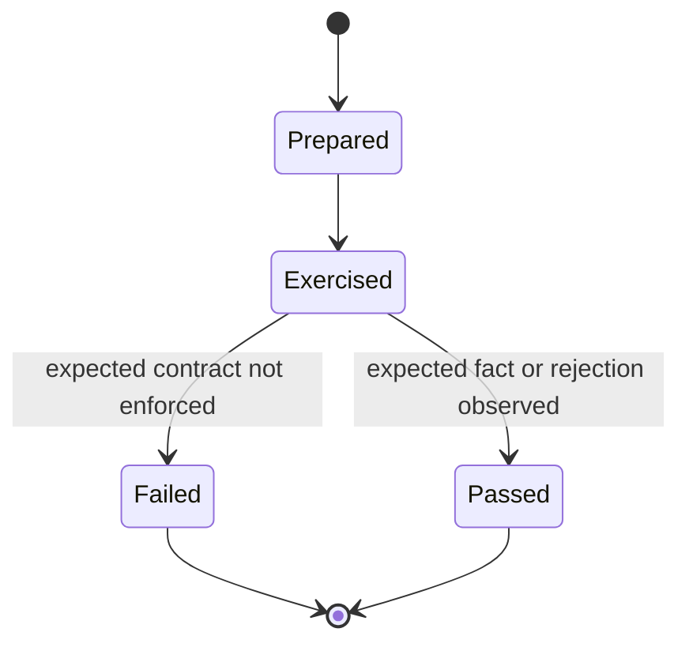
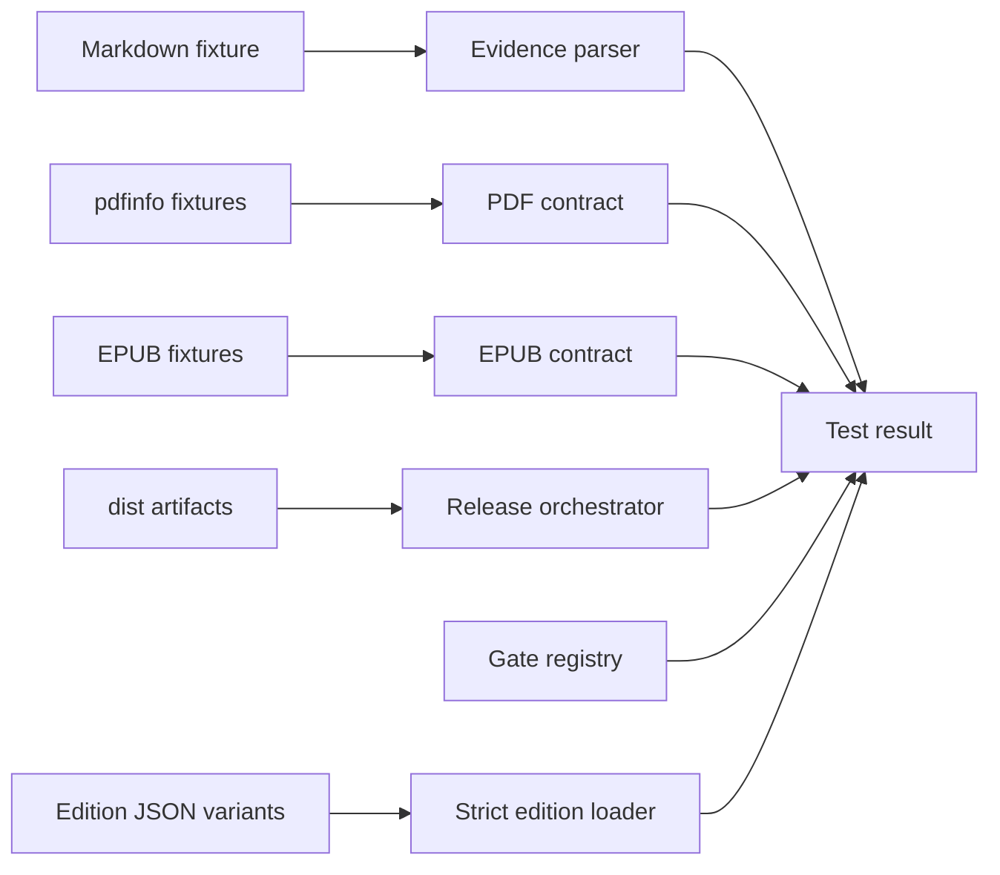

# Publication Verification Tests

## Overview

This folder owns focused regression tests for the canonical edition loader,
builder, pilot scorer, and release gate. Release-verifier tests are split by
evidence, PDF, EPUB, and end-to-end integration so each module stays small and
each failure names one contract.

## Key Components

- `test_edition_contract.py`: schema-v1 strict-loading tests for duplicate, unknown, missing, malformed, unsafe, out-of-range, and cross-field-inconsistent edition data, plus the tracked Vietnamese contract.
- `test_epub_edition_contract.py`: alternate-locale HTML head metadata, navigation, cover, OPF, language, accessibility, XML-escaping, and content-link contract proof with no Vietnamese-label fallback.
- `test_release_identity.py`: table-driven PDF and EPUB title, credit, and language drift rejection against the loaded contract.
- `test_readme_gateway.py`: reader-first ordering, contract-derived download identity, relative-link integrity, missing-rights and open-gate boundaries, and rejection of drift-prone artifact counts in the public README.
- `release_verifier_fixtures.py`: shared synthetic Markdown, PDFInfo, OPF, XHTML, and EPUB fixtures.
- `test_release_evidence.py`: visible-table parsing plus immutable hash and canonical-credit anchors against the explicitly supplied edition.
- `test_release_pdf.py`: metadata, encryption, all-page size, and rotation regressions.
- `test_release_epub.py`: active-rootfile, fixed manifest/spine, passive XHTML, TOC-target, broken-fragment, unlabelled-link, ambiguous external-label, and unsafe-scheme regressions.
- `test_release_verifier.py`: integration check against the tracked release candidate.
- `test_external_release_gates.py`: schema-v3 protocol-fingerprint, status, gate-specific evidence-role, contract-derived artifact-path, ancestor/exact-byte candidate binding, mandatory public fields, rights-scope and inventory binding, contact-data rejection, cohort/report hashes, path-reuse, and permitted-claim regressions.
- `test_rights_decision_contract.py`: direct passed/failed rights-summary contract plus stale binding, unauthorized format, unresolved contributor/third-party, open-item, and contradictory-decision regressions.
- `rights_decision_fixtures.py`: one shared complete rights-summary fixture for direct and external-gate integration tests.
- `test_external_review_packet.py`: deterministic ZIP, candidate and assignment binding, required attainment-audit and rights-inventory handoffs, explicit non-evidence boundary, checksum tamper detection, duplicate-path rejection, clean-worktree enforcement, and repository-path containment.
- Existing `test_beginner_pilot*.py` files retain the novice-cohort privacy and scoring contract, including dual scorer output: five counted hashes in the aggregate report and one matching hash in the `--epub-evidence-output` reader-app report.
- When an intentional chapter or layout change alters the tracked PDF extent, update the integration expectation only after rebuilding both artifacts and updating `release-evidence.md`; do not change synthetic parser fixtures merely to mirror the current book.

## Diagrams (Mermaid)

### Flowchart

### Component Diagram

### Sequence Diagram

### State Machine

### Data Flow Diagram

